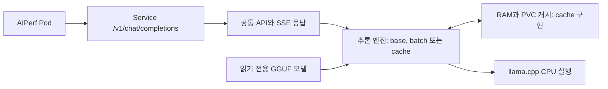
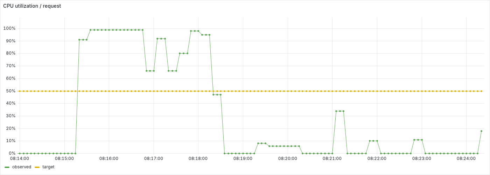
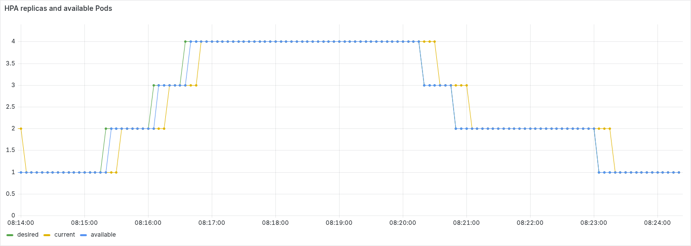
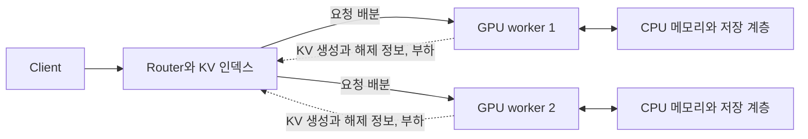

# CPU 기반 LLM 추론 엔진 실험 리포트

로컬 CPU 환경에서 LLM을 컨테이너로 배포하고, 추론 엔진 최적화가 처리량과 응답 지연에 미치는 영향을 비교했습니다. Qwen2.5-0.5B-Instruct Q4_K_M을 대상으로 기본 직렬 추론, continuous batching, prefix KV 캐시를 측정했습니다. 노드 장애 복구와 CPU 기반 HPA도 별도 부하로 확인했습니다.

이 문서의 성능 결과는 2026-09-20 UTC 측정을 기준으로 합니다. 상세 수치와 이미지는 [테스트 결과](reports/README.md)에서 확인할 수 있습니다.

## 1. 핵심 결과

동시성 8에서 기본 엔진은 44.45 tok/s, 배칭은 51.69 tok/s, 캐시 보존은 130.01 tok/s였습니다. 배칭은 처리량과 TTFT를 개선했지만 ITL과 요청 지연 p95는 악화됐습니다. 캐시는 반복 입력에서 가장 큰 개선을 보였으며, 입력 재사용 비율이 다른 부하에서는 추가 측정이 필요합니다.

- **배칭:** base 대비 처리량 16.3% 증가, TTFT 평균 64.0% 감소. ITL 평균은 8.05 ms에서 94.60 ms로 증가했습니다.
- **캐시 보존:** base 대비 처리량 192.5% 증가, TTFT 평균 68.7% 감소. 같은 캐시 구현의 초기화 조건보다 처리량이 33.2% 높았습니다.
- **장애 복구:** 노드 중단 후 생존 노드에 대체 Pod가 생성됐습니다. 대체 Pod Ready까지 300초 toleration은 약 350~355초, 60초 toleration은 약 109~119초가 걸렸습니다.
- **HPA:** 부하에 따른 replica 1→4 증가와 Service 편입을 확인했습니다. 고부하에서 요청 오류도 발생해 확장 동작과 요청 품질을 별도로 평가했습니다.
- **기본 품질:** 출력 형식을 제외하고 정답 내용을 평가했으며 세 이미지 모두 자동 검사 5개를 통과했습니다. 한국어 요약과 번역에서는 내용 오류가 확인됐습니다.

| 요구사항 | 수행 내용과 근거 |
| --- | --- |
| 장비와 목표에 따른 기술 선택 | CPU에서 실행할 수 있는 소형 GGUF 모델과 수정 가능한 추론 런타임 선택. 2절 |
| 이미지 빌드, 로드와 Kubernetes 배포 | 공통 Dockerfile의 구현별 타깃, Deployment와 Service, 실행 이미지 확인. 3절 |
| 다양한 길이의 프롬프트 100건과 동시성 증가 | 기본 비교는 입력 16개를 반복했습니다. 캐시 추가 실험에서는 32개와 128개 데이터셋을 사용했고, 128개 설정은 조건별 고유 입력 100개를 측정했습니다. 4절과 7절 |
| 베이스라인과 최소 두 가지 최적화 비교 | base, 배칭, KV 캐시를 같은 자원과 부하로 각각 3회 측정. 5절과 6절 |
| 개선과 악화의 원인 분석 | 직렬 대기, 배칭의 요청 간 간섭, 캐시 재사용 조건 분석. 7절 |
| 추가 운영 실험 | 노드 pause와 SIGKILL, CPU 기반 HPA 증가와 축소 확인. 8절과 9절 |
| GPU 운영 확장과 다음 최적화 | GPU 배칭, KV 캐시를 고려한 라우팅, HA와 저장소 설계. 10절과 11절 |

## 2. 환경과 기술 선택

### 실행 환경

| 항목 | 조건 |
| --- | --- |
| 호스트 | macOS, CPU 15코어, RAM 48 GiB |
| 모델 | Qwen2.5-0.5B-Instruct, GGUF Q4_K_M |
| 추론 런타임 | llama-cpp-python 0.3.35, CPU 전용 실행 |
| Benchmark | 추론 Pod 1개, 12 CPU와 16 GiB. AIPerf Pod 1 CPU와 1 GiB |
| Availability | 추론 Pod 2개, Pod당 2 CPU와 2 GiB |
| HPA | 추론 Pod 1~4개, Pod당 2 CPU와 2 GiB |
| 주변 부하 | 실험 부하 외 별도 부하 생성 작업 없음 |

측정 워크로드는 `requests=limits`로 설정했습니다.

모델의 리비전과 체크섬은 [모델 설정](../config/models/qwen2.5-0.5b-gguf-llamacpp.env), 런타임 의존성은 [requirements.txt](../src/llamacpp/base/requirements.txt)에 고정했습니다.

### 선택 근거

| 선택 | 이유 |
| --- | --- |
| Qwen2.5-0.5B-Instruct Q4_K_M | CPU에서 실행 가능한 GGUF 포맷의 소형 모델 중 기본적인 LLM 응답 기능을 사용할 수 있는 모델을 선택했습니다. 모델 크기와 실행 비용을 줄여 서빙 구조와 엔진 최적화에 집중했습니다. |
| llama-cpp-python | CPU를 지원하고, 상위 API와 native API를 통해 배칭과 KV 상태 저장 및 복원 같은 최적화를 구현할 수 있습니다. |
| Docker와 kind | 로컬 Kubernetes 환경에서 이미지 배포, 노드 장애와 Pod 재스케줄링을 같은 도구로 확인하기 위해 사용했습니다. |
| AIPerf | 범용 LLM 성능 측정 도구로서 동시성 부하, 스트리밍 응답과 요청별 성능 지표를 같은 방식으로 비교하기 위해 선택했습니다. |

모델과 양자화 선택의 목적은 로컬에서 기본적인 추론과 성능 실험을 수행하는 것입니다. 모델 간 품질 비교나 양자화에 따른 품질 저하는 이번 실험에서 평가하지 않았습니다.

## 3. 서빙 구조와 배포 검증

### 요청 처리 구조

`/v1/chat/completions`는 AIPerf를 통한 성능 측정을 지원하기 위해 제공합니다. 공통 API가 요청 검증, 채팅 템플릿 적용, 스트리밍, 토큰 집계와 길이 제한을 담당하고, 엔진 구현을 교체해 동일한 요청 경로에서 비교합니다.

| 구성 | 구현과 역할 |
| --- | --- |
| base | HTTP 요청을 수락한 뒤 하나의 모델 작업자에서 추론을 직렬 실행합니다. |
| enhanced-batch | 요청별 상태를 분리하고, 진행 중인 decode와 새 요청의 prefill을 하나의 native context에서 배치 처리합니다. |
| enhanced-cache | base의 직렬 실행 경로에 prefix KV 조회, 복원과 저장을 추가합니다. RAM과 디스크 계층을 사용합니다. |
| base-metric | 장애와 HPA 실험에서 서버 지표를 수집하는 구현입니다. 최적화 benchmark와는 별도 자원 조건으로 실행합니다. |

확장 구현은 특정 모델의 구조나 가중치를 변경하지 않습니다. 요청을 함께 처리하는 배칭과 이미 계산한 KV를 재사용하는 캐시는 범용 추론 엔진에서 적용할 수 있는 최적화 지점이며, GPU 환경에서도 활용할 수 있습니다. 다만 현재 코드는 llama.cpp API를 사용하고 실측 모델도 하나이므로, 다른 런타임과 모델에서의 동작 및 성능은 별도 검증 대상입니다.

모델 연산과 토큰화는 런타임을 사용했습니다. 공통 API, 요청 스케줄링, 배치 실행 연결, 캐시 관리, 배포 구성과 측정 자동화는 저장소에 구현했습니다. 구현 상세는 [추론 엔진 가이드](guides/inference-engine.md#llamacpp)을 참고합니다.

### 배포와 측정 검증

[공통 Dockerfile](../src/Dockerfile)의 `base`, `enhanced-batch`, `enhanced-cache` 타깃으로 이미지를 빌드하고, [이미지 로드 스크립트](../scripts/load-inference-images.sh)로 로컬 Kubernetes에 로드했습니다. 모델은 이미지에 포함하지 않고 읽기 전용 볼륨으로 연결했습니다. 각 구현의 매니페스트는 같은 Deployment와 Service를 사용하며, 구현을 순차 교체합니다.

측정 runner는 새 추론 Pod의 준비 상태를 기다린 뒤 Service에 요청을 보냅니다. 반복 실험에서 이미지 ID를 고정하고, 조건별 Pod UID가 서로 다른지 확인했습니다. 최종 기록은 48개 단계와 48개 추론 Pod, 본 요청 4,800건과 워밍업 96건의 성공, 출력 길이 부족과 초과 0건을 확인합니다. [실행 기록](reports/llamacpp/benchmark-suite-20260920-091620-649645/run.json), [검증 기록](reports/llamacpp/benchmark-suite-20260920-091620-649645/verification.json)

요청 호환성, 배칭 취소와 슬롯 재사용, 캐시 복원과 손상 처리에 대한 테스트는 [확장 구현의 검증 절차](guides/inference-engine.md#llamacpp-enhanced-검증)에 정리했습니다. 성능 측정에서는 요청 성공과 출력 길이를 검증했고, 생성 내용은 별도 질문으로 확인했습니다.

### 기본 응답 품질

base, enhanced-batch와 enhanced-cache에 같은 질문 7개를 각각 한 번씩 순차 요청했습니다. 세 이미지의 응답은 질문별로 같았고, 저장된 응답을 정답 내용 기준으로 판정하면 모두 자동 검사 5개 통과, 실패 0건, API 오류 0건이었습니다. 설명문, 수식과 코드 블록 등 출력 형식은 평가에서 제외했습니다.

요약과 번역은 자동 판정을 `REVIEW`로 남겼습니다. 저장된 응답을 검토한 결과 요약은 휴관일과 재개일을 바꿨고, 번역은 오후 3시라는 의미를 보존하지 못했습니다. 이 검사는 기본 기능의 한계를 확인하는 용도이며 동시 배칭이나 캐시 재사용 시의 품질 동등성을 입증하지는 않습니다. [품질 검사 결과와 원본 응답](reports/llamacpp/quality-20260920-145858/summary.md)

## 4. 실험 설계와 비교 조건

입력과 출력 토큰 길이, 길이 그룹의 구성 비율, 추론 엔진 Pod의 CPU와 메모리 자원량은 요구사항에 구체적인 값이 명시되어 있지 않았습니다. 각 값을 바꾸어 테스트하면서 로컬 환경에서 적절한 시간 안에 측정을 마치고 성능 차이를 분석할 수 있는 결과가 나오는 값으로 선정했습니다.

### 부하와 입력 구성

| 항목 | 설정 |
| --- | --- |
| 요청 대상 | `http://base-llamacpp:8000/v1/chat/completions`, 스트리밍 |
| 입력과 출력 목표 | 64/32토큰과 256/64토큰, 생성 설정상 비율 각 50% |
| 데이터셋 | 고유 입력 16개, seed 42, 순차 반복 |
| 조건별 요청 | 워밍업 2건 후 본 측정 100건 |
| 동시성 | 1, 2, 4, 8 |
| 반복 | 구현별 3회, 각 반복에서 실행 순서 순환 |
| 출력 조건 | `ignore_eos=true`, 서버 기본 `temperature=0`, `top_p=1` |
| 클라이언트 | worker 1개, 요청 timeout 3,600초 |
| 실행 방식 | 고정 동시성 부하, 모든 실험 순차 실행 |

입력 목표 길이와 실제 서버 토큰 수는 다릅니다. 저장된 요청별 원본에서 워밍업을 제외하고 집계하면 48개 단계 모두 다음 구성이었습니다. 실제 토큰 수에는 채팅 템플릿이 반영됩니다.

| 서버 입력 토큰 | 출력 토큰 | 단계별 요청 수 | 실제 비율 |
| ---: | ---: | ---: | ---: |
| 93 | 32 | 69 | 69% |
| 285 | 64 | 31 | 31% |

따라서 두 길이 그룹을 포함한 100건의 요청을 비교했지만, 서로 다른 프롬프트 100개를 사용한 실험은 아닙니다. 설정의 50:50과 유한한 입력 집합을 반복한 실제 요청 비율을 구분합니다. 입력 반복은 캐시 효과를 크게 만들 수 있으므로 신규 입력이나 낮은 재사용률의 부하로 일반화하지 않습니다.

별도 캐시 실험에서는 고유 입력 32개와 128개 Job을 각각 한 번 실행했습니다. 동시성별 본 요청 100건과 나머지 부하 설정은 유지했으며, 실제 사용한 고유 입력은 각각 32개와 100개였습니다. Job마다 빈 캐시로 시작했고 Job 내부의 동시성 단계 사이에는 추론 Pod와 캐시를 유지했습니다. 따라서 위의 3회 반복 비교와 구분합니다. [입력 구성과 측정 조건](reports/llamacpp/benchmark-cache-datasets-20260920-145858/summary.md)

동시성마다 PVC와 RAM 캐시를 초기화하는 조건도 입력 수별로 한 번씩 측정했습니다. 각 단계는 추론 Pod 종료, PVC 삭제와 빈 상태 확인, 새 Pod 준비를 거쳐 별도 Job으로 실행했습니다. 두 조건의 입력 집합 체크섬이 같음을 확인했습니다. [초기화 조건과 검증 기록](reports/llamacpp/benchmark-cache-datasets-clear-20260920-151923/summary.md)

### 동일하게 유지한 조건

비교 대상인 엔진 구현, 동시성과 캐시 보존 여부 외의 공통 설정값은 테스트의 변인을 최소화하기 위해 고정했습니다. 같은 동시성에서 구현을 비교할 때 모델, 양자화, 입력 데이터, 클라이언트 설정, 출력 길이, replica 1개, CPU와 메모리, 배치 노드를 동일하게 유지했습니다. 추론은 12 threads, 요청당 context 1,024토큰, 입력 상한 768토큰과 출력 상한 128토큰을 사용했습니다. 48개 단계의 데이터셋 체크섬과 정규화한 클라이언트 설정이 동일함을 확인했습니다.

추론 Pod와 AIPerf Pod는 서로 다른 노드에 배치했으며, 저장된 Pod 기록으로 배치와 Guaranteed QoS를 확인했습니다. 로컬 노드들은 한 호스트의 자원을 공유하므로, 노드 분리가 물리 자원 분리를 의미하지는 않습니다.

각 동시성 전에 추론 Pod를 재시작했습니다. 배칭은 활성 요청 슬롯 8개와 prefill chunk 64토큰을 사용하며, 슬롯 수에 따라 전체 KV 공간이 커집니다. 캐시는 RAM 64 MiB, 디스크 1,024 MiB, 최소 재사용 prefix 32토큰으로 설정했습니다. 공통 자원 한도는 같지만, 최적화 구현에 필요한 메모리 구조까지 동일한 것은 아닙니다.

| 실험 조건 | 상태 초기화 |
| --- | --- |
| base | 새 Pod에서 기본 직렬 추론 |
| enhanced-batch | 새 Pod에서 배칭. 요청 간 prefix 캐시 보존 없음 |
| enhanced-cache, 초기화 | 각 동시성의 워밍업 전에 PVC 캐시 삭제 |
| enhanced-cache, 보존 | 각 반복의 첫 동시성 전에만 PVC 캐시 삭제, 이후 동시성 사이에는 보존 |

배칭과 캐시는 독립된 두 최적화입니다. 캐시 초기화와 보존은 같은 구현의 비교 조건입니다. 두 캐시 조건 모두 워밍업과 본 측정 중에 캐시를 다시 채우고 재사용하므로, 초기화 조건을 모든 요청의 cache miss 결과로 해석하지 않습니다.

### 집계 기준

성능 지표는 AIPerf의 본 측정 요청을 기준으로 합니다. 표의 평균은 세 실행의 평균이며, `±`는 실행 간 표본 표준편차입니다. p95도 실행별 p95의 평균으로, 전체 요청을 합쳐 계산한 p95와 다릅니다. 변화율은 반올림 전 값으로 계산했습니다.

자원 표본은 추론 Pod 범위로 제한하고, 본 측정 시작과 종료 사이의 원본 시각만 포함했습니다. 중복 시각은 제거했습니다. CPU는 실행별 표본 평균을 다시 평균했고, 메모리는 세 실행에서 관찰된 최대 working set입니다. 수집 간격보다 짧은 순간 변동은 나타나지 않을 수 있습니다.

측정 설정과 원본 구조는 [AIPerf 가이드](guides/aiperf.md), 집계값은 [반복 측정 CSV](reports/llamacpp/benchmark-suite-20260920-091620-649645/summary.csv)에 있습니다.

## 5. 베이스라인 결과와 병목

각 동시성에서 세 실행을 합쳐 본 요청 300건이 성공했고 오류는 없었습니다.

| 동시성 | 출력 처리량 (tok/s) | 요청 처리량 (req/s) | TTFT 평균 / p95 (ms) | ITL 평균 / p95 (ms) | 요청 지연 p95 (ms) |
| --- | ---: | ---: | ---: | ---: | ---: |
| 1 | 43.24 ± 0.57 | 1.032 | 628.68 / 1119.64 | 8.29 / 10.04 | 1680.81 |
| 2 | 43.83 ± 0.14 | 1.046 | 1572.32 / 2062.74 | 8.19 / 9.95 | 2372.41 |
| 4 | 44.03 ± 0.27 | 1.050 | 3442.62 / 4319.00 | 8.18 / 9.97 | 4641.04 |
| 8 | 44.45 ± 0.21 | 1.060 | 7009.25 / 7984.90 | 8.05 / 9.56 | 8241.57 |

| 동시성 | CPU 표본 평균 (코어) | 최대 관측 working set (MiB) |
| --- | ---: | ---: |
| 1 | 10.00 | 641.6 |
| 2 | 10.49 | 643.4 |
| 4 | 10.80 | 643.8 |
| 8 | 10.38 | 651.0 |

동시성을 1에서 8로 높여도 처리량은 약 43~44 tok/s에 머물렀고, TTFT는 크게 증가했습니다. 반면 ITL 평균은 약 8 ms를 유지했습니다. [base의 단일 작업자 구조](../src/llamacpp/base/server.py)와 함께 보면, 추가 요청이 모델 실행을 병렬화하기보다 앞선 요청의 완료를 기다리는 구조가 주된 제약으로 해석됩니다.

CPU 표본 평균은 약 10~11코어였습니다. 이 자료만으로 연산과 메모리 대역폭 중 어느 쪽이 지배적인 병목인지 확정할 수는 없습니다. 입력 길이별 지연과 prefill 및 decode의 세부 비용 분해는 후속 분석 대상으로 남깁니다.

## 6. 최적화 구현과 before/after

### 최적화 1: Continuous batching

기본 엔진에서 대기 중인 요청을 더 일찍 처리하기 위해, 여러 요청의 연산을 하나의 배치에 넣도록 구성했습니다. 요청마다 sequence ID, sampler, 생성 토큰과 스트림 디코더를 분리하고 하나의 배칭 작업자가 native context를 관리합니다.

스케줄러는 진행 중인 decode 요청의 토큰을 먼저 배치에 넣고, 남는 공간에 새 요청의 prefill을 최대 64토큰씩 추가합니다. 요청이 완료되거나 취소되면 해당 KV와 슬롯을 회수하고 다음 요청을 수용합니다. 전체 배치 상한과 물리 배치 상한은 각각 512토큰이며, 활성 슬롯은 최대 8개입니다. 구현은 [배칭 스케줄러](../src/llamacpp/enhanced/batch/batching.py)와 [native 연결](../src/llamacpp/enhanced/batch/native.py)에 있습니다.

여러 요청이 진행될 수 있으므로 직렬 큐 대기가 줄어들 것으로 기대했습니다. 동시에 각 요청의 다음 토큰은 다른 요청을 포함한 배치 연산이 끝나야 받을 수 있어, 처리량 개선과 ITL 악화가 함께 발생할 가능성을 고려했습니다. 요청별 KV 공간과 스케줄러 상태를 유지하는 메모리 비용도 추가됩니다.

### 최적화 2: RAM과 디스크 prefix KV 캐시

반복되는 입력의 prefill을 줄이기 위해 입력 토큰의 prefix에 대응하는 native KV 상태를 저장했습니다. 캐시에 저장하는 대상은 입력의 KV 상태이며, 복원한 상태에서 나머지 계산과 생성을 수행합니다.

캐시는 가장 긴 공통 prefix를 찾고, 현재 native context보다 더 긴 prefix를 재사용할 수 있으면 복원합니다. 입력 전체가 일치해도 마지막 입력 토큰을 다시 계산해 logits를 갱신합니다. RAM 한도를 넘는 항목은 디스크로 내리고, 디스크 hit는 상태를 읽어 복원합니다. 교체는 LRU를 사용하며 모델과 라이브러리, context 등의 조건으로 namespace를 나눕니다. 구현은 [캐시 엔진](../src/llamacpp/enhanced/cache/engine.py)과 [prefix 캐시](../src/llamacpp/enhanced/cache/prefix_cache.py)에 있습니다.

추가 비용은 캐시 조회, KV 복사, 저장 공간과 디스크 입출력입니다. 현재 디스크 저장은 동기식이므로, 재계산을 줄이는 이득이 저장 및 복원 비용보다 큰지 확인해야 합니다. 이번 부하는 입력 16개를 반복하므로 반복 입력 재사용에 유리한 조건입니다. RAM hit, 디스크 hit와 퇴출 비용을 분리한 성능 비교는 수행하지 않았습니다.

### 비교 결과

아래 표의 모든 조건에서 세 실행의 본 요청 300건이 성공했고 오류는 없었습니다. base 결과는 5절과 같은 측정입니다.

| 구현과 캐시 조건 | 동시성 | 출력 처리량 (tok/s) | TTFT 평균 / p95 (ms) | ITL 평균 / p95 (ms) | 요청 지연 p95 (ms) |
| --- | ---: | ---: | ---: | ---: | ---: |
| enhanced-batch | 1 | 49.35 ± 0.31 | 572.66 / 1078.96 | 6.70 / 8.48 | 1526.70 |
| enhanced-batch | 2 | 50.15 ± 0.32 | 854.30 / 1449.09 | 19.28 / 45.19 | 3241.11 |
| enhanced-batch | 4 | 50.57 ± 0.32 | 1334.28 / 2609.01 | 48.07 / 71.47 | 5763.54 |
| enhanced-batch | 8 | 51.69 ± 0.16 | 2525.54 / 4050.89 | 94.60 / 136.92 | 10692.94 |
| enhanced-cache, 초기화 | 1 | 98.93 ± 0.31 | 106.16 / 434.90 | 7.71 / 9.21 | 743.31 |
| enhanced-cache, 초기화 | 2 | 98.53 ± 1.43 | 531.55 / 1762.11 | 7.70 / 9.22 | 2199.09 |
| enhanced-cache, 초기화 | 4 | 97.20 ± 1.84 | 1388.29 / 3330.59 | 7.83 / 9.40 | 3604.81 |
| enhanced-cache, 초기화 | 8 | 97.64 ± 0.52 | 3032.04 / 6915.72 | 7.73 / 9.45 | 7176.63 |
| enhanced-cache, 보존 | 1 | 97.48 ± 0.78 | 107.07 / 441.68 | 7.83 / 9.26 | 747.14 |
| enhanced-cache, 보존 | 2 | 128.15 ± 2.75 | 336.58 / 563.05 | 7.68 / 9.27 | 838.76 |
| enhanced-cache, 보존 | 4 | 129.34 ± 1.89 | 969.95 / 1300.33 | 7.57 / 9.35 | 1594.16 |
| enhanced-cache, 보존 | 8 | 130.01 ± 3.53 | 2190.50 / 2602.04 | 7.58 / 9.37 | 2854.38 |

동시성 8에서 base 대비 변화는 다음과 같습니다. 지연 열의 음수는 감소, 양수는 증가를 나타냅니다.

| 구현과 캐시 조건 | 출력 처리량 | TTFT 평균 | 요청 지연 p95 |
| --- | ---: | ---: | ---: |
| enhanced-batch | +16.3% | -64.0% | +29.7% |
| enhanced-cache, 초기화 | +119.6% | -56.7% | -12.9% |
| enhanced-cache, 보존 | +192.5% | -68.7% | -65.4% |

같은 동시성에서 자원 표본은 다음과 같습니다. working set은 캐시 예산이나 엔진이 할당한 전체 메모리와 같지 않으며, 표본 수가 적어 이 값만으로 메모리 효율을 결론 내리지 않습니다.

| 구현과 캐시 조건 | CPU 표본 평균 (코어) | 최대 관측 working set (MiB) | 실행별 CPU 표본 수 |
| --- | ---: | ---: | --- |
| base | 10.38 | 651.0 | 6, 6, 5 |
| enhanced-batch | 11.09 | 710.7 | 5, 5, 5 |
| enhanced-cache, 초기화 | 9.24 | 219.3 | 3, 2, 3 |
| enhanced-cache, 보존 | 9.72 | 195.4 | 2, 2, 2 |

성능 표의 원본은 [3회 반복 보고서](reports/llamacpp/benchmark-suite-20260920-091620-649645/summary.md)와 [전체 지표 CSV](reports/llamacpp/benchmark-suite-20260920-091620-649645/summary.csv)입니다.

## 7. 결과 해석과 효과가 제한된 조건

### 배칭은 첫 응답과 완료 지연 사이의 선택을 만들었습니다

배칭의 동시성 8 TTFT 평균은 7009.25 ms에서 2525.54 ms로 줄었습니다. 여러 요청이 슬롯을 확보해 진행하는 구조는 base의 직렬 대기를 줄이는 방향이며, 이 변화와 측정 결과가 일치합니다.

반면 ITL 평균은 94.60 ms, 요청 지연 p95는 10692.94 ms로 증가했습니다. 한 요청의 decode가 진행되는 동안에도 다른 요청의 decode와 prefill을 같은 작업자가 처리합니다. 이 요청 간 대기와 배치 연산 비용이 ITL 증가의 원인이라는 가설을 세울 수 있습니다. 다만 스케줄러 단계별 시간과 native 연산 시간을 분리해 측정하지 않아 각 원인의 기여도는 확정하지 않았습니다.

동시성 1에서도 배칭 구현의 처리량이 base보다 높았습니다. 이 조건에는 요청 간 동시 배칭이 없으므로, 개선 전체를 다중 요청 배칭의 효과로 볼 수 없습니다. 상위 생성 API와 저수준 native 실행 경로, prefill 분할과 sampler 등 구현 차이를 분리하는 실험이 필요합니다.

따라서 배칭을 채택할 때는 처리량과 TTFT뿐 아니라 ITL과 완료 지연 목표를 함께 적용해야 합니다. 이번 CPU 구성의 슬롯 8개와 chunk 64토큰이 최적값임을 확인한 것은 아닙니다.

### 캐시 이득은 입력 재사용과 초기 상태에 의존합니다

동시성 2, 4, 8에서 캐시 보존은 초기화보다 처리량이 30.1~33.2% 높았습니다. 동시성 단계 사이의 PVC 상태를 보존해 앞선 단계의 입력 KV를 다시 사용할 수 있는 조건입니다. 다만 조회, 복원과 prefill 생략 비용을 분리한 측정이나 hit 경로별 집계는 없어, 전체 이득 중 각 경로의 기여도를 수치로 확정하지 않았습니다.

동시성 1에서는 보존 조건이 97.48 tok/s, 초기화 조건이 98.93 tok/s로 보존의 이점이 나타나지 않았습니다. 두 조건 모두 첫 동시성 전에 빈 캐시로 시작하므로 이 비교에서 보존 효과를 기대하기 어렵습니다. 세 번의 측정만으로 작은 차이를 특정 원인에 귀속하지 않습니다.

입력이 매번 달라지거나 재사용 prefix가 짧으면 캐시 조회와 저장이 추가 비용이 될 수 있습니다. 위의 3회 비교는 반복 입력에서의 이득을 측정했습니다. 아래 추가 실험은 입력 집합을 확대했으며, 부분 prefix 공유, RAM 부족과 디스크 퇴출 조건은 별도로 검증해야 합니다.

### 고유 입력 수를 늘린 캐시 실험

32개와 128개 입력 설정의 동시성 1 처리량은 각각 77.47 tok/s와 43.29 tok/s, 동시성 8은 129.69 tok/s와 127.22 tok/s였습니다. 128개 설정은 한 단계의 본 요청에 고유 입력 100개를 사용했지만, 다음 동시성에서는 같은 입력을 재사용했습니다. 각 설정은 1회 측정이며 실제 길이 비율도 달라 고유 입력 수만의 효과를 확정하지는 않습니다.

보존 조건의 본 요청 800건과 워밍업 16건은 모두 성공했습니다. 다만 128개 설정에서는 동시성별 6건씩 총 24건이 목표 64토큰보다 사용량을 1~2토큰 많이 보고했습니다. 처리량은 이 사용량을 포함한 원래 측정값이며, 고정 출력 길이 검증을 완전히 통과한 결과로 보지 않습니다. [전체 수치와 불일치 요청 기록](reports/llamacpp/benchmark-cache-datasets-20260920-145858/summary.md)

동시성별 초기화 조건의 동시성 8 처리량은 32개 입력에서 78.90 tok/s, 128개 입력에서 43.18 tok/s였습니다. 보존 조건의 129.69 tok/s와 127.22 tok/s에 비해 낮았습니다. 초기화 조건도 본 요청 800건과 워밍업 16건이 모두 성공했으며, 128개 설정에서 사용량이 1토큰 많은 요청 24건을 기록했습니다. 두 조건은 단계 사이의 RAM 유지와 Pod 수명도 달라 PVC만의 효과로 해석하지 않습니다. [초기화 측정과 보존 조건 비교](reports/llamacpp/benchmark-cache-datasets-clear-20260920-151923/summary.md)

### 해석 범위

한 종류의 소형 양자화 모델과 한 대의 로컬 호스트에서 얻은 결과입니다. 입력은 두 길이 그룹이며 고유 입력 수가 작습니다. 짧은 성능 실험과 3회 반복은 구현 간 차이를 비교하는 근거가 되지만, 장시간 안정성이나 실제 사용자 부하를 대표하지는 않습니다. 요청 성공과 출력 길이 검증도 생성 품질 평가를 대신하지 않습니다.

## 8. 추가 실험: 노드 장애와 재스케줄링

추론 Pod 두 개를 서로 다른 engine 노드에 배치하고, 한 노드를 pause하거나 SIGKILL로 중단했습니다. 클라이언트 동시성은 4, 요청 timeout은 30초이며 요청마다 새 연결을 사용했습니다. `not-ready`와 `unreachable`의 NoExecute toleration을 300초와 60초로 나눠 조건별 1회 실행했습니다.

Pod 분산은 preferred anti-affinity를 사용했습니다. 장애 후에는 생존 노드에 대체 Pod를 수용할 여유가 있어 replica 2개를 다시 확보할 수 있었습니다.

### 복구 타임라인

아래 시간은 장애 주입부터의 경과 시간입니다. 노드와 Pod 이벤트 시각, 주기적 관찰에서 확인한 endpoint 시각 사이에는 수집 주기에 따른 차이가 있습니다.

| 장애와 toleration | Node Ready=Unknown | Ready endpoint 감소 | 대체 Pod 생성 | 대체 Pod Ready | endpoint 2개 회복 |
| --- | ---: | ---: | ---: | ---: | ---: |
| pause, 300초 | 43.8초 | 45.1초 | 344.8초 | 349.8초 | 351.6초 |
| SIGKILL, 300초 | 48.5초 | 50.2초 | 348.5초 | 354.5초 | 355.5초 |
| pause, 60초 | 52.8초 | 54.0초 | 112.8초 | 118.8초 | 119.6초 |
| SIGKILL, 60초 | 42.9초 | 43.9초 | 102.9초 | 108.9초 | 109.5초 |

장애 감지와 endpoint 제외는 약 43~54초 구간에 나타났습니다. 이후 대체 Pod 생성까지의 대기는 toleration에 영향을 받았으며, Pod 생성 후 Ready까지는 약 5~6초였습니다. 60초 조건에서 전체 복구가 빨라진 주된 차이는 이 대기 구간입니다.

### 요청 영향과 해석

| 장애와 toleration | 전체 관찰 시간 | 성공 / 오류 | 오류율 | 대체 Pod Ready 이후 오류 |
| --- | ---: | ---: | ---: | ---: |
| pause, 300초 | 700.9초 | 196 / 7 | 3.45% | 0 |
| SIGKILL, 300초 | 692.9초 | 206 / 11 | 5.07% | 0 |
| pause, 60초 | 463.2초 | 155 / 7 | 4.32% | 0 |
| SIGKILL, 60초 | 444.8초 | 140 / 16 | 10.26% | 0 |

pause에서는 timeout이 발생했고, SIGKILL에서는 연결 종료, 연결 실패와 일부 timeout이 발생했습니다. Ready endpoint가 하나 남아 있어도 클라이언트 오류가 있었으며, 생존 Pod가 전체 부하를 처리하는 동안 성능도 영향을 받았습니다. 예를 들어 pause 300초 실험에서 정상 구간 대비 NotReady부터 대체 Pod Ready까지의 성공 처리량은 0.332에서 0.219 req/s로 감소했습니다.

모든 실험에서 장애 노드를 복구하기 전에 생존 노드에 대체 Pod가 준비됐고, 그 이후 관찰 종료까지 요청 오류는 없었습니다. 노드 복귀 후 관찰 기간에는 Pod가 자동으로 다시 분산되지 않았습니다.

관찰 구간 길이와 오류 종류가 달라 전체 오류율만으로 toleration 정책의 우열을 판단하지 않습니다. 또한 로컬 노드 중단은 물리 호스트나 AZ 전체 장애를 검증한 결과가 아닙니다.

그림의 빨간 오류 표시는 발생 시점을 나타내며, 표시 높이는 오류 요청의 지연값이 아닙니다. 실험별 세부 결과는 [pause 300초](reports/llamacpp/availability-20260920-045929/summary.md), [SIGKILL 300초](reports/llamacpp/availability-sigkill-20260920-053546/summary.md), [pause 60초](reports/llamacpp/availability-pause-60s-20260920-061021/summary.md), [SIGKILL 60초](reports/llamacpp/availability-sigkill-60s-20260920-061946/summary.md)에 있습니다.

## 9. 추가 실험: CPU 기반 HPA

CPU request 대비 평균 사용률 50%를 목표로 replica 1~4개를 관리했습니다. 증가 정책은 30초당 최대 1개이며, 축소는 120초 안정화와 30초당 최대 1개 정책을 적용했습니다. 설정은 [HPA 매니페스트](../k8s/hpa-test-llamacpp/hpa.yaml)에 있습니다.

고부하는 동시성 8, 저부하는 동시성 1과 0.02 req/s를 사용했습니다. 고부하에서 1→4 증가만 확인하는 시나리오와, 이후 저부하로 전환해 4→1 축소까지 확인하는 시나리오를 각각 1회 실행했습니다.

성공 판정은 HPA desired/current, Deployment replica/available, Ready Pod와 Service endpoint가 목표 수로 일치하고 유지되는지 확인했습니다. 새 Pod의 Service 편입과 실제 요청 성공도 함께 확인했습니다.

| 시나리오 | Replica 변화 | 증가 확인 | 증가 상태 유지 | 축소 확인 | 최소 replica 유지 |
| --- | --- | ---: | --- | ---: | --- |
| 스케일 아웃 | 1→4 | 139.4초 | 약 62초 | 측정하지 않음 | 측정하지 않음 |
| 스케일 아웃→인 | 1→4→1 | 134.5초 | 60초 이상 | 328.9초 | 65.1초 |

증가 시간은 고부하 시작 요청부터, 축소 시간은 저부하 전환 요청부터 계산했습니다. endpoint만 먼저 목표 수에 도달한 시각과 전체 상태가 일치한 시각을 구분했습니다. 스케일 아웃 전용 시나리오에서는 endpoint 4개 도달이 129.1초였고 전체 판정은 139.4초였습니다.

| 시나리오와 부하 | 성공 / 오류 | 오류율 | 성공 요청 TTFT p95 | 성공 요청 지연 p95 |
| --- | ---: | ---: | ---: | ---: |
| 스케일 아웃, 고부하 | 84 / 17 | 16.83% | 26.51초 | 27.53초 |
| 스케일 아웃→인, 고부하 | 88 / 7 | 7.37% | 27.15초 | 28.40초 |
| 스케일 아웃→인, 저부하 | 7 / 0 | 0.00% | 8.86초 | 10.51초 |

CPU 상승 이후 HPA가 replica를 늘리고 새 Pod가 Ready 상태와 endpoint에 편입되는 흐름을 확인했습니다. 다만 초기 replica 1개에 동시성 8을 보내는 동안 큐 대기와 30초 timeout이 발생했습니다. 확장 동작이 성공했다는 사실만으로 요청 오류나 지연 목표까지 해결됐다고 볼 수 없습니다.

축소 시나리오에서는 저부하 전환, 지표 갱신, 안정화 대기, 단계적 축소와 Pod 종료를 거쳐 1개 상태로 돌아왔습니다. 최소 replica 유지 구간 안에서 새로 시작하고 완료한 요청 1건도 성공했습니다. 부하 전환 때 클라이언트를 재생성하면서 공백이 있었고 고부하와 저부하의 요청량도 달라, 두 구간 지연 차이를 같은 부하에서의 개선으로 해석하지 않습니다.

상세 근거는 [스케일 아웃 보고서](reports/llamacpp/hpa-20260920-073006-837104/summary.md)와 [스케일 아웃 및 축소 보고서](reports/llamacpp/hpa-20260920-081357-206946/summary.md)에 있습니다.

## 10. 대규모 GPU 운영으로의 확장

현재 실험에서 유지할 수 있는 것은 공통 요청 계약, 동일 조건 비교, 배칭과 KV 재사용이라는 최적화 방향, 실제 요청과 서비스 상태를 함께 검증하는 방법입니다. GPU에서 사용할 엔진 구현과 파라미터, 라우팅, 장애 범위와 저장소는 새로운 조건에 맞춰 설계가 필요합니다.

### GPU 특성과 병목에 맞는 배치 구조

CPU에서 사용한 슬롯 수와 prefill chunk를 GPU에 그대로 적용하지 않습니다. 모델과 GPU별로 prefill과 decode의 연산 시간, 메모리 대역폭, KV 메모리 용량, 실행 중인 요청 수와 입력 길이의 영향을 다시 측정해야 합니다.

GPU에서는 prefill과 decode를 함께 배치하는 방식이 자원 활용과 지연에 영향을 줍니다. vLLM도 chunked prefill과 배치 토큰 예산을 조정해 ITL, TTFT와 처리량 사이의 균형을 바꾸도록 설명합니다. [vLLM 최적화 가이드](https://docs.vllm.ai/en/latest/configuration/optimization/)

따라서 GPU 구현에서는 활성 요청 수, 배치 토큰 예산, prefill chunk와 decode 우선순위를 조합해 측정합니다. 현재 배칭에서 확인한 ITL과 완료 지연 악화를 판단 기준에 포함하고, 목표 지연 안에서 처리량을 최대화하는 구성을 선택합니다. 모델을 여러 GPU에 나눌 경우에는 GPU 간 통신과 동기화 비용도 포함해야 합니다.

### CPU와 GPU 메모리를 고려한 KV 캐시

KV 캐시를 GPU 메모리 밖으로 확장하면 저장 용량과 함께 CPU 메모리↔GPU 메모리 전송 비용을 고려해야 합니다. 복원할 KV의 크기, 전송 대역폭과 지연, 복사와 연산의 중첩 여부를 측정해, 재계산을 줄이는 이득이 전송과 관리 비용보다 큰 경우에 재사용하도록 설계합니다.

NVIDIA Dynamo는 worker의 KV cache offloading을 통해 GPU 메모리 외에 CPU 메모리와 디스크를 활용하는 구성을 제공합니다. 이를 기준으로 GPU, CPU와 디스크의 계층별 용량, 교체 정책과 복원 시간을 평가합니다. 현재 CPU의 RAM과 디스크 실험만으로 이 경로의 GPU 성능을 예측할 수는 없습니다. [Dynamo KV cache offloading](https://docs.nvidia.com/dynamo/latest/kubernetes/kv-cache-offloading/overview)

### Replica의 KV 정보를 활용하는 router-worker 구조

추론 엔진 replica가 늘어나면 동일한 요청도 어느 worker로 전달되는지에 따라 재사용 가능한 KV가 달라집니다. 여러 worker의 캐시를 활용하려면 worker가 보유한 KV 정보를 router에 전달하고, router가 캐시 재사용 가능성과 worker 부하를 함께 고려하는 구조가 필요합니다.

이 요구사항을 구현하는 기준 구조로 NVIDIA Dynamo의 KV-aware routing을 검토합니다. Dynamo는 worker의 KV 생성과 해제 이벤트로 캐시 인덱스를 갱신하고, prefix 재사용량과 진행 중인 prefill 및 decode 부하를 함께 반영해 worker를 선택합니다. [Dynamo KV-aware routing](https://docs.nvidia.com/dynamo/dev/knowledge-base/concepts/system-architecture/kv-aware-routing)

다음 그림은 이 리포트에서 제안하는 구성입니다.

구체적인 설계에서는 worker 식별자, 모델과 캐시 호환성, prefix 또는 블록 식별 정보, 생성과 해제 이벤트를 관리합니다. worker 종료, 재시작과 이벤트 지연 때 오래된 캐시 정보를 제거하고, router의 인덱스를 복구할 수 있어야 합니다. 캐시가 많은 worker에 요청이 집중되지 않도록 큐와 실행 부하를 함께 반영합니다.

router에 전달하는 캐시 위치 정보와 실제 KV 데이터 전송은 구분합니다. 캐시를 가진 worker로 요청을 보내는 것만으로 재사용할 수 있는 경우도 있고, 다른 worker에서 실행하려면 별도 KV 전송 경로가 필요할 수 있습니다. 그 경우에는 전송량과 네트워크 비용, KV 형식과 모델 호환성을 별도로 검증합니다. 최종 비교는 단순 분산 대비 hit 비율, TTFT p95, ITL p95, 처리량과 worker별 부하 편중을 기준으로 합니다.

### 추론 엔진 외의 HA와 PV 설계

로컬 실험은 노드 한 개의 중단과 Pod 재스케줄링을 확인했습니다. 운영 환경에서는 node, AZ, region을 장애 범위로 구분하고 router와 worker, 제어 계층과 저장소를 함께 고려해야 합니다. Kubernetes의 다중 AZ 구성과 Pod 분산은 이 설계의 기반이며, region 전체 장애 복구는 별도 계획이 필요합니다. [Kubernetes 다중 zone 가이드](https://kubernetes.io/docs/setup/best-practices/multiple-zones/)

| 범위 | 설계 방향 | 검증할 내용 |
| --- | --- | --- |
| Node | router와 worker를 물리 노드에 분산하고, 생존 노드의 GPU와 메모리 여유를 확보합니다. | 노드 중단 후 라우팅 제외, 대체 worker 준비, 캐시가 없는 상태의 지연과 요청 오류 |
| AZ | worker, router와 주요 의존성을 AZ에 분산하고, 한 AZ가 사라져도 처리 가능한 용량을 계획합니다. | AZ 장애 시 남은 용량, 트래픽 전환, 제어 계층과 저장소의 가용성 |
| Region | region별 서비스 구성을 두고 전역 트래픽 전환과 모델 및 설정 배포를 설계합니다. | 전환 시간, 대체 region의 수용량, 필요한 데이터 복구와 region 간 통신 비용 |
| PV와 모델 저장소 | 모델 원본, 재생성 가능한 KV 캐시, 보존할 결과 자료의 저장 요구를 구분합니다. | 볼륨 접근 모드, node 및 AZ 제약, 재연결 시간, 모델 로딩과 읽기 성능 |

PV의 node affinity와 저장소 토폴로지는 대체 Pod가 배치될 위치를 제한할 수 있습니다. 로컬 캐시 PVC를 그대로 다중 노드나 다중 AZ 가용성의 근거로 사용할 수 없으며, CSI와 StorageClass의 특성에 맞춰 장애 시 접근 가능성을 확인해야 합니다. [Kubernetes PV node affinity](https://kubernetes.io/docs/concepts/storage/persistent-volumes/#node-affinity)

KV 캐시는 손실 시 재계산할 수 있도록 설계하되, 그동안의 지연 증가와 GPU 부하를 수용해야 합니다. 현재 디스크 캐시는 namespace별 단일 writer를 전제로 하므로, replica 여러 개가 하나의 PVC를 공유하는 확장에는 동시 접근과 소유권 설계가 추가로 필요합니다.

자동 확장도 GPU 환경에 맞춰 다시 평가합니다. CPU 사용률뿐 아니라 요청 큐, 처리 중인 토큰, GPU 메모리와 지연 목표를 후보 지표로 삼고, 새 GPU 확보, 모델 로딩과 캐시 준비까지의 시간을 포함합니다. 현재 HPA 실험에서 확장 중 timeout이 발생한 점을 고려해 최소 용량과 부하 수용 제한도 함께 설계합니다.

## 부록. 재현과 근거 자료

| 자료 | 위치 |
| --- | --- |
| 배포 시작과 엔진 실행 | [README](../README.md), [공통 API](guides/inference-engine.md#llamacpp) |
| 모델과 런타임 | [모델 리비전 및 체크섬](../config/models/qwen2.5-0.5b-gguf-llamacpp.env), [Dockerfile](../src/Dockerfile) |
| 최적화 코드와 기능 검증 절차 | [확장 구현](guides/inference-engine.md#llamacpp) |
| Benchmark 재현 | [AIPerf 가이드](guides/aiperf.md) |
| Benchmark 식별과 결과 | [이미지 ID와 실행 명령](reports/llamacpp/benchmark-suite-20260920-091620-649645/run.json), [실행별 지표](reports/llamacpp/benchmark-suite-20260920-091620-649645/runs.csv), [반복 집계](reports/llamacpp/benchmark-suite-20260920-091620-649645/summary.csv), [검증 기록](reports/llamacpp/benchmark-suite-20260920-091620-649645/verification.json) |
| 장애 실험 재현 | [Availability 가이드](guides/availability-test.md#llamacpp) |
| HPA 재현 | [HPA 가이드](guides/hpa-test.md#llamacpp) |
| 결과 보고서와 원본 이미지 | [테스트 결과](reports/README.md) |

실측 당시의 이미지 ID와 모델 및 입력 데이터 식별자는 기록돼 있습니다. 다만 benchmark 실행 기록의 이미지 소스 체크섬과 빌드 문맥 필드는 비어 있어, 이미지와 특정 소스 커밋의 대응까지 입증하는 기록은 없습니다. 후속 실행에서는 빌드 시점의 커밋과 소스 식별자를 함께 남기는 것이 필요합니다.

저장소에는 요약과 집계 지표, 검증 자료 및 본문에서 사용하는 이미지를 보관합니다.
