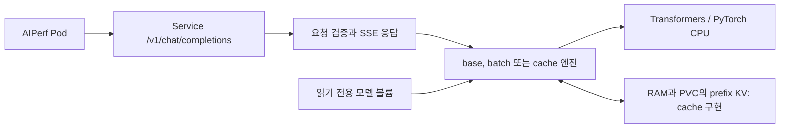
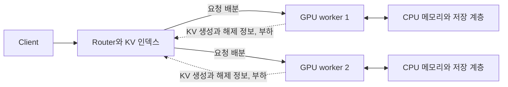

# Transformers CPU 기반 LLM 추론 엔진 실험 리포트

로컬 CPU 환경에서 LLM을 컨테이너로 배포하고, 추론 엔진 최적화가 처리량과 응답 지연에 미치는 영향을 비교했습니다. SmolLM2-135M-Instruct FP32를 대상으로 기본 직렬 추론, 요청 배칭, prefix KV 캐시를 측정했습니다. 노드 장애 복구와 CPU 기반 HPA도 별도 부하로 확인했습니다.

이 문서의 성능 결과는 2026-09-21 UTC 측정을 기준으로 합니다. 상세 수치와 이미지는 [테스트 결과](reports/transformers/README.md)에서 확인할 수 있습니다.

## 1. 핵심 결과

동시성 8에서 기본 엔진은 45.09 tok/s, 배칭은 79.32 tok/s, 캐시는 48.97 tok/s였습니다. 배칭은 처리량과 TTFT, 요청 지연 p95를 개선했지만 ITL은 악화됐습니다. 캐시는 반복 입력에서 TTFT를 줄였으며, 처리량 개선은 배칭보다 작았습니다.

- **배칭:** 동시성 8에서 base 대비 처리량 75.9% 증가, TTFT 평균 57.0% 감소. ITL 평균은 19.20 ms에서 37.60 ms로 증가했습니다.
- **캐시:** 동시성 1에서 TTFT 평균 45.5% 감소, 처리량 7.3% 증가. 동시성 8에서는 처리량 8.6% 증가, TTFT 평균 8.9% 감소였습니다.
- **요청 검증:** 36개 측정 단계의 본 요청 3,600건과 워밍업 72건을 확인했습니다. 본 측정의 오류와 출력 길이 불일치는 모두 0건입니다.
- **장애 복구:** 60초 toleration에서 pause와 SIGKILL 후 대체 Pod Ready까지 각각 115.4초와 115.9초가 걸렸습니다. 관측 구간에는 실험별 요청 오류 8건이 발생했습니다.
- **HPA:** replica와 ready endpoint의 1→4→1 변화를 확인했습니다. 고부하 233건과 저부하 5건은 모두 성공했습니다.

| 요구사항 | 수행 내용과 근거 |
| --- | --- |
| 장비와 목표에 따른 기술 선택 | CPU에서 실행할 수 있는 소형 FP32 모델과 배칭 및 KV 재사용을 구현할 수 있는 런타임 선택. 2절 |
| 이미지 빌드, 로드와 Kubernetes 배포 | 공통 Dockerfile의 구현별 타깃, Deployment와 Service, 실행 이미지 확인. 3절 |
| 다양한 길이의 프롬프트 100건과 동시성 증가 | 두 길이 그룹의 입력 16개를 반복해 동시성별 본 요청 100건을 측정했습니다. 서로 다른 프롬프트 100개를 사용한 조건은 포함하지 않았습니다. 4절 |
| 베이스라인과 최소 두 가지 최적화 비교 | base, 배칭, KV 캐시를 같은 자원과 부하로 각각 3회 측정. 5절과 6절 |
| 개선과 악화의 원인 분석 | 직렬 대기, 배칭의 처리량과 ITL 변화, 캐시의 prefill 재사용 효과 분석. 7절 |
| 추가 운영 실험 | 노드 pause와 SIGKILL, CPU 기반 HPA 증가와 축소 확인. 8절과 9절 |
| 결과의 적용 범위 | 모델, 입력 재사용과 공유 호스트 조건에 따른 해석 범위 정리. 10절과 11절 |

## 2. 환경과 기술 선택

### 실행 환경

| 항목 | 조건 |
| --- | --- |
| 호스트 | Apple M5 Pro, macOS 26.6.2 |
| Docker | 29.5.3, aarch64, 할당 CPU 15개와 메모리 약 23.92 GiB |
| 모델 | SmolLM2-135M-Instruct, FP32 |
| 추론 런타임 | Transformers 4.57.6, torch 2.10.0, CPU 전용 실행 |
| Benchmark | kind control-plane 1개. 추론 Pod 8 CPU와 16 GiB, PyTorch 4스레드. AIPerf Pod 1 CPU와 1 GiB |
| Availability | control-plane 1개, monitor worker 1개, engine worker 2개. 추론 Pod 2개, Pod당 2 CPU와 2 GiB, PyTorch 2스레드 |
| HPA | Availability와 같은 노드 구성. 추론 Pod 1~4개, Pod당 2 CPU와 2 GiB, PyTorch 2스레드 |

측정 워크로드는 `requests=limits`로 설정했습니다. Benchmark의 추론과 AIPerf는 같은 노드에 배치했으며, Availability와 HPA는 Kubernetes v1.36.4의 별도 멀티 노드 클러스터에서 실행했습니다. kind 노드는 한 Docker 호스트의 자원을 공유합니다.

모델의 리비전과 체크섬은 [모델 설정](../config/models/smollm2-135m-transformers.env), 런타임 의존성은 [requirements.txt](../src/transformers_cpu/requirements.txt)에 고정했습니다. 호스트와 이미지 정보는 [환경 기록](reports/transformers/benchmark-suite-20260921-101648-638635/environment/run.json)에 있습니다.

### 선택 근거

| 선택 | 이유 |
| --- | --- |
| SmolLM2-135M-Instruct FP32 | 로컬 CPU에서 기본 추론과 반복 성능 측정을 수행할 수 있는 소형 모델을 사용했습니다. 모델 실행 비용을 줄여 서빙 구조와 엔진 최적화의 차이를 비교했습니다. |
| Transformers와 PyTorch | CPU 및 GPU 실행을 지원하고, 범용적으로 사용되는 런타임을 선택하였습니다. |
| Docker와 kind | 로컬 Kubernetes 환경에서 이미지 배포, 노드 장애와 Pod 재스케줄링을 같은 도구로 확인하기 위해 사용했습니다. |
| AIPerf | 범용 LLM 성능 측정 도구로서 동시성 부하, 스트리밍 응답과 요청별 성능 지표를 같은 방식으로 비교하기 위해 선택했습니다. |

모델과 dtype 선택의 목적은 로컬에서 기본적인 추론과 성능 실험을 수행하는 것입니다. 모델 간 품질 비교나 양자화에 따른 성능 및 품질 변화는 이번 실험에서 평가하지 않았습니다.

## 3. 서빙 구조와 배포 검증

### 요청 처리 구조

`/v1/chat/completions`는 AIPerf를 통한 성능 측정을 지원하기 위해 제공합니다. API가 요청 검증, 채팅 템플릿 적용, 스트리밍, 토큰 집계와 길이 제한을 담당하고, 엔진 구현을 교체해 동일한 요청 경로에서 비교합니다.

| 구성 | 구현과 역할 |
| --- | --- |
| base | HTTP 요청을 수락한 뒤 하나의 모델 작업자에서 추론을 직렬 실행합니다. |
| enhanced-batch | 최대 4개 요청을 모아 배치 처리합니다. 진행 중인 배치가 끝나면 다음 요청을 수용합니다. |
| enhanced-cache | base의 직렬 실행 경로에 prefix KV 조회, 복원과 저장을 추가합니다. RAM과 디스크 계층을 사용합니다. |
| base-metric | 장애와 HPA 실험에서 서버 지표를 수집하는 구현입니다. 최적화 benchmark와는 별도 자원 조건으로 실행합니다. |

모델 연산과 토큰화는 라이브러리가 담당합니다. 저장소에는 API, 요청 작업자, 배치 실행, 캐시 관리와 측정 자동화가 구현돼 있습니다. 배칭과 캐시는 독립된 구현이며 둘을 결합한 성능 결과는 없습니다. 구조와 API는 [Transformers 가이드](guides/inference-engine.md), 이미지는 [Dockerfile](../src/Dockerfile)에 정의돼 있습니다.

### 배포와 측정 검증

[공통 Dockerfile](../src/Dockerfile)의 Transformers 구현별 타깃으로 이미지를 구성하고, 모델은 읽기 전용 볼륨으로 연결했습니다. 성능 실험은 `local/transformers-base:0.1.0`, `local/transformers-enhanced-batch:0.1.0`, `local/transformers-enhanced-cache:0.1.0`를 같은 Deployment와 Service에 순차 적용했습니다. 각 동시성 단계에서 새 추론 Pod를 준비한 후 요청했으며, 저장된 Pod UID 36개가 모두 다릅니다. 실행 이미지 ID는 [실행 기록](reports/transformers/benchmark-suite-20260921-101648-638635/run.json)에, 이미지별 소스 체크섬은 환경 기록에 남아 있습니다.

최종 기록에서 본 요청 3,600건과 워밍업 72건을 확인했습니다. 본 측정의 요청 오류와 출력 길이 불일치는 0건이었습니다. 요청 호환성, 배치 취소와 완료 행 제거, 캐시 복원에 대한 검증 절차는 [추론 엔진 가이드](guides/inference-engine.md)에 정리했습니다. 생성 내용의 정답률과 구현 간 품질 동등성은 별도로 평가하지 않았습니다.

## 4. 실험 설계와 비교 조건

### 부하와 입력 구성

| 항목 | 설정 |
| --- | --- |
| 요청 대상 | `http://transformers-base:8000/v1/chat/completions`, 스트리밍 |
| 입력과 출력 목표 | 64/32토큰과 256/64토큰, 생성 설정상 비율 각 50% |
| 데이터셋 | 고유 입력 16개, seed 42, 순차 반복 |
| 조건별 요청 | 워밍업 2건 후 본 측정 100건 |
| 동시성 | 1, 2, 4, 8 |
| 반복 | 구현별 3회, 각 반복에서 실행 순서 순환 |
| 출력 조건 | `ignore_eos=true` |
| 클라이언트 | AIPerf 0.12.0, worker 1개, 요청 timeout 3,600초 |
| 실행 방식 | 고정 동시성 부하, 모든 실험 순차 실행 |

입력 목표 길이와 실제 서버 토큰 수는 다릅니다. 36개 단계의 AIPerf 집계값에서 입력 토큰의 최솟값은 94, 최댓값은 286, 평균은 153.52였고 출력 평균은 41.92토큰이었습니다. 두 길이 그룹을 반복한 본 요청의 구성은 다음과 같습니다. 실제 입력 토큰 수에는 채팅 템플릿이 반영됩니다.

| 서버 입력 토큰 | 출력 토큰 | 단계별 요청 수 | 실제 비율 |
| ---: | ---: | ---: | ---: |
| 94 | 32 | 69 | 69% |
| 286 | 64 | 31 | 31% |

따라서 두 길이 그룹을 포함한 100건의 요청을 비교했지만, 서로 다른 프롬프트 100개를 사용한 실험은 아닙니다. 설정의 50:50과 유한한 입력 집합을 반복한 실제 요청 비율을 구분합니다. 입력 반복은 캐시 재사용에 유리하므로 신규 입력이나 낮은 재사용률의 부하로 일반화하지 않습니다.

### 동일하게 유지한 조건

같은 동시성에서 구현을 비교할 때 모델, dtype, 입력 구성, 클라이언트 설정, 출력 길이, replica 1개, CPU와 메모리, 배치 노드를 동일하게 유지했습니다. 추론은 PyTorch 4스레드, context 1,024토큰, 입력 상한 768토큰과 출력 상한 128토큰을 사용했습니다.

추론 Pod와 AIPerf Pod는 같은 control-plane 노드에 배치했습니다. 저장된 추론 Pod 36개의 UID가 모두 다르며 Guaranteed QoS를 확인했습니다. CPU 할당량은 8개이고 PyTorch 연산 스레드는 4개로 설정했으며, 할당량은 실제 CPU 사용량과 다릅니다.

각 동시성 전에 추론 Pod를 재시작했습니다. 배칭은 최대 요청 4개와 대기 시간 5 ms를 사용했습니다. 캐시는 RAM 64 MiB, 디스크 1,024 MiB, 최소 재사용 prefix 32토큰으로 설정했습니다. 공통 자원 한도는 같지만 최적화 구현에 필요한 메모리 구조까지 동일한 것은 아닙니다.

| 실험 조건 | 상태 초기화 |
| --- | --- |
| base | 새 Pod에서 기본 직렬 추론 |
| enhanced-batch | 새 Pod에서 배칭. 요청 간 prefix 캐시 보존 없음 |
| enhanced-cache | 각 반복의 첫 동시성 전에 PVC 캐시 삭제, 이후 동시성 사이에는 보존. RAM은 Pod 재시작으로 초기화 |

배칭과 캐시는 독립된 두 최적화입니다. 캐시 초기화는 첫 워밍업 전에 수행하므로, 워밍업과 본 측정 중에는 다시 채우고 재사용합니다. 동시성마다 PVC를 비우는 조건과 비교한 실험은 이번 측정에 포함하지 않았습니다.

### 집계 기준

성능 지표는 AIPerf의 본 측정 요청을 기준으로 합니다. 표의 평균은 세 실행의 평균이며, `±`는 실행 간 표본 표준편차입니다. p95도 실행별 p95의 평균으로, 전체 요청을 합쳐 계산한 p95와 다릅니다. 변화율은 반올림 전 값으로 계산했습니다.

본 측정 시간은 워밍업, Pod 준비와 결과 수집을 제외합니다. SSE 청크 하나에 여러 토큰이 포함될 수 있어 클라이언트 ITL과 모델 내부의 decode 연산 시간은 구분합니다. CPU 사용량과 메모리 working set은 구현별 비교값으로 집계하지 않았습니다.

측정 설정과 원본 구조는 [AIPerf 가이드](guides/aiperf.md), 집계값은 [반복 측정 CSV](reports/transformers/benchmark-suite-20260921-101648-638635/summary.csv)에 있습니다.

## 5. 베이스라인 결과와 병목

각 동시성에서 세 실행을 합쳐 본 요청 300건이 성공했고 오류는 없었습니다.

| 동시성 | 출력 처리량 (tok/s) | 요청 처리량 (req/s) | TTFT 평균 / p95 (ms) | ITL 평균 / p95 (ms) | 요청 지연 p95 (ms) |
| --- | ---: | ---: | ---: | ---: | ---: |
| 1 | 44.79 ± 0.17 | 1.069 | 138.88 / 233.32 | 19.33 / 20.16 | 1491.54 |
| 2 | 44.96 ± 0.11 | 1.072 | 1063.57 / 1589.18 | 19.27 / 20.04 | 2185.96 |
| 4 | 45.27 ± 0.07 | 1.080 | 2874.59 / 3729.29 | 19.12 / 19.87 | 4330.07 |
| 8 | 45.09 ± 0.08 | 1.076 | 6408.65 / 7300.41 | 19.20 / 20.04 | 7895.86 |

동시성 1에서 8로 늘려도 출력 처리량은 44.79~45.27 tok/s 범위였습니다. 반면 TTFT 평균은 138.88 ms에서 6,408.65 ms로 늘었고 ITL 평균은 약 19 ms로 유지됐습니다. 요청 지연 p95도 1,491.54 ms에서 7,895.86 ms로 증가했습니다.

이는 요청이 늘어도 한 번에 하나만 실행하는 base의 구조와 일치합니다. 실행 중인 요청의 토큰 생성 간격은 비슷하지만 후속 요청의 첫 토큰 대기가 누적됩니다. 이 자료만으로 연산과 메모리 대역폭 중 어느 쪽이 지배적인 병목인지 확정할 수는 없습니다. 입력 길이별 지연과 모델 연산의 세부 비용은 분리해 측정하지 않았습니다.

## 6. 최적화 구현과 before/after

### 최적화 1: 요청 배칭

기본 엔진의 직렬 대기를 줄이기 위해 여러 요청의 연산을 하나의 배치로 실행하도록 구성했습니다. 배칭 작업자는 최대 4개 요청을 5 ms 동안 모으고, 길이가 다른 입력에는 왼쪽 패딩과 요청별 attention mask, position ID를 적용합니다.

요청마다 샘플링 옵션, 출력 제한과 취소 상태를 분리하며, 완료된 행은 다음 decode 전에 배치와 KV에서 제거합니다. 새 요청은 진행 중인 배치에 합류하지 않고 다음 배치를 기다립니다. 따라서 이번 구현은 continuous batching과 달리 현재 배치의 완료 시점이 후속 요청의 대기에 영향을 줍니다. 구현은 [배칭 엔진](../src/transformers_cpu/enhanced/batch/engine.py)에 있습니다.

배치 실행은 전체 처리량을 높이는 한편, 각 요청이 다른 행을 포함한 연산의 완료를 기다리는 비용을 만듭니다. 길이가 다른 입력의 패딩과 요청별 KV를 유지하는 메모리 비용도 추가됩니다.

### 최적화 2: RAM과 디스크 prefix KV 캐시

반복되는 입력의 prefill을 줄이기 위해 입력 토큰의 prefix에 대응하는 KV 텐서를 저장했습니다. 캐시에 저장하는 대상은 입력의 KV 상태이며, 복원한 상태에서 나머지 계산과 생성을 수행합니다.

캐시는 가장 긴 공통 prefix를 찾아 복원합니다. 입력 전체가 일치해도 마지막 입력 토큰을 다시 계산해 logits를 얻습니다. RAM 한도를 넘는 항목은 디스크로 내리고, 디스크 hit는 상태를 읽어 복원합니다. 교체는 LRU를 사용하며 모델과 라이브러리, dtype, context 등의 조건으로 namespace를 나눕니다. 구현은 [캐시 엔진](../src/transformers_cpu/enhanced/cache/engine.py)에 있습니다.

추가 비용은 캐시 조회, KV 직렬화와 복원, 저장 공간과 디스크 입출력입니다. 디스크 저장은 동기식이며, 정상 종료 시 RAM 항목을 저장합니다. 이번 부하는 입력 16개를 반복하므로 입력 재사용에 유리한 조건입니다. RAM hit, 디스크 hit와 퇴출 비용을 분리한 성능 비교는 수행하지 않았습니다.

### 비교 결과

아래 표의 모든 조건에서 세 실행의 본 요청 300건이 성공했고 오류는 없었습니다. base 결과는 5절과 같은 측정입니다.

| 구현 | 동시성 | 출력 처리량 (tok/s) | TTFT 평균 / p95 (ms) | ITL 평균 / p95 (ms) | 요청 지연 p95 (ms) |
| --- | ---: | ---: | ---: | ---: | ---: |
| enhanced-batch | 1 | 45.39 ± 0.07 | 145.32 / 239.77 | 18.84 / 19.72 | 1467.03 |
| enhanced-batch | 2 | 62.21 ± 0.14 | 306.36 / 415.15 | 26.88 / 42.84 | 1741.71 |
| enhanced-batch | 4 | 78.53 ± 0.15 | 733.91 / 762.99 | 38.03 / 46.08 | 2174.95 |
| enhanced-batch | 8 | 79.32 ± 1.05 | 2756.33 / 2934.21 | 37.60 / 45.74 | 4336.87 |
| enhanced-cache | 1 | 48.08 ± 0.12 | 75.73 / 127.16 | 19.29 / 20.15 | 1387.20 |
| enhanced-cache | 2 | 48.90 ± 0.19 | 913.21 / 1406.97 | 19.24 / 20.11 | 1994.96 |
| enhanced-cache | 4 | 49.06 ± 0.09 | 2587.39 / 3367.36 | 19.19 / 20.00 | 3963.82 |
| enhanced-cache | 8 | 48.97 ± 0.20 | 5837.01 / 6648.95 | 19.22 / 20.07 | 7304.73 |

동시성 8에서 base 대비 변화는 다음과 같습니다. 지연 열의 음수는 감소, 양수는 증가를 나타냅니다.

| 구현 | 출력 처리량 | TTFT 평균 | 요청 지연 p95 |
| --- | ---: | ---: | ---: |
| enhanced-batch | +75.9% | -57.0% | -45.1% |
| enhanced-cache | +8.6% | -8.9% | -7.5% |

성능 표의 원본은 [3회 반복 보고서](reports/transformers/benchmark-suite-20260921-101648-638635/summary.md)와 [전체 지표 CSV](reports/transformers/benchmark-suite-20260921-101648-638635/summary.csv)입니다.

## 7. 결과 해석과 효과가 제한된 조건

### 배칭은 처리량과 완료 지연을 개선했지만 ITL은 늘었습니다

배칭의 동시성 8 처리량은 45.09 tok/s에서 79.32 tok/s로 증가했고, TTFT 평균은 6408.65 ms에서 2756.33 ms로 줄었습니다. 요청 지연 p95도 7895.86 ms에서 4336.87 ms로 감소했습니다. 여러 요청을 함께 실행하는 구조가 base의 직렬 대기를 줄이는 방향이며, 이 변화와 측정 결과가 일치합니다.

반면 ITL 평균은 19.20 ms에서 37.60 ms로 증가했습니다. 한 요청의 다음 토큰은 다른 요청을 포함한 배치 연산이 끝난 뒤 받을 수 있습니다. 배치 연산과 요청 간 간섭이 ITL 증가의 원인이라는 가설을 세울 수 있지만, 연산과 패딩, 메모리 접근 시간을 분리해 측정하지 않아 각 원인의 기여도는 확정하지 않았습니다.

동시성 1에서는 처리량이 1.3% 증가했지만 TTFT는 138.88 ms에서 145.32 ms로 늘었습니다. 함께 처리할 요청이 없는 조건에서도 배치 대기와 스케줄링 비용이 남는다는 해석과 일치합니다. 다만 5 ms 대기와 나머지 실행 비용의 기여도를 분리한 결과는 없습니다.

### 최대 배치 크기 이후에는 처리량보다 대기가 늘었습니다

동시성 2와 4에서 배칭의 처리량은 base 대비 38.4%, 73.5% 증가했습니다. 동시성 4에서 8로 높였을 때는 78.53 tok/s에서 79.32 tok/s로 약 1.0% 증가하는 데 그쳤고, TTFT 평균은 733.91 ms에서 2756.33 ms로 늘었습니다.

최대 배치가 4개이고 진행 중인 배치에 새 요청을 넣지 않으므로, 추가 요청은 다음 배치를 기다립니다. 이번 설정에서는 동시성 4 이후의 부하 증가가 처리량보다 대기 시간에 크게 반영됐습니다. 최대 요청 4개와 대기 시간 5 ms가 최적값임을 확인한 것은 아닙니다.

### 캐시 이득은 첫 토큰에 집중됐고 직렬 대기는 남았습니다

캐시의 동시성 1 TTFT 평균은 138.88 ms에서 75.73 ms로 45.5% 줄었습니다. 반면 ITL 평균은 19.33 ms와 19.29 ms로 비슷했고 처리량 증가는 7.3%였습니다. 입력 prefill의 재사용은 첫 토큰을 앞당겼지만 이후 생성 비용은 유지되는 결과입니다.

base의 동시성 1 평균 요청 지연 934.88 ms 중 TTFT는 138.88 ms, decode 구간은 796.00 ms였습니다. 첫 토큰 이후 생성 시간이 큰 비중을 차지해 입력 계산을 줄이는 효과가 전체 처리량 증가로 그대로 이어지지는 않았습니다. TTFT에는 입력 계산 외 클라이언트와 전송 비용도 포함됩니다.

동시성 8에서는 처리량이 8.6% 증가했고 TTFT는 8.9% 줄었습니다. 캐시를 적용해도 요청을 하나씩 실행하는 구조는 유지되므로, 동시성이 높아지면 첫 토큰까지의 직렬 대기가 남습니다. 입력 재사용률이나 RAM과 디스크 hit 경로를 분리하지 않았으므로 각 경로의 기여도를 수치로 확정하지 않았습니다.

### 해석 범위

한 종류의 소형 FP32 모델과 한 대의 로컬 호스트에서 얻은 결과입니다. 입력은 두 길이 그룹이며 고유 입력 수가 작습니다. 짧은 성능 실험과 3회 반복은 구현 간 차이를 비교하는 근거가 되지만, 장시간 안정성이나 실제 사용자 부하를 대표하지는 않습니다. 요청 성공과 출력 길이 검증도 생성 품질 평가를 대신하지 않습니다.

## 8. 추가 실험: 노드 장애와 재스케줄링

서로 다른 engine worker에 base-metric Pod를 하나씩 배치하고 worker2를 pause 또는 SIGKILL했습니다. 생존 worker3에서 대체 Pod를 준비한 후 원래 노드를 복구했습니다. 두 실험은 각각 1회이며 NoExecute toleration은 60초입니다.

클라이언트는 동시성 4, timeout 30초, 매 요청 새 연결을 사용했습니다. 워밍업 90초, 정상 구간 150초, 대체 Pod 준비 후 90초와 노드 복구 후 90초를 관측했습니다.

### 복구 타임라인

아래 시간은 장애 요청부터 상태를 처음 관측할 때까지의 경과 시간입니다. 노드 복구 열은 pause 해제 또는 재시작 요청을 기준으로 계산했습니다.

| 장애와 toleration | Node NotReady 관측 | 대체 Pod Ready | 노드 복구 요청→Node Ready |
| --- | ---: | ---: | ---: |
| pause, 60초 | 49.9초 | 115.4초 | 10.4초 |
| SIGKILL, 60초 | 51.1초 | 115.9초 | 1.6초 |

노드 이상은 약 50초 후 관측됐으며 대체 Pod Ready까지는 약 115초가 걸렸습니다. 60초 toleration에는 노드 장애 감지 시간이 포함되지 않습니다. 감지 이후 toleration 대기와 Pod 준비가 더해진 결과이며, 이 관측 시각만으로 내부 처리 단계별 시간을 정확히 나누지는 않았습니다.

### 요청 영향과 해석

| 장애와 toleration | 성공 / 오류 | 오류율 | 성공 요청 평균 지연 |
| --- | ---: | ---: | ---: |
| pause, 60초 | 414 / 8 | 1.90% | 3.794초 |
| SIGKILL, 60초 | 428 / 8 | 1.83% | 3.704초 |

pause 오류는 timeout 8건이며 장애 전 3.4초부터 장애 후 45.6초 사이에 시작된 요청입니다. 장애 순간 진행 중인 요청과 endpoint 제외 전 요청이 영향을 받았습니다. SIGKILL은 timeout 2건과 연결 오류 6건입니다.

요청 집계는 `[collection_start, experiment_complete)`에 시작된 요청을 대상으로 하며 관측 종료 후 완료된 요청도 포함합니다. 워밍업을 포함한 전체 AIPerf 성공 수 514건, 520건과 구분합니다. 두 실험 모두 원래 노드를 복구하기 전에 생존 노드에 대체 Pod가 준비됐습니다. 종료 절차에서는 노드를 복구한 뒤 추론 Pod를 두 worker에 다시 분산했습니다. 이 재분산은 자동 복구 관측과 구분합니다.

그래프의 0초는 장애 요청 시각입니다. 성공 요청은 완료 시각, 오류는 AIPerf 오류 로그 시각에 표시하며 빨간 ×의 높이 10은 지연값이 아닙니다. 대체 Pod 복구는 확인했지만 두 실험 모두 요청 오류가 있었으므로 무중단 서비스로 해석하지 않습니다. [pause 상세](reports/transformers/availability-pause-60s-20260921-122415-594492/summary.md), [SIGKILL 상세](reports/transformers/availability-sigkill-60s-20260921-123349-464541/summary.md)

## 9. 추가 실험: CPU 기반 HPA

CPU request 대비 평균 사용률 50%를 목표로 replica 1~4개를 설정했습니다. 확장 안정화는 0초, 축소 안정화는 120초이며 양방향 모두 30초당 Pod 1개를 변경합니다. 고부하는 동시성 8, 저부하는 동시성 1과 0.02 req/s입니다.

고부하에서 1→4로 증가한 뒤 저부하로 전환해 4→1 축소까지 확인하는 시나리오를 1회 실행했습니다. 성공 판정은 HPA current/desired, Deployment, Ready Pod와 ready endpoint가 목표 수로 일치하고 유지되는지 확인했습니다.

| 시나리오 | Replica 변화 | 증가 확인 | 증가 상태 유지 | 축소 확인 | 최소 replica 유지 |
| --- | --- | ---: | --- | ---: | --- |
| 스케일 아웃→인 | 1→4→1 | 129.6초 | 60초 | 212.1초 | 60초 |

증가 시간은 고부하 시작 요청부터, 축소 시간은 저부하 전환 요청부터 계산했습니다. 클라이언트 초기화와 부하 전환 시간이 포함되므로 순수 HPA 반응 시간과 다릅니다. 축소 판정에는 종료 중인 Pod가 없는 조건도 포함했습니다.

| 부하 구간 | 성공 / 오류 | 오류율 |
| --- | ---: | ---: |
| 고부하 | 233 / 0 | 0.00% |
| 저부하 | 5 / 0 | 0.00% |

CPU 상승 이후 HPA가 replica를 늘리고 새 Pod가 Ready 상태와 Service endpoint에 편입되는 흐름을 확인했습니다. 확장 후 각 engine worker에 Pod 2개가 배치됐으며 고부하 요청 233건은 모두 성공했습니다.

축소 시나리오에서는 저부하 전환 후 4→3→2→1로 줄었습니다. 최소 replica 유지 구간 안에서 새로 시작하고 완료한 요청 1건도 성공했습니다. 저부하 요청은 총 5건으로, 최종 Service 경로의 동작을 확인한 결과입니다.

같은 부하에서 replica를 고정한 대조 실험은 수행하지 않았습니다. 고부하와 저부하는 요청량도 달라 두 구간의 지연 차이를 HPA만의 개선 효과로 해석하지 않습니다. 또한 같은 Docker 호스트 안에서 Pod 수를 조정했으므로 물리 노드 증설에 따른 처리 용량 증가는 측정하지 않았습니다.

초기 CPU 공백과 HPA desired 0은 지표가 채워지기 전 구간이며, 실제 가용 Pod와 ready endpoint는 각각 1개였습니다.

요청 처리량 패널은 서버 counter의 1분 rate, TTFT p95는 서버 histogram의 1분 추정치로 AIPerf 실행별 p95와 집계가 다릅니다. 상세 근거는 [스케일 아웃 및 축소 보고서](reports/transformers/hpa-20260921-124439-448222/summary.md)에 있습니다.

## 10. 대규모 GPU 운영으로의 확장

현재 실험에서 유지할 수 있는 것은 공통 요청 계약, 동일 조건 비교, 배칭과 KV 재사용이라는 최적화 방향, 실제 요청과 서비스 상태를 함께 검증하는 방법입니다. GPU에서 사용할 엔진 구현과 파라미터, 라우팅, 장애 범위와 저장소는 새로운 조건에 맞춰 설계가 필요합니다.

### GPU 특성과 병목에 맞는 배치 구조

CPU에서 사용한 슬롯 수와 prefill chunk를 GPU에 그대로 적용하지 않습니다. 모델과 GPU별로 prefill과 decode의 연산 시간, 메모리 대역폭, KV 메모리 용량, 실행 중인 요청 수와 입력 길이의 영향을 다시 측정해야 합니다.

GPU에서는 prefill과 decode를 함께 배치하는 방식이 자원 활용과 지연에 영향을 줍니다. vLLM도 chunked prefill과 배치 토큰 예산을 조정해 ITL, TTFT와 처리량 사이의 균형을 바꾸도록 설명합니다. [vLLM 최적화 가이드](https://docs.vllm.ai/en/latest/configuration/optimization/)

따라서 GPU 구현에서는 활성 요청 수, 배치 토큰 예산, prefill chunk와 decode 우선순위를 조합해 측정합니다. 현재 배칭에서 확인한 ITL과 완료 지연 악화를 판단 기준에 포함하고, 목표 지연 안에서 처리량을 최대화하는 구성을 선택합니다. 모델을 여러 GPU에 나눌 경우에는 GPU 간 통신과 동기화 비용도 포함해야 합니다.

### CPU와 GPU 메모리를 고려한 KV 캐시

KV 캐시를 GPU 메모리 밖으로 확장하면 저장 용량과 함께 CPU 메모리↔GPU 메모리 전송 비용을 고려해야 합니다. 복원할 KV의 크기, 전송 대역폭과 지연, 복사와 연산의 중첩 여부를 측정해, 재계산을 줄이는 이득이 전송과 관리 비용보다 큰 경우에 재사용하도록 설계합니다.

NVIDIA Dynamo는 worker의 KV cache offloading을 통해 GPU 메모리 외에 CPU 메모리와 디스크를 활용하는 구성을 제공합니다. 이를 기준으로 GPU, CPU와 디스크의 계층별 용량, 교체 정책과 복원 시간을 평가합니다. 현재 CPU의 RAM과 디스크 실험만으로 이 경로의 GPU 성능을 예측할 수는 없습니다. [Dynamo KV cache offloading](https://docs.nvidia.com/dynamo/latest/kubernetes/kv-cache-offloading/overview)

### Replica의 KV 정보를 활용하는 router-worker 구조

추론 엔진 replica가 늘어나면 동일한 요청도 어느 worker로 전달되는지에 따라 재사용 가능한 KV가 달라집니다. 여러 worker의 캐시를 활용하려면 worker가 보유한 KV 정보를 router에 전달하고, router가 캐시 재사용 가능성과 worker 부하를 함께 고려하는 구조가 필요합니다.

이 요구사항을 구현하는 기준 구조로 NVIDIA Dynamo의 KV-aware routing을 검토합니다. Dynamo는 worker의 KV 생성과 해제 이벤트로 캐시 인덱스를 갱신하고, prefix 재사용량과 진행 중인 prefill 및 decode 부하를 함께 반영해 worker를 선택합니다. [Dynamo KV-aware routing](https://docs.nvidia.com/dynamo/dev/knowledge-base/concepts/system-architecture/kv-aware-routing)

다음 그림은 이 리포트에서 제안하는 구성입니다.

구체적인 설계에서는 worker 식별자, 모델과 캐시 호환성, prefix 또는 블록 식별 정보, 생성과 해제 이벤트를 관리합니다. worker 종료, 재시작과 이벤트 지연 때 오래된 캐시 정보를 제거하고, router의 인덱스를 복구할 수 있어야 합니다. 캐시가 많은 worker에 요청이 집중되지 않도록 큐와 실행 부하를 함께 반영합니다.

router에 전달하는 캐시 위치 정보와 실제 KV 데이터 전송은 구분합니다. 캐시를 가진 worker로 요청을 보내는 것만으로 재사용할 수 있는 경우도 있고, 다른 worker에서 실행하려면 별도 KV 전송 경로가 필요할 수 있습니다. 그 경우에는 전송량과 네트워크 비용, KV 형식과 모델 호환성을 별도로 검증합니다. 최종 비교는 단순 분산 대비 hit 비율, TTFT p95, ITL p95, 처리량과 worker별 부하 편중을 기준으로 합니다.

### 추론 엔진 외의 HA와 PV 설계

로컬 실험은 노드 한 개의 중단과 Pod 재스케줄링을 확인했습니다. 운영 환경에서는 node, AZ, region을 장애 범위로 구분하고 router와 worker, 제어 계층과 저장소를 함께 고려해야 합니다. Kubernetes의 다중 AZ 구성과 Pod 분산은 이 설계의 기반이며, region 전체 장애 복구는 별도 계획이 필요합니다. [Kubernetes 다중 zone 가이드](https://kubernetes.io/docs/setup/best-practices/multiple-zones/)

| 범위 | 설계 방향 | 검증할 내용 |
| --- | --- | --- |
| Node | router와 worker를 물리 노드에 분산하고, 생존 노드의 GPU와 메모리 여유를 확보합니다. | 노드 중단 후 라우팅 제외, 대체 worker 준비, 캐시가 없는 상태의 지연과 요청 오류 |
| AZ | worker, router와 주요 의존성을 AZ에 분산하고, 한 AZ가 사라져도 처리 가능한 용량을 계획합니다. | AZ 장애 시 남은 용량, 트래픽 전환, 제어 계층과 저장소의 가용성 |
| Region | region별 서비스 구성을 두고 전역 트래픽 전환과 모델 및 설정 배포를 설계합니다. | 전환 시간, 대체 region의 수용량, 필요한 데이터 복구와 region 간 통신 비용 |
| PV와 모델 저장소 | 모델 원본, 재생성 가능한 KV 캐시, 보존할 결과 자료의 저장 요구를 구분합니다. | 볼륨 접근 모드, node 및 AZ 제약, 재연결 시간, 모델 로딩과 읽기 성능 |

PV의 node affinity와 저장소 토폴로지는 대체 Pod가 배치될 위치를 제한할 수 있습니다. 로컬 캐시 PVC를 그대로 다중 노드나 다중 AZ 가용성의 근거로 사용할 수 없으며, CSI와 StorageClass의 특성에 맞춰 장애 시 접근 가능성을 확인해야 합니다. [Kubernetes PV node affinity](https://kubernetes.io/docs/concepts/storage/persistent-volumes/#node-affinity)

KV 캐시는 손실 시 재계산할 수 있도록 설계하되, 그동안의 지연 증가와 GPU 부하를 수용해야 합니다. 현재 디스크 캐시는 namespace별 단일 writer를 전제로 하므로, replica 여러 개가 하나의 PVC를 공유하는 확장에는 동시 접근과 소유권 설계가 추가로 필요합니다.

자동 확장도 GPU 환경에 맞춰 다시 평가합니다. CPU 사용률뿐 아니라 요청 큐, 처리 중인 토큰, GPU 메모리와 지연 목표를 후보 지표로 삼고, 새 GPU 확보, 모델 로딩과 캐시 준비까지의 시간을 포함합니다. 현재 HPA 실험에서 확장 중 timeout이 발생한 점을 고려해 최소 용량과 부하 수용 제한도 함께 설계합니다.

## 부록. 재현과 근거 자료

| 자료 | 연결 |
| --- | --- |
| 모델과 실행 환경 | [환경 기록](reports/transformers/benchmark-suite-20260921-101648-638635/environment/run.json), [모델 체크섬](../config/models/smollm2-135m-transformers.sha256) |
| 배포와 엔진 구현 | [Transformers CPU 가이드](guides/inference-engine.md) |
| 성능 재현 | [AIPerf 가이드](guides/aiperf.md), [실행 순서와 이미지 ID](reports/transformers/benchmark-suite-20260921-101648-638635/run.json) |
| 성능 수치 | [3회 반복 요약](reports/transformers/benchmark-suite-20260921-101648-638635/summary.md), [회차별 집계](reports/transformers/benchmark-suite-20260921-101648-638635/runs.csv) |
| 장애 실험 재현 | [Availability 가이드](guides/availability-test.md) |
| HPA 재현 | [HPA 가이드](guides/hpa-test.md) |
| 결과와 이미지 | [Transformers 테스트 결과](reports/transformers/README.md) |

요청 수, 출력 길이 불일치와 입력 토큰 분포는 각 sweep의 `c*/artifacts/profile_export_aiperf.json`을 확인했습니다. Pod UID와 QoS는 `c*/inference-pod.json`에서 확인했습니다. 개별 파일은 반복 요약의 회차별 링크 아래에 있습니다. 저장소에는 요약과 집계 지표, Pod 기록 및 본문에서 사용하는 이미지를 보관합니다.
