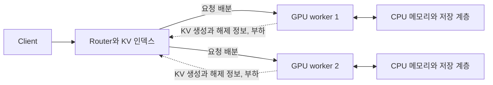

# Transformers CPU 기반 inference engine 실험 리포트

CPU 기반으로 local kubernetes 환경(kind)에서 inference engine을 컨테이너로 배포하고, 추론 최적화가 처리량과 응답 지연에 미치는 영향을 비교합니다.

SmolLM2-135M-Instruct FP32 모델을 사용하여 기본 추론(**baseline**), **request batching을 적용한 추론**, **prefix KV cache 재사용**을 적용한 추론에 대해서 각각 성능 측정을 진행하였습니다.

추가로 노드 장애 복구와 CPU 기반 HPA도 별도 테스트 시나리오로 진행하였습니다.

Benchmark 상세 수치는 [테스트 결과](reports/transformers/benchmark-suite-20260922-061851-685273/summary.md)에서 확인할 수 있으며, 노드 장애 테스트의 상세 정보는 [pause 상세](reports/transformers/availability-pause-60s-20260921-122415-594492/summary.md) 및 [SIGKILL 상세](reports/transformers/availability-sigkill-60s-20260921-123349-464541/summary.md), HPA 테스트의 상세 정보는 [HPA 보고서](reports/transformers/hpa-20260921-124439-448222/summary.md)에서 확인하실 수 있습니다.

## 1. 요약

Concurrency 1, 2, 4, 8에서 base, batch, cache를 각각 3회 측정한 평균입니다. 처리량은 tok/s를 기준으로 작성하였으며, 지연시간은 TTFT(ms)와 ITL(ms)값을 사용하였습니다.

base에서의 처리량(tok/s)은 43.44, 43.99, 44.33, 44.29 tok/s로 평탄했으며 TTFT 평균은 142.41, 1086.58, 2934.60, 6523.55 ms로 동시성이 증가할수록 증가하는 양상을 보였습니다. 동시성 2, 4, 8에서 batch는 base 대비 처리량을 높이고 TTFT를 줄였지만 ITL이 커졌습니다. cache는 모든 동시성에서 반복 입력의 TTFT를 줄였으며, 처리량 개선은 동시성 1에서는 batch보다 크고 동시성 2, 4, 8에서는 작았습니다. 동시성 1에서 batch는 base 대비 TTFT가 늘고 ITL은 줄었습니다.

| Concurrency | base (tok/s / TTFT ms / ITL ms) | batch (tok/s / TTFT ms / ITL ms) | cache (tok/s / TTFT ms / ITL ms) |
| ---: | --- | --- | --- |
| 1 | 43.44 / 142.41 / 19.89 | 44.41 / 146.24 / 19.35 | 47.13 / 76.98 / 19.68 |
| 2 | 43.99 / 1086.58 / 19.71 | 61.28 / 307.77 / 27.38 | 48.05 / 930.85 / 19.57 |
| 4 | 44.33 / 2934.60 / 19.54 | 77.06 / 738.56 / 38.99 | 47.96 / 2647.67 / 19.61 |
| 8 | 44.29 / 6523.55 / 19.57 | 77.56 / 2814.20 / 38.57 | 47.73 / 5991.29 / 19.70 |

## 2. 실험 환경

### 실행 환경

| 항목 | 조건 |
| --- | --- |
| 호스트 | Apple M5 Pro, macOS 26.6.2 |
| Docker | 29.5.3, aarch64, 할당 CPU 15개와 메모리 약 23.92 GiB |
| 모델 | SmolLM2-135M-Instruct, FP32 |
| 추론 런타임 | Transformers 4.57.6, torch 2.10.0, CPU 전용 실행 |
| Benchmark | kind control-plane 1개. 추론 Pod 8 CPU와 16 GiB, PyTorch 4스레드. AIPerf Pod 1 CPU와 1 GiB |
| Availability | control-plane 1개, monitor worker 1개, engine worker 2개. 추론 Pod 2개, Pod당 2 CPU와 2 GiB, PyTorch 2스레드 |
| HPA | Availability와 같은 노드 구성. 추론 Pod 1~4개, Pod당 2 CPU와 2 GiB, PyTorch 2스레드 |

본 실험 환경에 대한 제약조건은 [requirements.md](../docs/guides/requirements.md) 파일을 참고해주세요.
Benchmark에 사용되는 Kubernetes Pod의 resource는 추론 Pod가 requests와 limits 모두 CPU 8, memory 16Gi(Guaranteed QoS), AIPerf Pod가 CPU 1, memory 1Gi입니다. 

모델의 리비전과 체크섬은 [모델 설정](../config/models/smollm2-135m-transformers.env), 런타임 의존성은 [requirements.txt](../src/transformers_cpu/requirements.txt)에 작성해두었습니다. 

### 선택 근거

| 선택 | 이유 |
| --- | --- |
| SmolLM2-135M-Instruct FP32 | 로컬 CPU에서 기본 추론과 반복 성능 측정을 수행할 수 있는 소형 모델을 사용했습니다. 모델 실행 비용을 줄여 서빙 구조와 엔진 최적화의 차이를 비교하고자 하였습니다. |
| Transformers와 PyTorch | CPU 및 GPU 실행을 지원하고, 범용적으로 사용되는 런타임을 선택하였습니다. |
| Docker와 kind | 범용적으로 사용하는 container runtime(docker) 과 해당 container runtime에서 쉽게 kubernetes를 배포할 수 있어 선택하였습니다.  |
| AIPerf | 추론 엔진의 중요한 성능 지표를 뽑을 수 있으며, 여러 가지 LLM 성능 측정 benchmark 옵션을 제공하기에 선택하였습니다. |

## 3. 서빙 구조와 배포

### 요청 처리 구조

OpenAI API와 호환되는 `/v1/chat/completions`를 구현하여 AIPerf로 해당 API를 통해 성능 측정을 진행하였습니다. API가 요청 검증, chat template 적용, streaming, 토큰 집계와 길이 제한을 담당하고, 엔진 구현을 교체해 동일한 요청 경로에서 비교하였습니다.

| 구성 | 구현과 역할 |
| --- | --- |
| base | HTTP 요청을 수락한 뒤 하나의 worker에서 추론을 실행합니다. |
| enhanced-batch | 최대 4개 요청을 모아 배치 처리합니다. 진행 중인 배치가 끝나면 대기 중인 요청으로 다음 배치를 실행합니다. |
| enhanced-cache | base의 추론 실행 경로에 prefix KV 조회, load와 save를 추가합니다. RAM과 디스크 계층을 사용합니다. |

구현 내용은 [Source code](../src/transformers_cpu)에 작성되어 있으며, 이미지는 [Dockerfile](../src/Dockerfile)에 정의돼 있습니다.

### 배포와 측정 검증

이미지와 배포 리소스는 `src/Dockerfile`과 `k8s/` directory에 위치해 있습니다. 모델 가중치는 이미지에 포함하지 않고 kind 노드의 `/models`를 컨테이너에 읽기 전용으로 마운트합니다.

| 타깃 | 이미지 | 구성 |
| --- | --- | --- |
| `transformers-base` | `local/transformers-base:0.1.0` | 직렬 추론 |
| `transformers-enhanced-batch` | `local/transformers-enhanced-batch:0.1.0` | 배치 처리 |
| `transformers-enhanced-cache` | `local/transformers-enhanced-cache:0.1.0` | prefix KV 캐시 |

`k8s/`는 변형별 Deployment와 Service, 벤치마크 Job을 디렉터리 단위로 보관합니다. 

| 디렉터리 | 구성 |
| --- | --- |
| `k8s/transformers-base/` | `deployment.yaml`, `service.yaml` |
| `k8s/transformers-enhanced-batch/` | `deployment.yaml`, `service.yaml` |
| `k8s/transformers-enhanced-cache/` | `deployment.yaml`, `service.yaml`, `cache.yaml` (PVC, `/cache`) |
| `k8s/aiperf/` 및 `k8s/aiperf-smollm2/` | AIPerf `Job`과 결과 PVC, 토크나이저 마운트 |

세 추론 변형은 같은 `Deployment/transformers-base`와 `Service/transformers-base:8000`을 공유합니다.

## 4. 실험 설계와 비교 조건

### 부하와 입력 구성

| 항목 | 설정 |
| --- | --- |
| 요청 대상 | `http://transformers-base:8000/v1/chat/completions`, 스트리밍 |
| 입력과 출력 목표 | **64/32토큰과 256/64토큰**, 생성 설정상 비율 각 50% |
| 데이터셋 | **고유 입력 16개**, seed 42, 순차 반복 |
| 조건별 요청 | 워밍업 2건 후 본 측정 **100건** |
| 동시성 | **1, 2, 4, 8** |
| 반복 | 구현별 3회, 각 반복에서 실행 순서 순환 |
| 출력 조건 | `ignore_eos=true` |
| 클라이언트 | AIPerf 0.12.0, worker 1개, 요청 timeout 3,600초 |
| 실행 방식 | 고정 동시성 부하, 모든 실험 순차 실행 |

### 동일하게 유지한 조건

같은 동시성에서 구현을 비교할 때 Guaranteed QoS로 CPU 8개, Memory 16Gi로 동일하게 배포하였으며, 추론 엔진의 설정 값을 동일하게 유지하였습니다. 또한 각 테스트 전에 추론 Pod는 재시작하였습니다.

### 집계 기준

성능 지표는 AIPerf의 결과를 기준으로 합니다. 표의 평균은 세 실행의 평균이며, `±`는 실행 간 표본 표준편차입니다. p95도 실행별 p95의 평균이며, 전체 요청을 합쳐 계산한 p95와는 다릅니다. 변화율은 반올림 전 값으로 계산했습니다.

## 5. 베이스라인 결과와 병목

각 실행당 요청 100건이 모두 성공했고 오류는 없었습니다.

| 동시성 | 출력 처리량 (tok/s) | 요청 처리량 (req/s) | TTFT 평균 / p95 (ms) | ITL 평균 / p95 (ms) | 요청 지연 p95 (ms) |
| --- | ---: | ---: | ---: | ---: | ---: |
| 1 | 43.44 ± 0.32 | 1.036 | 142.41 / 241.23 | 19.89 / 20.68 | 1524.90 |
| 2 | 43.99 ± 0.25 | 1.049 | 1086.58 / 1622.09 | 19.71 / 20.36 | 2223.30 |
| 4 | 44.33 ± 0.16 | 1.057 | 2934.60 / 3793.09 | 19.54 / 20.35 | 4421.09 |
| 8 | 44.29 ± 0.05 | 1.057 | 6523.55 / 7426.80 | 19.57 / 20.36 | 8087.11 |

동시성 1에서 8로 늘려도 출력 처리량은 43.44~44.33 tok/s 범위였습니다. 반면 TTFT 평균은 142.41 ms에서 6,523.55 ms로 늘었고 ITL 평균은 약 19 ms로 유지됐습니다. 요청 지연 p95도 1,524.90 ms에서 8,087.11 ms로 증가했습니다.

이 결과는 한 번에 하나의 요청만 실행하는 직렬 추론 구조와 일치합니다. 동시성이 증가하면 추론 시작 전 대기 시간이 늘어나고, 이 시간이 TTFT에 포함됩니다. 이번 직렬 실행 조건에서는 ITL 평균이 약 19~20 ms로 유사하게 유지됐습니다.

## 6. 최적화 구현과 before/after

### 최적화 1: 요청 배칭

기본 엔진의 직렬 대기를 줄이기 위해 여러 요청의 연산을 하나의 배치로 실행하도록 구성했습니다. worker는 최대 4개 요청을 5 ms 동안 모으고, 길이가 다른 입력에는 왼쪽 패딩과 요청별 attention mask, position ID를 적용합니다.

요청마다 샘플링 옵션, 출력 제한과 취소 상태를 분리하며, 완료된 행은 다음 decode 전에 배치와 KV에서 제거합니다. 새 요청은 진행 중인 배치에 합류하지 않고 다음 배치를 기다립니다. 따라서 이번 구현은 continuous batching과 달리 현재 배치의 완료 시점이 후속 요청의 대기에 영향을 줍니다.

배치 실행은 전체 처리량을 높이는 한편, 각 요청이 다른 행을 포함한 연산의 완료를 기다리는 비용을 만듭니다. 길이가 다른 입력의 패딩과 요청별 KV를 유지하는 메모리 비용도 추가됩니다.

| 구현 | 동시성 | 출력 처리량 (tok/s) | TTFT 평균 / p95 (ms) | ITL 평균 / p95 (ms) | 요청 지연 p95 (ms) |
| --- | ---: | ---: | ---: | ---: | ---: |
| enhanced-batch | 1 | 44.41 ± 0.17 | 146.24 / 241.34 | 19.35 / 20.08 | 1492.39 |
| enhanced-batch | 2 | 61.28 ± 0.18 | 307.77 / 416.79 | 27.38 / 43.57 | 1755.97 |
| enhanced-batch | 4 | 77.06 ± 0.24 | 738.56 / 767.90 | 38.99 / 46.99 | 2212.23 |
| enhanced-batch | 8 | 77.56 ± 1.11 | 2814.20 / 3086.80 | 38.57 / 47.02 | 4521.92 |

### 최적화 2: RAM과 디스크 prefix KV 캐시

반복되는 입력의 prefill을 줄이기 위해 입력 토큰의 prefix에 대응하는 KV 텐서를 저장했습니다. 캐시에 저장하는 대상은 입력의 KV 상태이며, 복원한 상태에서 나머지 계산과 생성을 수행합니다.

캐시는 가장 긴 공통 prefix를 찾아 복원합니다. 입력 전체가 일치해도 마지막 입력 토큰을 다시 계산해 logits를 얻습니다. RAM 한도를 넘는 항목은 디스크로 내리고, 디스크 hit는 상태를 읽어 복원합니다. 교체는 LRU를 사용하며 모델과 라이브러리, dtype, context 등의 조건으로 namespace를 나눕니다.

추가 비용은 캐시 조회, KV 직렬화와 복원, 저장 공간과 디스크 입출력입니다. 디스크 저장은 동기식이며, 정상 종료 시 RAM 항목을 저장합니다. 이번 부하는 입력 16개를 반복하므로 입력 재사용에 유리한 조건입니다. RAM hit, 디스크 hit와 퇴출 비용을 분리한 성능 비교는 수행하지 않았습니다.

| 구현 | 동시성 | 출력 처리량 (tok/s) | TTFT 평균 / p95 (ms) | ITL 평균 / p95 (ms) | 요청 지연 p95 (ms) |
| --- | ---: | ---: | ---: | ---: | ---: |
| enhanced-cache | 1 | 47.13 ± 0.07 | 76.98 / 119.89 | 19.68 / 20.48 | 1398.48 |
| enhanced-cache | 2 | 48.05 ± 0.39 | 930.85 / 1428.67 | 19.57 / 20.63 | 2053.33 |
| enhanced-cache | 4 | 47.96 ± 0.17 | 2647.67 / 3439.44 | 19.61 / 20.47 | 4046.06 |
| enhanced-cache | 8 | 47.73 ± 0.94 | 5991.29 / 7151.80 | 19.70 / 20.38 | 7964.74 |

### 비교 결과

Concurrency 1, 2, 4, 8에서 tok/s, TTFT 평균, ITL 평균을 base 대비 비교한 결과입니다. 괄호 안은 base 대비 변화율이며, 변화율은 반올림 전 값으로 계산했습니다.

| Concurrency | 구현 | tok/s (vs base, higher is better) | TTFT 평균 ms (vs base, lower is better) | ITL 평균 ms (vs base, lower is better) |
| ---: | --- | ---: | ---: | ---: |
| 1 | base | 43.44 | 142.41 | 19.89 |
| 1 | batch | 44.41 (+2.2%) | 146.24 (+2.7%) | 19.35 (-2.7%) |
| 1 | cache | 47.13 (+8.5%) | 76.98 (-45.9%) | 19.68 (-1.0%) |
| 2 | base | 43.99 | 1086.58 | 19.71 |
| 2 | batch | 61.28 (+39.3%) | 307.77 (-71.7%) | 27.38 (+38.9%) |
| 2 | cache | 48.05 (+9.2%) | 930.85 (-14.3%) | 19.57 (-0.7%) |
| 4 | base | 44.33 | 2934.60 | 19.54 |
| 4 | batch | 77.06 (+73.8%) | 738.56 (-74.8%) | 38.99 (+99.5%) |
| 4 | cache | 47.96 (+8.2%) | 2647.67 (-9.8%) | 19.61 (+0.3%) |
| 8 | base | 44.29 | 6523.55 | 19.57 |
| 8 | batch | 77.56 (+75.1%) | 2814.20 (-56.9%) | 38.57 (+97.1%) |
| 8 | cache | 47.73 (+7.8%) | 5991.29 (-8.2%) | 19.70 (+0.6%) |

성능 표의 원본은 [전체 지표 CSV](reports/transformers/benchmark-suite-20260922-061851-685273/summary.csv)입니다.

## 7. 결과 해석

### 배칭은 처리량과 완료 지연을 개선했지만 ITL은 늘었습니다

배칭의 동시성 8 처리량은 44.29 tok/s에서 77.56 tok/s로 증가했고, TTFT 평균은 6523.55 ms에서 2814.20 ms로 줄었습니다. 요청 지연 p95도 8087.11 ms에서 4521.92 ms로 감소했습니다. 여러 요청을 함께 실행하는 구조가 base의 직렬 대기를 줄이는 방향이며, 이 변화와 측정 결과가 일치합니다.

반면 ITL 평균은 19.57 ms에서 38.57 ms로 증가했습니다. 한 요청의 다음 토큰은 다른 요청을 포함한 배치 연산이 끝난 뒤 받을 수 있어 이에 영향받은 결과입니다.

동시성 1에서는 처리량이 2.2% 증가했지만 TTFT는 142.41 ms에서 146.24 ms로 늘었습니다. 함께 처리할 요청이 없는 조건에서도 배치 대기와 스케줄링 비용이 TTFT 증가에 영향을 준 것으로 해석됩니다.

### 배칭에서 최대 배치 크기(4) 이후에는 처리량보다 대기가 늘었습니다

동시성 2와 4에서 배칭의 처리량은 base 대비 39.3%, 73.8% 증가했습니다. 동시성 4에서 8로 높였을 때는 77.06 tok/s에서 77.56 tok/s로 약 0.6% 증가하는 데 그쳤고, TTFT 평균은 738.56 ms에서 2814.20 ms로 늘었습니다.

### 캐시 이득은 첫 토큰에 집중되었습니다.

캐시의 동시성 1 TTFT 평균은 142.41 ms에서 76.98 ms로 45.9% 줄었습니다. 반면 ITL 평균은 19.89 ms와 19.68 ms로 비슷했고 처리량 증가는 8.5%였습니다. 입력 prefill의 재사용은 첫 토큰을 앞당겼지만 이후 생성 비용은 유지되는 결과입니다.

## 8. 대규모 GPU 운영으로의 확장

### GPU 특성과 병목에 맞는 배치 구조

먼저 모델과 GPU별로 prefill과 decode의 연산 시간, 메모리 대역폭, KV 메모리 용량, 실행 중인 요청 수와 입력 길이의 영향을 다시 측정해야 합니다.

GPU에서는 prefill과 decode를 함께 배치할 때 FLOPs와 HBM memory bandwidth를 함께 고려해야 합니다. prefill은 입력 토큰을 병렬로 처리하는 연산 집약 단계로 연산량(FLOPs)과 입력 길이에 영향을 크게 받으며(compute-bound), decode는 토큰을 하나씩 생성하며 모델 가중치와 KV cache를 반복적으로 읽는 대역폭 집약 단계로 HBM 대역폭과 KV cache 크기에 영향을 크게 받습니다(memory-bandwidth bound). 따라서 실제 추론 요청의 입력 길이와 출력 길이 분포, 동시성 특성을 고려해 배치 토큰 예산과 chunk 크기를 맞춰야 합니다. 

ref. [vLLM 최적화 가이드](https://docs.vllm.ai/en/latest/configuration/optimization/)

GPU 구현에서는 활성 요청 수, 배치 토큰 예산, prefill chunk와 decode 우선순위를 조합해 측정합니다. 현재 배칭에서 확인한 base 대비 ITL 증가와 최대 배치 크기를 넘는 동시성에서의 대기 증가를 판단 기준에 포함하고, 목표 지연 안에서 처리량을 최대화하는 구성을 선택합니다. 모델을 여러 GPU에 나눌 경우에는 GPU 간 통신과 동기화 비용도 포함해야 합니다.

### CPU와 GPU 메모리를 고려한 KV 캐시

KV 캐시를 GPU 메모리 밖으로 확장하면 저장 용량과 함께 CPU 메모리↔GPU 메모리 전송 비용을 고려해야 합니다. 복원할 KV의 크기, 전송 대역폭과 지연, 복사와 연산의 중첩 여부를 측정해, 재계산을 줄이는 이득이 전송과 관리 비용보다 큰 경우에 재사용하도록 설계합니다.

NVIDIA Dynamo는 worker의 KV cache offloading을 통해 GPU 메모리 외에 CPU 메모리와 디스크를 활용하는 구성을 제공합니다. 이를 기준으로 GPU, CPU와 디스크의 계층별 용량, 교체 정책과 복원 시간을 평가합니다. 현재 CPU의 RAM과 디스크 실험만으로 이 경로의 GPU 성능을 예측할 수는 없습니다.

ref. [Dynamo KV cache offloading](https://docs.nvidia.com/dynamo/latest/kubernetes/kv-cache-offloading/overview)

### Replica의 KV 정보를 활용하는 router-worker 구조

추론 엔진 replica가 늘어나면 동일한 요청도 어느 worker로 전달되는지에 따라 재사용 가능한 KV가 달라집니다. 여러 worker의 캐시를 활용하려면 worker가 보유한 KV 정보를 router에 전달하고, router가 캐시 재사용 가능성과 worker 부하를 함께 고려하는 구조가 필요합니다. 

ref. [Dynamo KV-aware routing](https://docs.nvidia.com/dynamo/dev/knowledge-base/concepts/system-architecture/kv-aware-routing)

## 9. 추가 실험: 노드 장애와 재스케줄링

서로 다른 engine worker에 Pod를 하나씩 배치하고 worker2를 pause 또는 SIGKILL했습니다. 생존 worker3에서 대체 Pod를 준비한 후 원래 노드를 복구했습니다. 두 실험은 각각 1회이며 NoExecute toleration은 60초입니다.

클라이언트는 동시성 4, timeout 30초, 매 요청 새 연결을 사용했습니다. 워밍업 90초, 정상 구간 150초, 대체 Pod 준비 후 90초와 노드 복구 후 90초를 관측했습니다.

### 복구 타임라인

아래 시간은 장애 요청부터 상태를 처음 관측할 때까지의 경과 시간입니다. 노드 복구 열은 pause 해제 또는 재시작 요청을 기준으로 계산했습니다.

| 장애와 toleration | Node NotReady 관측 | 대체 Pod Ready | 노드 복구 요청→Node Ready |
| --- | ---: | ---: | ---: |
| pause, 60초 | 49.9초 | 115.4초 | 10.4초 |
| SIGKILL, 60초 | 51.1초 | 115.9초 | 1.6초 |

노드 이상은 약 50초 후 관측됐으며 대체 Pod Ready까지는 약 115초가 걸렸습니다. 60초 toleration에는 노드 장애 감지 시간이 포함되지 않습니다. 감지 이후 toleration 대기와 Pod 준비가 더해진 결과입니다.

### 요청 영향과 해석

| 장애와 toleration | 성공 / 오류 | 오류율 | 성공 요청 평균 지연 |
| --- | ---: | ---: | ---: |
| pause, 60초 | 414 / 8 | 1.90% | 3.794초 |
| SIGKILL, 60초 | 428 / 8 | 1.83% | 3.704초 |

pause 오류는 timeout 8건이며 장애 전 3.4초부터 장애 후 45.6초 사이에 시작된 요청입니다. 장애 순간 진행 중인 요청과 endpoint 제외 전 요청이 영향을 받았습니다. SIGKILL은 timeout 2건과 연결 오류 6건입니다.

요청 집계는 `[collection_start, experiment_complete)`에 시작된 요청을 대상으로 하며 관측 종료 후 완료된 요청도 포함합니다. 워밍업을 포함한 전체 AIPerf 성공 수 514건, 520건과 구분합니다. 두 실험 모두 원래 노드를 복구하기 전에 생존 노드에 대체 Pod가 준비됐습니다. 종료 절차에서는 노드를 복구한 뒤 추론 Pod를 두 worker에 다시 분산했습니다. 이 재분산은 자동 복구 관측과 구분합니다.

그래프의 0초는 장애 요청 시각입니다. 성공 요청은 완료 시각, 오류는 AIPerf 오류 로그 시각에 표시하며 빨간 ×의 높이 10은 지연값이 아닙니다.

## 10. 추가 실험: CPU 기반 HPA

CPU request 대비 평균 사용률 50%를 목표로 replica 1~4개를 설정했습니다. 확장 안정화는 0초, 축소 안정화는 120초이며 양방향 모두 30초당 Pod 1개를 변경합니다.

고부하에서 1→4로 증가한 뒤 저부하로 전환해 4→1 축소까지 확인하는 시나리오를 1회 실행했습니다.

| 시나리오 | Replica 변화 | 증가 확인 | 증가 상태 유지 | 축소 확인 | 최소 replica 유지 |
| --- | --- | ---: | --- | ---: | --- |
| 스케일 아웃→인 | 1→4→1 | 129.6초 | 60초 | 212.1초 | 60초 |

| 부하 구간 | 성공 / 오류 | 오류율 |
| --- | ---: | ---: |
| 고부하 | 233 / 0 | 0.00% |
| 저부하 | 5 / 0 | 0.00% |

CPU 상승 이후 HPA가 replica를 늘리고 새 Pod가 Ready 상태와 Service endpoint에 편입되는 흐름을 확인했습니다. 확장 후 각 engine worker에 Pod 2개가 배치됐으며 고부하 요청 233건은 모두 성공했습니다.

축소 시나리오에서는 저부하 전환 후 4→3→2→1로 줄었습니다. 최소 replica 유지 구간 안에서 새로 시작하고 완료한 요청 1건도 성공했습니다. 저부하 요청은 총 5건으로, 최종 Service 경로의 동작을 확인한 결과입니다.

초기 CPU 공백과 HPA desired 0은 지표가 채워지기 전 구간이며, 실제 가용 Pod와 ready endpoint는 각각 1개였습니다.

## 부록

각 실험의 집계 결과는 해당 `summary.md`에서 확인할 수 있습니다.

| 실험 | summary.md |
| --- | --- |
| Benchmark 3회 (base, batch, cache, 동시성 1/2/4/8) | [reports/transformers/benchmark-suite-20260922-061851-685273/summary.md](reports/transformers/benchmark-suite-20260922-061851-685273/summary.md) |
| Availability pause 60초 | [reports/transformers/availability-pause-60s-20260921-122415-594492/summary.md](reports/transformers/availability-pause-60s-20260921-122415-594492/summary.md) |
| Availability SIGKILL 60초 | [reports/transformers/availability-sigkill-60s-20260921-123349-464541/summary.md](reports/transformers/availability-sigkill-60s-20260921-123349-464541/summary.md) |
| HPA 1→4→1 | [reports/transformers/hpa-20260921-124439-448222/summary.md](reports/transformers/hpa-20260921-124439-448222/summary.md) |
