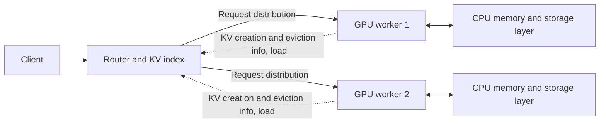

> Korean version: [한국어](reports-transformers-KR.md)
# Transformers CPU-based inference engine experiment report

Deploys inference engines as containers in a local Kubernetes environment (kind) on CPU, and compares how inference optimizations affect throughput and response latency.

Using the SmolLM2-135M-Instruct FP32 model, performance was measured for baseline inference (**baseline**), inference with **request batching**, and inference with **prefix KV cache reuse**.

Node failure recovery and CPU-based HPA were also run as separate test scenarios.

Detailed Benchmark figures are in [test results](reports/transformers/benchmark-suite-20260922-061851-685273/summary.md), node failure test details are in [pause details](reports/transformers/availability-pause-60s-20260921-122415-594492/summary.md) and [SIGKILL details](reports/transformers/availability-sigkill-60s-20260921-123349-464541/summary.md), and HPA test details are in the [HPA report](reports/transformers/hpa-20260921-124439-448222/summary.md).

## 1. Summary

Averages of three runs each for base, batch, and cache at concurrency 1, 2, 4, 8. Throughput uses tok/s, latency uses TTFT (ms) and ITL (ms).

Base throughput (tok/s) was flat at 43.44, 43.99, 44.33, 44.29 tok/s, while mean TTFT increased with concurrency as 142.41, 1086.58, 2934.60, 6523.55 ms. At concurrency 2, 4, 8, batch raised throughput and reduced TTFT relative to base but increased ITL. Cache reduced TTFT for repeated inputs at all concurrency levels, with throughput gains larger than batch at concurrency 1 and smaller at concurrency 2, 4, 8. At concurrency 1, batch increased TTFT and reduced ITL relative to base.

| Concurrency | base (tok/s / TTFT ms / ITL ms) | batch (tok/s / TTFT ms / ITL ms) | cache (tok/s / TTFT ms / ITL ms) |
| ---: | --- | --- | --- |
| 1 | 43.44 / 142.41 / 19.89 | 44.41 / 146.24 / 19.35 | 47.13 / 76.98 / 19.68 |
| 2 | 43.99 / 1086.58 / 19.71 | 61.28 / 307.77 / 27.38 | 48.05 / 930.85 / 19.57 |
| 4 | 44.33 / 2934.60 / 19.54 | 77.06 / 738.56 / 38.99 | 47.96 / 2647.67 / 19.61 |
| 8 | 44.29 / 6523.55 / 19.57 | 77.56 / 2814.20 / 38.57 | 47.73 / 5991.29 / 19.70 |

## 2. Experiment environment

### Runtime environment

| Item | Condition |
| --- | --- |
| Host | Apple M5 Pro, macOS 26.6.2 |
| Docker | 29.5.3, aarch64, 15 allocated CPUs and about 23.92 GiB memory |
| Model | SmolLM2-135M-Instruct, FP32 |
| Inference runtime | Transformers 4.57.6, torch 2.10.0, CPU-only execution |
| Benchmark | 1 kind control-plane. Inference Pod 8 CPU and 16 GiB, PyTorch 4 threads. AIPerf Pod 1 CPU and 1 GiB |
| Availability | 1 control-plane, 1 monitor worker, 2 engine workers. 2 inference Pods, 2 CPU and 2 GiB per Pod, PyTorch 2 threads |
| HPA | Same node setup as Availability. 1-4 inference Pods, 2 CPU and 2 GiB per Pod, PyTorch 2 threads |

For constraints of this experiment environment see [requirements.md](../docs/guides/requirements.md).
Kubernetes Pod resources for Benchmark are CPU 8 and memory 16Gi for both requests and limits for inference Pods (Guaranteed QoS), and CPU 1 and memory 1Gi for the AIPerf Pod.

Model revision and checksums are in [model settings](../config/models/smollm2-135m-transformers.env), and runtime dependencies are in [requirements.txt](../src/transformer/requirements.txt).

### Rationale

| Choice | Reason |
| --- | --- |
| SmolLM2-135M-Instruct FP32 | Used a small model that supports baseline inference and repeat performance measurement on local CPU. This reduces model execution cost to compare serving structure and engine optimization differences. |
| Transformers and PyTorch | Selected a widely used runtime that supports CPU and GPU execution. |
| Docker and kind | Selected a widely used container runtime (docker) and a Kubernetes distribution that is easy to deploy on that runtime. |
| AIPerf | Selected because it reports key inference engine performance metrics and provides many LLM benchmark options. |

## 3. Serving structure and deployment

### Request handling structure

Implements OpenAI-compatible `/v1/chat/completions` and measures performance through that API with AIPerf. The API handles request validation, chat template application, streaming, token accounting, and length limits, and engine implementations are swapped to compare on the same request path.

| Component | Implementation and role |
| --- | --- |
| base | Accepts HTTP requests and then runs inference on a single worker. |
| enhanced-batch | Collects up to 4 requests and processes them as a batch. When the running batch finishes, runs the next batch from waiting requests. |
| enhanced-cache | Adds prefix KV lookup, load, and save to the base inference path. Uses RAM and disk layers. |

Implementation is in [Source code](../src/transformer), and images are defined in [Dockerfile](../src/Dockerfile).

### Deployment and measurement verification

Images and deployment resources are in `src/Dockerfile` and the `k8s/` directory. Model weights are not included in images, and the kind node `/models` path is mounted read-only into containers.

| Target | Image | Configuration |
| --- | --- | --- |
| `transformers-base` | `local/transformers-base:0.1.0` | Serial inference |
| `transformers-enhanced-batch` | `local/transformers-enhanced-batch:0.1.0` | Batch processing |
| `transformers-enhanced-cache` | `local/transformers-enhanced-cache:0.1.0` | Prefix KV cache |

`k8s/` keeps per-variant Deployment and Service plus benchmark Jobs by directory.

| Directory | Contents |
| --- | --- |
| `k8s/transformers-base/` | `deployment.yaml`, `service.yaml` |
| `k8s/transformers-enhanced-batch/` | `deployment.yaml`, `service.yaml` |
| `k8s/transformers-enhanced-cache/` | `deployment.yaml`, `service.yaml`, `cache.yaml` (PVC, `/cache`) |
| `k8s/aiperf/` and `k8s/aiperf-smollm2/` | AIPerf `Job` and result PVC, tokenizer mount |

The three inference variants share the same `Deployment/transformers-base` and `Service/transformers-base:8000`.

## 4. Experiment design and comparison conditions

### Load and input configuration

| Item | Setting |
| --- | --- |
| Request target | `http://transformers-base:8000/v1/chat/completions`, streaming |
| Input and output targets | **64/32 tokens and 256/64 tokens**, 50% each by generation setting |
| Dataset | **16 unique inputs**, seed 42, sequential repeats |
| Requests per condition | **100** measured requests after 2 warmup requests |
| Concurrency | **1, 2, 4, 8** |
| Repeats | 3 per implementation, rotating execution order each round |
| Output condition | `ignore_eos=true` |
| Client | AIPerf 0.12.0, 1 worker, request timeout 3,600 seconds |
| Execution | Fixed-concurrency load, all experiments run sequentially |

### Conditions held constant

When comparing implementations at the same concurrency, all used Guaranteed QoS with 8 CPUs and 16Gi memory, and inference engine settings were kept identical. Inference Pods were also restarted before each test.

### Aggregation criteria

Performance metrics use AIPerf results. Table averages are means of three runs, and `±` is the sample standard deviation across runs. p95 is the mean of per-run p95 values, which differs from p95 computed over all pooled requests. Change rates were computed from unrounded values.

## 5. Baseline results and bottleneck

Each run completed all 100 requests with no errors.

| Concurrency | Output throughput (tok/s) | Request throughput (req/s) | TTFT mean / p95 (ms) | ITL mean / p95 (ms) | Request latency p95 (ms) |
| --- | ---: | ---: | ---: | ---: | ---: |
| 1 | 43.44 ± 0.32 | 1.036 | 142.41 / 241.23 | 19.89 / 20.68 | 1524.90 |
| 2 | 43.99 ± 0.25 | 1.049 | 1086.58 / 1622.09 | 19.71 / 20.36 | 2223.30 |
| 4 | 44.33 ± 0.16 | 1.057 | 2934.60 / 3793.09 | 19.54 / 20.35 | 4421.09 |
| 8 | 44.29 ± 0.05 | 1.057 | 6523.55 / 7426.80 | 19.57 / 20.36 | 8087.11 |

Raising concurrency from 1 to 8 kept output throughput in the 43.44-44.33 tok/s range. Mean TTFT rose from 142.41 ms to 6,523.55 ms, while mean ITL stayed near 19 ms. Request latency p95 also rose from 1,524.90 ms to 8,087.11 ms.

This result matches a serial inference structure that executes one request at a time. Higher concurrency increases queueing time before inference starts, and that time is included in TTFT. Under this serial condition, mean ITL stayed similar at about 19-20 ms.

## 6. Optimized implementations and before/after

### Optimization 1: request batching

To reduce serial queueing in the baseline engine, configured execution to run operations from multiple requests as one batch. The worker collects up to 4 requests for 5 ms, and applies left padding, per-request attention masks, and position IDs to inputs of different lengths.

Sampling options, output limits, and cancellation state stay separated per request, and completed rows are removed from the batch and KV before the next decode. New requests do not join a running batch and wait for the next batch. This implementation therefore differs from continuous batching because completion of the current batch affects wait time for later requests.

Batched execution raises total throughput while adding the cost of waiting for operations that include other rows to complete for each request. Padding for different-length inputs and per-request KV memory cost are also added.

| Implementation | Concurrency | Output throughput (tok/s) | TTFT mean / p95 (ms) | ITL mean / p95 (ms) | Request latency p95 (ms) |
| --- | ---: | ---: | ---: | ---: | ---: |
| enhanced-batch | 1 | 44.41 ± 0.17 | 146.24 / 241.34 | 19.35 / 20.08 | 1492.39 |
| enhanced-batch | 2 | 61.28 ± 0.18 | 307.77 / 416.79 | 27.38 / 43.57 | 1755.97 |
| enhanced-batch | 4 | 77.06 ± 0.24 | 738.56 / 767.90 | 38.99 / 46.99 | 2212.23 |
| enhanced-batch | 8 | 77.56 ± 1.11 | 2814.20 / 3086.80 | 38.57 / 47.02 | 4521.92 |

### Optimization 2: RAM and disk prefix KV cache

To reduce prefill for repeated inputs, stored KV tensors for input token prefixes. The cache target is the input KV state, and remaining computation and generation run from the restored state.

The cache finds and restores the longest common prefix. Even on full input match, the last input token is recomputed to obtain logits. Entries beyond the RAM limit spill to disk, and disk hits restore state by reading it. Replacement uses LRU and namespaces separate model, library, dtype, context, and related conditions.

Added costs are cache lookup, KV serialization and restore, storage, and disk I/O. Disk writes are synchronous, and RAM entries are saved on clean shutdown. This load repeats 16 inputs and therefore favors input reuse. RAM hits, disk hits, and eviction costs were not compared separately.

| Implementation | Concurrency | Output throughput (tok/s) | TTFT mean / p95 (ms) | ITL mean / p95 (ms) | Request latency p95 (ms) |
| --- | ---: | ---: | ---: | ---: | ---: |
| enhanced-cache | 1 | 47.13 ± 0.07 | 76.98 / 119.89 | 19.68 / 20.48 | 1398.48 |
| enhanced-cache | 2 | 48.05 ± 0.39 | 930.85 / 1428.67 | 19.57 / 20.63 | 2053.33 |
| enhanced-cache | 4 | 47.96 ± 0.17 | 2647.67 / 3439.44 | 19.61 / 20.47 | 4046.06 |
| enhanced-cache | 8 | 47.73 ± 0.94 | 5991.29 / 7151.80 | 19.70 / 20.38 | 7964.74 |

### Comparison results

Comparison of tok/s, mean TTFT, and mean ITL against base at concurrency 1, 2, 4, 8. Parentheses show change relative to base, computed from unrounded values.

| Concurrency | Implementation | tok/s (vs base, higher is better) | TTFT mean ms (vs base, lower is better) | ITL mean ms (vs base, lower is better) |
| ---: | --- | ---: | ---: | ---: |
| 1 | base | 43.44 | 142.41 | 19.89 |
| 1 | batch | 44.41 (+2.2%) | 146.24 (+2.7%) | 19.35 (-2.7%) |
| 1 | cache | 47.13 (+8.5%) | 76.98 (-45.9%) | 19.68 (-1.0%) |
| 2 | base | 43.99 | 1086.58 | 19.71 |
| 2 | batch | 61.28 (+39.3%) | 307.77 (-71.7%) | 27.38 (+38.9%) |
| 2 | cache | 48.05 (+9.2%) | 930.85 (-14.3%) | 19.57 (-0.7%) |
| 4 | base | 44.33 | 2934.60 | 19.54 |
| 4 | batch | 77.06 (+73.8%) | 738.56 (-74.8%) | 38.99 (+99.5%) |
| 4 | cache | 47.96 (+8.2%) | 2647.67 (-9.8%) | 19.61 (+0.3%) |
| 8 | base | 44.29 | 6523.55 | 19.57 |
| 8 | batch | 77.56 (+75.1%) | 2814.20 (-56.9%) | 38.57 (+97.1%) |
| 8 | cache | 47.73 (+7.8%) | 5991.29 (-8.2%) | 19.70 (+0.6%) |

Source for the performance table is [full metrics CSV](reports/transformers/benchmark-suite-20260922-061851-685273/summary.csv).

## 7. Interpretation

### Batching improved throughput and completion latency but increased ITL

Batching throughput at concurrency 8 rose from 44.29 tok/s to 77.56 tok/s, and mean TTFT fell from 6523.55 ms to 2814.20 ms. Request latency p95 also fell from 8087.11 ms to 4521.92 ms. Running multiple requests together reduced base serial queueing, and the measured change matches that structure.

Mean ITL instead rose from 19.57 ms to 38.57 ms. A request receives its next token only after batched operations including other requests finish, which affected the result.

At concurrency 1, throughput rose 2.2% but TTFT rose from 142.41 ms to 146.24 ms. With no requests to co-process, batch wait and scheduling cost likely contributed to the TTFT increase.

### Beyond max batch size (4), batching added wait more than throughput

At concurrency 2 and 4, batching throughput rose 39.3% and 73.8% over base. Raising concurrency from 4 to 8 increased throughput only from 77.06 tok/s to 77.56 tok/s, about 0.6%, while mean TTFT rose from 738.56 ms to 2814.20 ms.

### Cache gains concentrated on first token.

Cache mean TTFT at concurrency 1 fell from 142.41 ms to 76.98 ms, down 45.9%. Mean ITL was similar at 19.89 ms versus 19.68 ms, and throughput rose 8.5%. Reusing input prefill moved the first token earlier while later generation cost stayed the same.

## 8. Scaling to large GPU operation

### Batch structure matched to GPU characteristics and bottlenecks

First re-measure prefill and decode compute time, memory bandwidth, KV memory capacity, and effects of running request count and input length for each model and GPU.

On GPU, batching prefill and decode together requires considering FLOPs and HBM memory bandwidth together. Prefill is a compute-bound stage that processes input tokens in parallel and depends strongly on operation count (FLOPs) and input length, while decode generates one token at a time and repeatedly reads model weights and KV cache, making it memory-bandwidth bound and strongly affected by HBM bandwidth and KV cache size. Therefore match batch token budget and chunk size to actual request input length, output length, and concurrency. 

ref. [vLLM optimization guide](https://docs.vllm.ai/en/latest/configuration/optimization/)

For GPU implementation, measure combinations of active request count, batch token budget, prefill chunk, and decode priority. Include the base-relative ITL increase and wait increase above max batch size observed in current batching as decision criteria, and select the configuration that maximizes throughput within target latency. When splitting a model across GPUs, also include inter-GPU communication and synchronization cost.

### KV cache considering CPU and GPU memory

Extending KV cache beyond GPU memory adds CPU memory to GPU memory transfer cost along with capacity. Measure KV size to restore, transfer bandwidth and latency, and whether copy overlaps compute, and reuse only when savings from reduced recomputation exceed transfer and management cost.

NVIDIA Dynamo supports using CPU memory and disk beyond GPU memory through worker KV cache offloading. Use it as a baseline to evaluate per-layer capacity for GPU, CPU, and disk, replacement policy, and restore time. The current CPU RAM and disk experiment alone cannot predict GPU performance for this path.

ref. [Dynamo KV cache offloading](https://docs.nvidia.com/dynamo/latest/kubernetes/kv-cache-offloading/overview)

### Router-worker structure using replica KV information

As inference engine replicas grow, reusable KV for the same request depends on which worker receives it. To use caches across workers, workers must report KV holdings to the router, and the router must consider both cache reuse potential and worker load.

ref. [Dynamo KV-aware routing](https://docs.nvidia.com/dynamo/dev/knowledge-base/concepts/system-architecture/kv-aware-routing)

```mermaid
flowchart LR
    C["Client"] --> R["Router and KV index"]
    R -->|"Request distribution"| W1["GPU worker 1"]
    R -->|"Request distribution"| W2["GPU worker 2"]
    W1 -.->|"KV creation and eviction info, load"| R
    W2 -.->|"KV creation and eviction info, load"| R
    W1 <--> H1["CPU memory and storage layer"]
    W2 <--> H2["CPU memory and storage layer"]
```

## 9. Additional experiment: node failure and rescheduling

Placed one Pod on each of two different engine workers and paused worker2 or SIGKILLed it. After preparing a replacement Pod on surviving worker3, recovered the original node. Each of the two experiments ran once with 60-second NoExecute toleration.

Clients used concurrency 4, 30-second timeout, and a new connection per request. Observed 90 seconds warmup, 150 seconds healthy interval, 90 seconds after replacement Pod readiness, and 90 seconds after node recovery.

### Recovery timeline

Times below measure elapsed time from failure request to first observation of each state. The node recovery column is measured from pause release or restart request.

| Failure and toleration | Node NotReady observed | Replacement Pod Ready | Node recovery request to Node Ready |
| --- | ---: | ---: | ---: |
| pause, 60s | 49.9s | 115.4s | 10.4s |
| SIGKILL, 60s | 51.1s | 115.9s | 1.6s |

Node abnormality was observed after about 50 seconds, and replacement Pod readiness took about 115 seconds. The 60-second toleration does not include node failure detection time. Detection is followed by toleration wait and Pod preparation.

### Request impact and interpretation

| Failure and toleration | Success / error | Error rate | Mean successful request latency |
| --- | ---: | ---: | ---: |
| pause, 60s | 414 / 8 | 1.90% | 3.794s |
| SIGKILL, 60s | 428 / 8 | 1.83% | 3.704s |

Pause errors are 8 timeouts for requests started between 3.4 seconds before failure and 45.6 seconds after failure. Requests in flight at failure time and requests before endpoint removal were affected. SIGKILL produced 2 timeouts and 6 connection errors.

Request counts cover requests started in `[collection_start, experiment_complete)`, including requests completed after observation ended. This differs from full AIPerf success counts of 514 and 520 that include warmup. In both experiments a replacement Pod was ready on the surviving node before the original node recovered. During teardown, nodes were recovered and inference Pods were redistributed across two workers. This redistribution is separate from automatic recovery observation.

Graph 0 seconds is failure request time. Successful requests are plotted at completion time, errors at AIPerf error log time, and red x height 10 is not a latency value.

## 10. Additional experiment: CPU-based HPA

Targeted 50% mean utilization relative to CPU request with 1-4 replicas. Scale-up stabilization is 0 seconds, scale-down stabilization is 120 seconds, with 1 Pod change per 30 seconds in both directions.

Ran once a scenario that scales 1 to 4 under high load and then switches to low load to verify scale-down from 4 to 1.

| Scenario | Replica change | Scale-up confirmed | Scale-up sustained | Scale-down confirmed | Min replica sustained |
| --- | --- | ---: | --- | ---: | --- |
| Scale out to in | 1→4→1 | 129.6s | 60s | 212.1s | 60s |

| Load interval | Success / error | Error rate |
| --- | ---: | ---: |
| High load | 233 / 0 | 0.00% |
| Low load | 5 / 0 | 0.00% |

Confirmed the flow where HPA added replicas after CPU rose and new Pods became Ready and joined Service endpoints. After scale-up each engine worker held 2 Pods, and all 233 high-load requests succeeded.

During scale-down, replicas fell 4 to 3 to 2 to 1 after switching to low load. One request started and completed inside the minimum-replica sustain interval also succeeded. The 5 low-load requests verify behavior on the final Service path.

Initial CPU gap and HPA desired 0 cover the interval before metrics filled in, while actual available Pods and ready endpoints were each 1.

## Appendix

Aggregated results for each experiment are in the corresponding `summary.md`.

| Experiment | summary.md |
| --- | --- |
| Benchmark 3 runs (base, batch, cache, concurrency 1/2/4/8) | [reports/transformers/benchmark-suite-20260922-061851-685273/summary.md](reports/transformers/benchmark-suite-20260922-061851-685273/summary.md) |
| Availability pause 60s | [reports/transformers/availability-pause-60s-20260921-122415-594492/summary.md](reports/transformers/availability-pause-60s-20260921-122415-594492/summary.md) |
| Availability SIGKILL 60s | [reports/transformers/availability-sigkill-60s-20260921-123349-464541/summary.md](reports/transformers/availability-sigkill-60s-20260921-123349-464541/summary.md) |
| HPA 1→4→1 | [reports/transformers/hpa-20260921-124439-448222/summary.md](reports/transformers/hpa-20260921-124439-448222/summary.md) |
