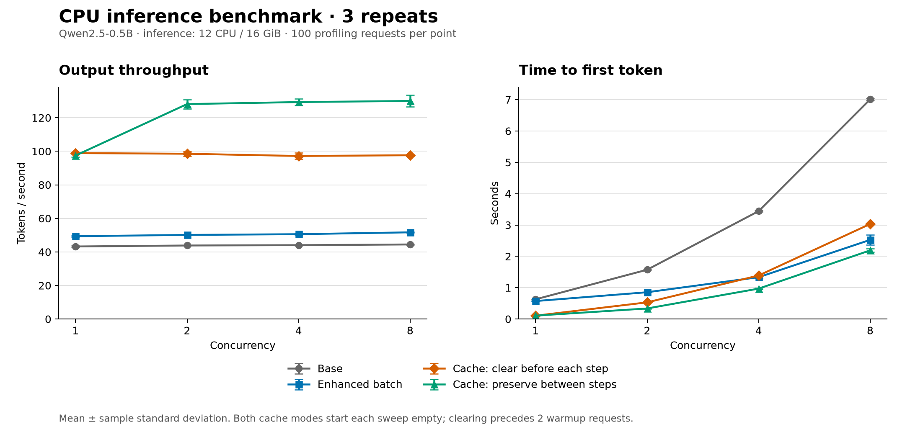
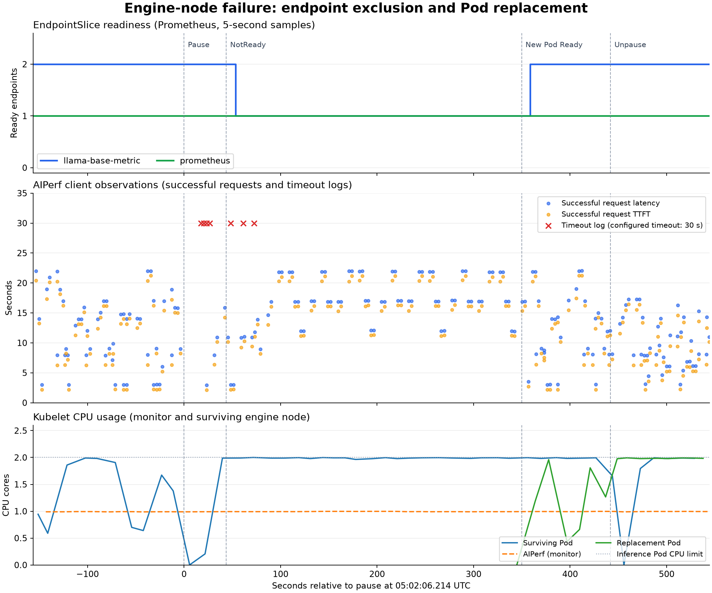
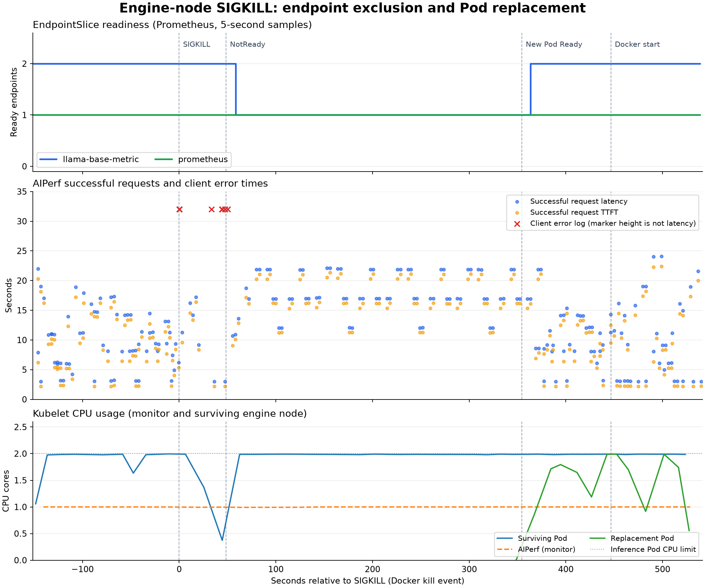

# 테스트 결과

2026-09-20에 Qwen2.5-0.5B-Instruct Q4_K_M 모델로 측정한 결과입니다. kind 노드들은 하나의 Docker 호스트 자원을 공유했습니다.

## Benchmark

기본 직렬 추론인 `base`, continuous batching을 적용한 `enhanced-batch`, RAM과 디스크 prefix KV 캐시를 사용하는 `enhanced-cache`의 처리량과 지연을 비교합니다.

추론 Pod는 12 CPU와 16 GiB를 사용했습니다. 동시성 1, 2, 4, 8에서 네 조건을 각각 3회 측정했으며, 본 요청 4,800건과 워밍업 96건이 모두 성공했습니다. 출력 길이 부족이나 초과는 없었습니다. 캐시 초기화 조건은 각 동시성 전에 비우고, 보존 조건은 첫 동시성 전에만 비웠습니다.

### 측정 결과

표의 값은 3회 측정의 평균입니다.

| 구현 | 동시성 | 출력 처리량 (tok/s) | TTFT 평균 (ms) | ITL 평균 (ms) |
| --- | ---: | ---: | ---: | ---: |
| base | 1 | 43.24 | 628.68 | 8.29 |
| base | 2 | 43.83 | 1572.32 | 8.19 |
| base | 4 | 44.03 | 3442.62 | 8.18 |
| base | 8 | 44.45 | 7009.25 | 8.05 |
| enhanced-batch | 1 | 49.35 | 572.66 | 6.70 |
| enhanced-batch | 2 | 50.15 | 854.30 | 19.28 |
| enhanced-batch | 4 | 50.57 | 1334.28 | 48.07 |
| enhanced-batch | 8 | 51.69 | 2525.54 | 94.60 |
| enhanced-cache, 초기화 | 1 | 98.93 | 106.16 | 7.71 |
| enhanced-cache, 초기화 | 2 | 98.53 | 531.55 | 7.70 |
| enhanced-cache, 초기화 | 4 | 97.20 | 1388.29 | 7.83 |
| enhanced-cache, 초기화 | 8 | 97.64 | 3032.04 | 7.73 |
| enhanced-cache, 보존 | 1 | 97.48 | 107.07 | 7.83 |
| enhanced-cache, 보존 | 2 | 128.15 | 336.58 | 7.68 |
| enhanced-cache, 보존 | 4 | 129.34 | 969.95 | 7.57 |
| enhanced-cache, 보존 | 8 | 130.01 | 2190.50 | 7.58 |

동시성 8에서 enhanced-batch는 base보다 처리량이 16.3% 높고 TTFT가 짧았지만, ITL은 8.05 ms에서 94.60 ms로 길어졌습니다. 캐시 보존은 초기화보다 동시성 2, 4, 8의 처리량이 30.1~33.2% 높았습니다. 캐시 결과는 입력 16개를 반복하는 부하에서 얻었으며, 초기화 조건도 워밍업과 본 측정 안에서는 캐시를 재사용했습니다.

### 처리량과 TTFT 비교

[상세 결과](benchmark-suite-20260920-091620-649645/summary.md)

## Availability

engine 노드 하나를 pause하거나 SIGKILL로 종료해 요청 오류, Service endpoint 제외, 대체 Pod의 복구 시간을 확인합니다. 추론 Pod 2개를 서로 다른 engine 노드에 배치했고, Pod당 2 CPU와 2 GiB를 사용했습니다. 클라이언트 동시성은 4이며, NoExecute toleration을 300초와 60초로 나눠 조건별로 1회 측정했습니다.

### 측정 결과

시간은 장애 주입부터의 경과 시간입니다. 요청 수와 오류율은 각 실험의 고정 관찰 구간 기준입니다.

| 장애 | Toleration | Ready endpoint 감소 | 대체 Pod Ready | 성공 요청 | 오류 요청 | 오류율 |
| --- | ---: | ---: | ---: | ---: | ---: | ---: |
| pause | 300초 | 45.1초 | 349.8초 | 196 | 7 | 3.45% |
| SIGKILL | 300초 | 50.2초 | 354.5초 | 206 | 11 | 5.07% |
| pause | 60초 | 54.0초 | 118.8초 | 155 | 7 | 4.32% |
| SIGKILL | 60초 | 43.9초 | 108.9초 | 140 | 16 | 10.26% |

60초 toleration 조건에서 대체 Pod 준비까지 걸린 시간은 약 109~119초였고, 300초 조건에서는 약 350~355초였습니다. 네 실험 모두 장애 노드 복구 전에 생존 노드에서 replica 2개를 확보했으며, 대체 Pod Ready 이후 관찰 종료까지 요청 오류는 없었습니다. 노드 복귀 후 관찰 기간에는 Pod의 자동 재분산이 나타나지 않았습니다. 실험별 관찰 구간 길이가 달라 전체 오류율만으로 복구 성능을 비교하지 않습니다.

### pause, toleration 300초

[상세 결과](availability-20260920-045929/summary.md)

### SIGKILL, toleration 300초

[상세 결과](availability-sigkill-20260920-053546/summary.md)

### pause, toleration 60초

[상세 결과](availability-pause-60s-20260920-061021/summary.md)

### SIGKILL, toleration 60초

[상세 결과](availability-sigkill-60s-20260920-061946/summary.md)

## HPA

CPU request 대비 평균 사용률 50%를 목표로 replica가 부하에 따라 증가하고 축소되는지 확인합니다. 추론 Pod당 2 CPU와 2 GiB를 사용했으며, replica 범위는 1~4개였습니다. 고부하는 동시성 8, 저부하는 동시성 1과 0.02 req/s로 측정했습니다.

### 측정 결과

각 시나리오는 1회 실행했습니다. 증가 시간은 고부하 시작 요청부터, 축소 시간은 저부하 전환 요청부터 HPA, Deployment, Pod, endpoint 상태가 목표 수로 일치할 때까지입니다.

| 시나리오 | Replica 변화 | 증가 확인 | 축소 확인 | 유지 확인 |
| --- | --- | ---: | ---: | --- |
| 스케일 아웃 | 1→4 | 139.4초 | 측정하지 않음 | 4개 상태 약 62초 |
| 스케일 아웃→인 | 1→4→1 | 134.5초 | 328.9초 | 4개 상태 60초 이상, 1개 상태 65.1초 |

| 시나리오와 부하 | 성공 요청 | 오류 요청 | 오류율 | 성공 요청 TTFT p95 | 성공 요청 지연 p95 |
| --- | ---: | ---: | ---: | ---: | ---: |
| 스케일 아웃, 고부하 | 84 | 17 | 16.83% | 26.51초 | 27.53초 |
| 스케일 아웃→인, 고부하 | 88 | 7 | 7.37% | 27.15초 | 28.40초 |
| 스케일 아웃→인, 저부하 | 7 | 0 | 0.00% | 8.86초 | 10.51초 |

두 시나리오 모두 replica 증가와 새 Pod의 Service 편입을 확인했습니다. 스케일 아웃→인에서는 replica 1개로 축소한 뒤 유지 구간 안에서 새로 시작하고 완료된 요청 1건도 성공했습니다. 고부하에서는 오류가 발생했으며, 고부하와 저부하의 지연 차이는 요청량이 다른 조건의 결과입니다.

### 스케일 아웃 (1→4)

[상세 결과](hpa-20260920-073006-837104/summary.md)

### 스케일 아웃→인 (1→4→1)

[상세 결과](hpa-20260920-081357-206946/summary.md)

