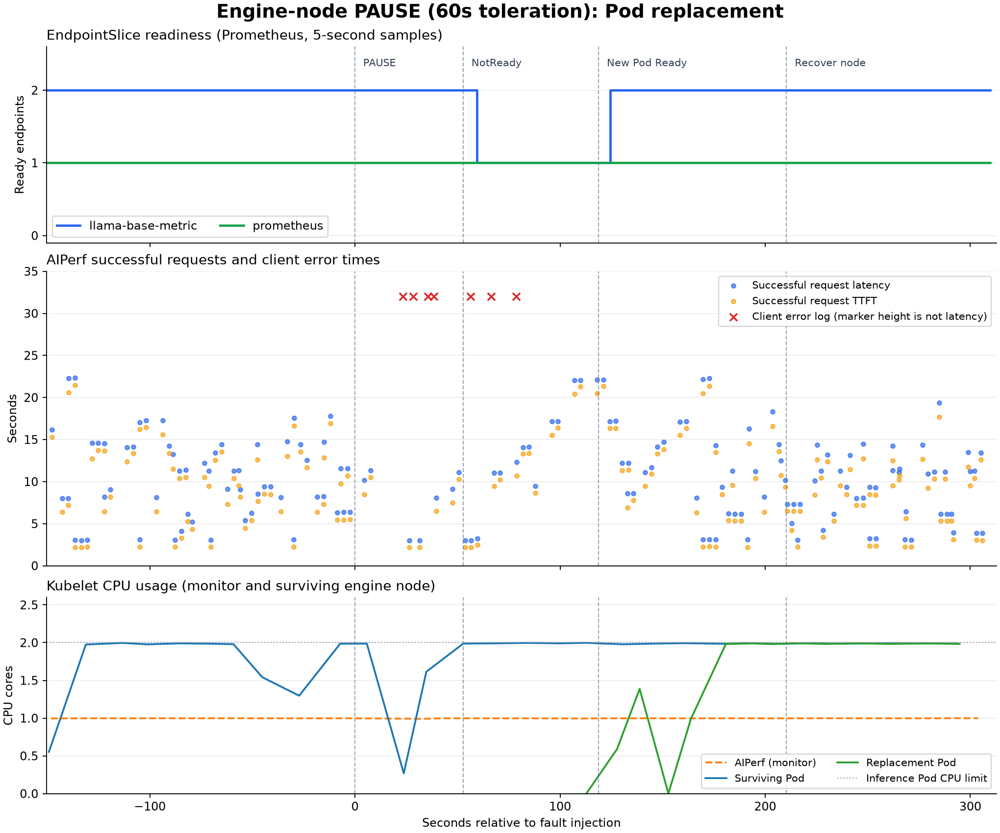

# Engine 노드 동결(pause), NoExecute toleration 60초

## 1. 실험 요약

engine 노드 하나에 동결(pause) 장애를 주입했다. 장애 후 **54.0초**에 Service ready endpoint 감소를 확인했고, **118.8초**에 생존 노드의 대체 Pod가 Ready가 됐다. 대체 Pod 생성부터 Ready까지는 **6초**였다.

고정 관찰 구간의 AIPerf 결과는 **성공 155건, 오류 7건(4.32%)**이다. 노드 복구 전 대체 replica가 확보됐으며, 노드 복귀 후 관찰 기간에는 자동 재분산이 나타나지 않았다.

## 2. 실험 환경

| 항목 | 실행 조건 |
| --- | --- |
| 관찰 구간 | 2026-09-20 06:11:58.791–06:19:41.980 UTC (KST=UTC+9) |
| 클러스터 | kind `local-k8s`, Kubernetes v1.36.4, control-plane 1개 + worker 3개 |
| 배치 | monitor worker 1개에 AIPerf, Prometheus, Grafana, kube-state-metrics, engine worker 2개에 추론 Pod 각 1개 |
| 추론 | `local/llama-base-metric:0.1.0`, 모델 `Qwen/Qwen2.5-0.5B-Instruct`, replica 2, Pod별 CPU 2 / 2Gi, thread 2 |
| 부하 | `local/aiperf:0.12.0`, concurrency 4, streaming, 요청별 새 연결, timeout 30초, 입력/출력 분포 `64,32:50;256,64:50` |
| toleration | Pod의 `not-ready`, `unreachable` 모두 `NoExecute`, `tolerationSeconds: 60` |
| 스케줄링과 종료 | hostname preferred pod anti-affinity, `terminationGracePeriodSeconds: 60` |
| 장애 대상 | `local-k8s-worker2` |
| 수집 주기 | Kubernetes 객체, Docker 상태 약 2초, Prometheus 5초, kubelet 자원 약 10초; Docker 이벤트, 타임스탬프 로그 |

CPU와 메모리 requests와 limits는 동일했다. 추론 이미지와 모델은 engine 노드에 준비돼 있었다.

`docker pause`로 장애를 주입했으며, 장애 중 Docker 상태는 `Running=true, Paused=true`였다.

## 3. 관찰 결과

### 재스케줄링 시간표

상대 시간은 `docker pause` 완료 기준이다. 조건, 객체 시각은 초 단위이며, “확인” 시각에는 객체 수집 주기에 따른 지연이 포함된다.

| UTC 시각 | 장애 후 | 관찰 |
| --- | ---: | --- |
| 06:14:29.195 | 0.0초 | Docker pause 완료: 노드 프로세스 동결 |
| 06:14:52.692 | 23.5초 | 첫 클라이언트 오류 |
| 06:15:22.000 | 52.8초 | Node Ready=Unknown (kubectl: NotReady) |
| 06:15:22.000 | 52.8초 | unreachable:NoExecute taint 기록 |
| 06:15:23.218 | 54.0초 | 장애 endpoint ready=false, Service ready 2→1 확인 |
| 06:15:47.694 | 78.5초 | 마지막 클라이언트 오류 |
| 06:16:22.000 | 112.8초 | 생존 engine 노드에 대체 Pod 생성 |
| 06:16:28.000 | 118.8초 | 대체 Pod Ready=True |
| 06:16:28.826 | 119.6초 | Service ready endpoint 1→2 확인 |
| 06:17:59.591 | 210.4초 | 노드 복구 명령 완료 |
| 06:18:02.992 | 213.8초 | 기존 장애 Pod API 객체 삭제 확인 |
| 06:18:11.121 | 221.9초 | 장애 노드 Ready 회복 확인 |
| 06:19:41.980 | 312.8초 | 관찰 종료 |

NoExecute taint 기록부터 controller 삭제 요청까지 약 60.7초였다. 기존 장애 Pod가 Terminating 상태로 남은 동안에도 새 Pod가 생성됐고, 노드 복구 후 기존 객체가 정리됐다.

### Pod 변화와 Kubernetes 상태

| 구분 | Pod 이름 | 정상 | 장애 중 | 노드 복귀 후 |
| --- | --- | --- | --- | --- |
| A: 장애 | `llama-base-metric-7c6d46685b-xqtm8` | local-k8s-worker2, Ready | Ready=False → Terminating | 삭제 |
| B: 생존 | `llama-base-metric-7c6d46685b-2kn9h` | local-k8s-worker3, Ready | 계속 처리 | 같은 노드 유지 |
| C: 대체 | `llama-base-metric-7c6d46685b-dtgkg` | 없음 | local-k8s-worker3에 새로 생성 후 Ready | 같은 노드 유지 |

대체 Pod C의 UID는 `8d5454cc-9103-4417-8462-d2077d45d64b`다. Pod C는 생존 노드에 새로 생성됐다.

### 클라이언트 영향

성공은 AIPerf 요청 완료 시각, 오류는 ERROR 로그 시각으로 구간을 나눴다. 지연과 TTFT는 성공 요청만의 분포이며 실패율 분모는 구간 내 성공 완료와 오류의 합이다.

| 구간 | 길이 | 성공 / 오류 | 실패율 | 성공 req/s | 지연 p50 / p95 | TTFT p50 |
| --- | ---: | ---: | ---: | ---: | ---: | ---: |
| 정상 | 150.4초 | 58 / 0 | 0.00% | 0.386 | 11.28 / 17.59초 | 9.51초 |
| 장애→Node NotReady | 52.8초 | 7 / 4 | 36.36% | 0.133 | 9.13 / 11.28초 | 7.47초 |
| NotReady→대체 Pod Ready | 66.0초 | 14 / 3 | 17.65% | 0.212 | 13.20 / 22.09초 | 11.98초 |
| 대체 Pod Ready→노드 복구 명령 | 91.6초 | 33 / 0 | 0.00% | 0.360 | 11.70 / 22.15초 | 10.77초 |
| 노드 복구 명령→관찰 종료 | 102.4초 | 43 / 0 | 0.00% | 0.420 | 9.32 / 14.37초 | 8.44초 |

| 오류 유형 (AIPerf 전체 실행) | 건수 |
| --- | ---: |
| `TimeoutError` | 7 |

전체 AIPerf 실행은 성공 186건, 오류 7건으로, 예열과 종료 처리까지 포함해 고정 관찰 구간과 범위가 다르다. 성공 응답 완료 사이 최대 간격은 **18.79초**였다.

아래 그래프는 이 실험의 AIPerf 요청별 결과, 오류 로그, Prometheus EndpointSlice, kubelet CPU를 같은 시간축에 정렬한 것이다. 파란 점은 성공 요청 지연, 주황 점은 성공 요청 TTFT이며 x축은 장애 주입 기준 초다. 빨간 ×는 실제 오류 로그 시각이고, **표시 높이 32는 지연값이 아니다**. CPU는 중복 캐시 표본을 제거했다.



### 대표 로그

반복 probe, scrape 로그를 제외하고 오류, eviction, 대체 서버 시작을 발췌했다. 긴 오류 메시지는 줄였다.

```text
06:14:52.692  AIPerf      TimeoutError()
06:15:47.694  AIPerf      TimeoutError()
06:16:22.730  Controller  "Deleting pod" controller="taint-eviction-controller" [Pod A]
06:16:23.897  Server C    Application startup complete.
06:16:33.372  Server C    "POST /v1/chat/completions HTTP/1.1" 200 OK
```

## 4. 해석

**대체 Pod가 Ready가 되기까지 118.8초가 걸렸다.** 장애 후 52.8초에 Node Ready가 Unknown으로 바뀌었고, NoExecute taint 기록 후 controller 삭제 요청까지 약 60.7초가 걸렸다. 대체 Pod 생성부터 Ready까지는 6초였다.

**ready endpoint가 1개 남아 있는 동안에도 요청 오류가 발생했다.** 고정 관찰 구간에서 오류 7건을 기록했으며, 대체 Pod Ready 이후부터 관찰 종료까지의 오류는 0건이었다.

정상 대비 NotReady→대체 Pod Ready 구간의 성공 처리량은 0.386→0.212 req/s로 45.0% 감소했다. TTFT 중앙값은 9.51→11.98초였다.

**노드 복구 전에 생존 노드에서 replica 2개가 확보됐다.** 대체 Pod는 `local-k8s-worker3`에 배치됐고, 장애 노드가 돌아온 뒤에도 생존 Pod와 대체 Pod는 같은 노드에 남았다. 복귀 후 관찰 기간에는 자동 재분산이 나타나지 않았다.
