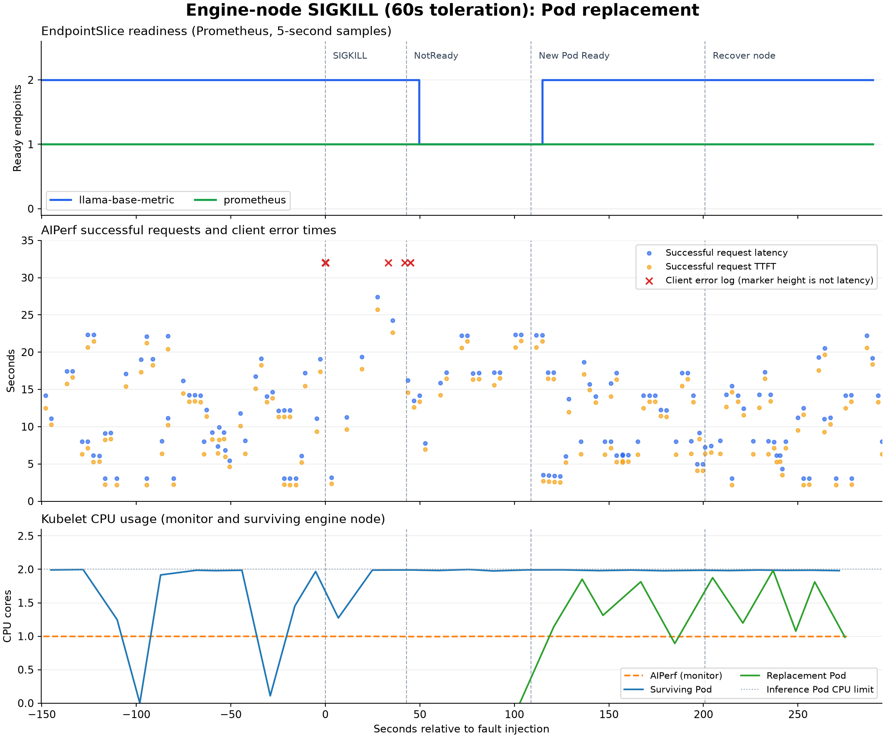

# Engine 노드 강제 종료(SIGKILL) · NoExecute toleration 60초

## 1. 실험 요약

engine 노드 하나에 강제 종료(SIGKILL) 장애를 주입했다. 장애 후 **43.9초**에 Service ready endpoint 감소를 확인했고, **108.9초**에 생존 노드의 대체 Pod가 Ready가 됐다. 대체 Pod 생성부터 Ready까지는 **6초**였다.

고정 관찰 구간의 AIPerf 결과는 **성공 140건, 오류 16건(10.26%)**이다. 노드 복구 전 대체 replica가 확보됐으며, 노드 복귀 후 관찰 기간에는 자동 재분산이 나타나지 않았다.

## 2. 실험 환경

| 항목 | 실행 조건 |
| --- | --- |
| 관찰 구간 | 2026-09-20 06:21:23.781–06:28:48.553 UTC (KST=UTC+9) |
| 클러스터 | kind `local-k8s`, Kubernetes v1.36.4, control-plane 1개 + worker 3개 |
| 배치 | monitor worker 1개에 AIPerf·Prometheus·Grafana·kube-state-metrics, engine worker 2개에 추론 Pod 각 1개 |
| 추론 | `local/llama-base-metric:0.1.0`, 모델 `Qwen/Qwen2.5-0.5B-Instruct`, replica 2, Pod별 CPU 2 / 2Gi, thread 2 |
| 부하 | `local/aiperf:0.12.0`, concurrency 4, streaming, 요청별 새 연결, timeout 30초, 입력/출력 분포 `64,32:50;256,64:50` |
| toleration | Pod의 `not-ready`·`unreachable` 모두 `NoExecute`, `tolerationSeconds: 60` |
| 스케줄링·종료 | hostname preferred pod anti-affinity, `terminationGracePeriodSeconds: 60` |
| 장애 대상 | `local-k8s-worker2` |
| 수집 주기 | Kubernetes 객체·Docker 상태 약 2초, Prometheus 5초, kubelet 자원 약 10초; Docker 이벤트·타임스탬프 로그 |

CPU·메모리 requests와 limits는 동일했다. 추론 이미지와 모델은 engine 노드에 준비돼 있었다.

Docker의 `kill(signal=9)`·`die(exitCode=137)` 이벤트와 `Status=exited, Running=false, Paused=false, Pid=0, OOMKilled=false`를 확인했다. 실험 중 Docker 재시작 정책은 `no`였다.

## 3. 관찰 결과

### 재스케줄링 시간표

상대 시간은 Docker `kill(signal=9)` 이벤트 기준이다. 조건·객체 시각은 초 단위이며, “확인” 시각에는 객체 수집 주기에 따른 지연이 포함된다.

| UTC 시각 | 장애 후 | 관찰 |
| --- | ---: | --- |
| 06:23:54.130 | 0.0초 | Docker kill 이벤트: signal=9 |
| 06:23:54.174 | 0.0초 | 첫 클라이언트 오류 |
| 06:24:37.000 | 42.9초 | Node Ready=Unknown (kubectl: NotReady) |
| 06:24:37.000 | 42.9초 | unreachable:NoExecute taint 기록 |
| 06:24:37.990 | 43.9초 | 장애 endpoint ready=false, Service ready 2→1 확인 |
| 06:24:39.179 | 45.0초 | 마지막 클라이언트 오류 |
| 06:25:37.000 | 102.9초 | 생존 engine 노드에 대체 Pod 생성 |
| 06:25:43.000 | 108.9초 | 대체 Pod Ready=True |
| 06:25:43.607 | 109.5초 | Service ready endpoint 1→2 확인 |
| 06:27:15.046 | 200.9초 | 노드 복구 명령 완료 |
| 06:27:17.319 | 203.2초 | 장애 노드 Ready 회복 확인 |
| 06:27:19.296 | 205.2초 | 기존 장애 Pod API 객체 삭제 확인 |
| 06:28:48.553 | 294.4초 | 관찰 종료 |

NoExecute taint 기록부터 controller 삭제 요청까지 약 60.9초였다. 기존 장애 Pod가 Terminating 상태로 남은 동안에도 새 Pod가 생성됐고, 노드 복구 후 기존 객체가 정리됐다.

### Pod 변화와 Kubernetes 상태

| 구분 | Pod 이름 | 정상 | 장애 중 | 노드 복귀 후 |
| --- | --- | --- | --- | --- |
| A: 장애 | `llama-base-metric-7c6d46685b-6clln` | local-k8s-worker2, Ready | Ready=False → Terminating | 삭제 |
| B: 생존 | `llama-base-metric-7c6d46685b-9hvx6` | local-k8s-worker3, Ready | 계속 처리 | 같은 노드 유지 |
| C: 대체 | `llama-base-metric-7c6d46685b-pldfh` | 없음 | local-k8s-worker3에 새로 생성·Ready | 같은 노드 유지 |

대체 Pod C의 UID는 `f38c9c3c-497e-48ef-9bd9-be58fd4c404f`다. Pod C는 생존 노드에 새로 생성됐다.

### 클라이언트 영향

성공은 AIPerf 요청 완료 시각, 오류는 ERROR 로그 시각으로 구간을 나눴다. 지연·TTFT는 성공 요청만의 분포이며 실패율 분모는 구간 내 성공 완료와 오류의 합이다.

| 구간 | 길이 | 성공 / 오류 | 실패율 | 성공 req/s | 지연 p50 / p95 | TTFT p50 |
| --- | ---: | ---: | ---: | ---: | ---: | ---: |
| 정상 | 150.3초 | 51 / 0 | 0.00% | 0.339 | 11.13 / 22.14초 | 10.24초 |
| 장애→Node NotReady | 42.9초 | 5 / 14 | 73.68% | 0.117 | 19.36 / 26.79초 | 17.74초 |
| NotReady→대체 Pod Ready | 66.0초 | 14 / 2 | 12.50% | 0.212 | 17.22 / 22.32초 | 16.36초 |
| 대체 Pod Ready→노드 복구 명령 | 92.0초 | 37 / 0 | 0.00% | 0.402 | 9.18 / 19.42초 | 8.34초 |
| 노드 복구 명령→관찰 종료 | 93.5초 | 33 / 0 | 0.00% | 0.353 | 11.21 / 19.79초 | 9.55초 |

| 오류 유형 (AIPerf 전체 실행) | 건수 |
| --- | ---: |
| `ServerDisconnectedError` | 3 |
| `ClientPayloadError` | 1 |
| `ClientConnectorError` | 12 |

전체 AIPerf 실행은 성공 169건·오류 16건으로, 예열과 종료 처리까지 포함해 고정 관찰 구간과 범위가 다르다. 성공 응답 완료 사이 최대 간격은 **8.16초**였다.

아래 그래프는 이 실험의 AIPerf 요청별 결과·오류 로그, Prometheus EndpointSlice, kubelet CPU를 같은 시간축에 정렬한 것이다. 파란 점은 성공 요청 지연, 주황 점은 성공 요청 TTFT이며 x축은 장애 주입 기준 초다. 빨간 ×는 실제 오류 로그 시각이고, **표시 높이 32는 지연값이 아니다**. CPU는 중복 캐시 표본을 제거했다.



### 대표 로그

반복 probe·scrape 로그를 제외하고 오류, eviction, 대체 서버 시작을 발췌했다. 긴 오류 메시지는 줄였다.

```text
06:23:54.174  AIPerf      ServerDisconnectedError('Server disconnected')
06:23:54.175  AIPerf      ClientPayloadError("Response payload is not completed: <TransferEncodingError: 400, message='Not enough data to satisfy transfer length header.'>")
06:23:54.178  AIPerf      ClientConnectorError(ConnectionKey(host='llama-base-metric', port=8000, is_ssl=False, ssl=True, proxy=None, proxy_auth=None, proxy_headers_hash=None), ConnectionRefusedError(111, "Connect call failed 
06:24:39.179  AIPerf      ClientConnectorError(ConnectionKey(host='llama-base-metric', port=8000, is_ssl=False, ssl=True, proxy=None, proxy_auth=None, proxy_headers_hash=None), OSError(113, "Connect call failed ('10.96.150.242
06:25:37.945  Controller  "Deleting pod" controller="taint-eviction-controller" [Pod A]
06:25:39.107  Server C    Application startup complete.
06:25:45.753  Server C    "POST /v1/chat/completions HTTP/1.1" 200 OK
```

## 4. 해석

**대체 Pod가 Ready가 되기까지 108.9초가 걸렸다.** 장애 후 42.9초에 Node Ready가 Unknown으로 바뀌었고, NoExecute taint 기록 후 controller 삭제 요청까지 약 60.9초가 걸렸다. 대체 Pod 생성부터 Ready까지는 6초였다.

**ready endpoint가 1개 남아 있는 동안에도 요청 오류가 발생했다.** 고정 관찰 구간에서 오류 16건을 기록했으며, 대체 Pod Ready 이후부터 관찰 종료까지의 오류는 0건이었다.

정상 대비 NotReady→대체 Pod Ready 구간의 성공 처리량은 0.339→0.212 req/s로 37.5% 감소했다. TTFT 중앙값은 10.24→16.36초였다.

**노드 복구 전에 생존 노드에서 replica 2개가 확보됐다.** 대체 Pod는 `local-k8s-worker3`에 배치됐고, 장애 노드가 돌아온 뒤에도 생존 Pod와 대체 Pod는 같은 노드에 남았다. 복귀 후 관찰 기간에는 자동 재분산이 나타나지 않았다.
