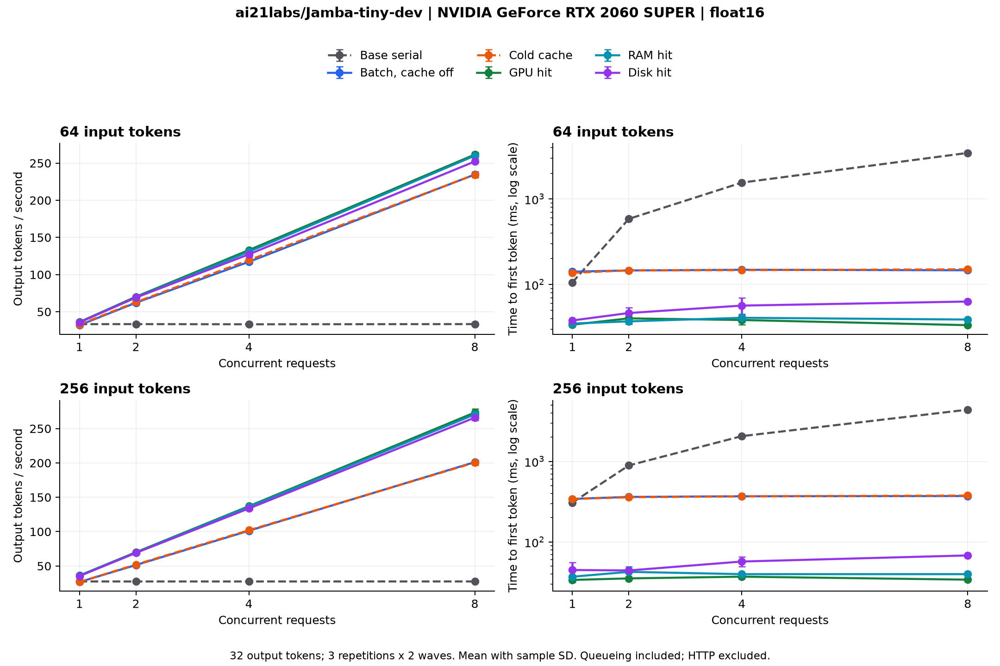

# Jamba base 및 hybrid GPU 비교

RTX 2060 SUPER 8GB에서 학습된 개발용 [AI21 Jamba-tiny-dev](https://huggingface.co/ai21labs/Jamba-tiny-dev)의 같은 가중치로 base와 hybrid 엔진을 비교했습니다. 모델은 318,688,640 파라미터이며 revision은 `ed303361004ac875426a61675edecf8e9d976882`입니다.

PyTorch 2.10.0+cu128, Transformers 4.57.6, FP16, SDPA를 사용했습니다. Mamba 전용 커널은 사용하지 않은 PyTorch 경로입니다. CPU 스레드 4개, `n_ctx=288`, `max_parallel=8`, 배치 대기 5ms로 실행했습니다. GPU, RAM, 디스크 캐시 예산은 각각 64, 256, 1024 MiB입니다.

## 주요 결과

입력 256토큰, 출력 32토큰의 결과입니다. 처리량은 출력 tok/s이며 각 조건을 3회 반복하고, 반복마다 2개 요청 묶음을 측정했습니다. 각 묶음은 동시성 수만큼 서로 다른 입력을 동시에 제출합니다. 따라서 조건별 측정 요청 수는 동시성 1에서 6개, 동시성 8에서 48개입니다.

| 조건 | 동시성 1 tok/s | 동시성 8 tok/s, 평균 및 표준편차 | 동시성 8 base 대비 | 동시성 1 TTFT ms | 동시성 8 TTFT ms |
| --- | ---: | ---: | ---: | ---: | ---: |
| base, 직렬 generate | 27.51 | 27.51 ± 0.57 | 1.00x | 308.12 | 4385.56 |
| 배치, prefix cache 없음 | 26.66 | 201.22 ± 2.80 | 7.31x | 342.58 | 371.55 |
| cold cache | 26.78 | 200.55 ± 3.62 | 7.29x | 341.20 | 376.71 |
| GPU hit | 36.15 | 273.43 ± 5.12 | 9.94x | 33.79 | 34.05 |
| RAM hit | 35.87 | 270.53 ± 4.32 | 9.83x | 37.04 | 39.86 |
| disk hit | 35.34 | 265.94 ± 4.38 | 9.67x | 44.88 | 68.07 |

동시성 1에서 GPU hit는 base 대비 처리량이 31.4% 증가했고 TTFT가 89.0% 감소했습니다. 같은 조건에서 batch와 cold cache는 base보다 약 3% 느렸습니다. 높은 동시성에서의 큰 개선에는 배치가 직렬 대기열을 줄인 효과가 포함됩니다.

동시성 8의 최대 할당 GPU 메모리는 base 680.4 MiB, batch 및 cold 1066.8 MiB, warm cache 조건 657.9 MiB였습니다. 이는 측정 구간의 PyTorch peak allocated 평균이며, 모델 로딩과 warm checkpoint 준비의 최대값이나 GPU 전체 사용량을 나타내지 않습니다.

## 검증과 측정 범위

입력 64/256토큰, 출력 32토큰, 동시성 1/2/4/8, 6개 조건을 3회 반복했습니다. 총 288개 측정 묶음과 1,080개 요청에서 base의 출력 토큰 ID 및 사용량과 모두 일치했습니다. 출력 길이 부족, 캐시 오류와 복원 토큰 수 불일치가 없었습니다. GPU, RAM, 디스크 조건은 각 측정 묶음의 hit가 해당 계층에서 발생했음을 검사했습니다.

base도 요청 내부의 dynamic KV와 Mamba 상태를 사용합니다. 요청 간 prefix cache, 사전 할당 hybrid 버퍼와 배치가 없는 기준 구현입니다. 입력과 출력, dtype 및 커널 경로는 두 엔진에서 같습니다.

HTTP와 입력 토큰화는 제외하고, 엔진의 대기열, 배치 대기, 생성 및 스트리머 비용을 포함했습니다. TTFT는 첫 생성 토큰의 CPU 도착 기준입니다. 모델 로딩, 워밍업, cache 초기화와 warm checkpoint 준비는 제외했습니다. cold 조건에는 checkpoint 생성 비용이 포함됩니다.

warm 조건은 모든 요청의 prefix가 준비된 상태입니다. 실제 서비스의 hit 비율을 가정한 혼합 부하가 아닙니다. disk 조건은 직전에 기록한 파일을 읽으므로 OS page cache 영향을 포함하며, 물리 디스크 cold read 성능을 나타내지 않습니다. p95는 표본 수가 적으므로 서비스의 장기 tail latency로 해석하지 않습니다.

측정 중 기존 llama.cpp Deployment를 0 replicas로 두어 GPU 추론을 분리했고 종료 후 1 replica 및 ready 상태를 복원했습니다. 기존 CUDA runtime 이미지에 이 저장소의 `src`와 `scripts`를 읽기 전용으로 연결했습니다. 소스 SHA-256은 측정 후 workspace와 다시 대조했습니다.

## 결과 파일과 재현

- [전체 조건 요약](benchmark-suite-20260930-063538/summary.md), [요약 CSV](benchmark-suite-20260930-063538/summary.csv), [측정 묶음별 CSV](benchmark-suite-20260930-063538/runs.csv)
- [실행 설정, 입력, 기준 출력과 모델 및 소스 SHA-256](benchmark-suite-20260930-063538/run.json)
- [검증 결과](benchmark-suite-20260930-063538/verification.json), [GPU 환경과 기존 서비스 복원 상태](benchmark-suite-20260930-063538/environment.json)
- [실행 및 벤치마크 가이드](../../../guides/hybrid-cache.md#base와-성능-비교)

`scripts/benchmark-hybrid.py`로 다시 측정합니다. 차트는 matplotlib이 있는 환경에서 `python scripts/plot-hybrid-benchmark.py <결과 디렉터리>`로 생성합니다. 요청별 토큰 ID와 지연의 원본은 결과 디렉터리의 로컬 `requests.jsonl`에 보관합니다.

이 결과는 작은 Jamba 개발용 모델과 현재 PyTorch 경로의 비교입니다. 대형 Jamba, Mamba 가속 커널, CUDA Graph 또는 HTTP 서비스의 성능으로 일반화하지 않습니다.
