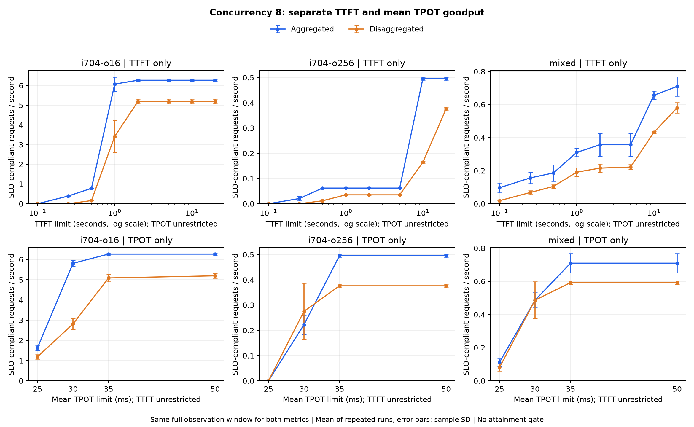

> Korean version: [한국어](separate-KR.md)

# Goodput with TTFT and ITL (TPOT) Applied Separately

When only TTFT is constrained, Aggregation (A) dominates clearly. When only ITL (TPOT) is constrained to 30 ms, Disaggregation (D) average goodput is higher on 256-token-output loads. First-response wait and average inter-token interval during generation show different results, so attainment and goodput for each must be judged separately.

For conditions where vLLM runtime results could differ, see the [vLLM source analysis](../vllm-source-analysis.md).

Recalculated 7,680 measured requests from the existing 2026-10-01 benchmark. A is 4 Aggregation workers, D is 1 Prefill plus 3 Decode workers, with the same model and MPS environment as the [original report](../summary.md). No new GPU benchmark was run.

## Calculation Method

- TTFT goodput: requests with `TTFT <= threshold` / total observation time of that run. No TPOT limit applied.
- ITL (TPOT) goodput: requests with `per-request average TPOT <= threshold` / same total observation time. No TTFT limit applied.
- Even for TPOT-only evaluation, TTFT and wait time are not subtracted from the denominator. Compares how many SLO-satisfying requests were processed during total service time.
- Raw AIPerf `inter_token_latency` matches `(request latency - TTFT) / (output tokens - 1)`. ITL (TPOT) in this report is a per-request average, not a maximum or p99 per-token-interval criterion.

Used TTFT 100, 250, 500, 1,000, 2,000, 5,000, 10,000, 20,000 ms and TPOT 25, 30, 35, 50 ms. Averaged goodput arithmetically across three repetitions, and computed attainment over 96 combined requests per condition per mode. Excluded warmup. Input length labels are synthetic input settings; actual inputs are 64→94, 256→286, 704→734 tokens.

## TTFT Limited to 1 Second Only

The table below is concurrency 8 with no TPOT limit. D change is goodput change vs A.

| Input/Output | A req/s | D req/s | A Attainment | D Attainment | D Change |
| --- | ---: | ---: | ---: | ---: | ---: |
| 64/16 | 7.745 | 4.526 | 100.0% | 76.0% | -41.57% |
| 64/64 | 0.253 | 0.144 | 12.5% | 9.4% | -43.16% |
| 64/256 | 0.063 | 0.036 | 12.5% | 9.4% | -42.98% |
| 256/16 | 7.686 | 4.727 | 100.0% | 80.2% | -38.50% |
| 256/64 | 0.249 | 0.141 | 12.5% | 9.4% | -43.19% |
| 256/256 | 0.063 | 0.036 | 12.5% | 9.4% | -43.31% |
| 704/16 | 6.074 | 3.420 | 96.9% | 65.6% | -43.70% |
| 704/64 | 0.236 | 0.138 | 12.5% | 9.4% | -41.68% |
| 704/256 | 0.062 | 0.035 | 12.5% | 9.4% | -43.14% |
| mixed | 0.311 | 0.191 | 43.8% | 32.3% | -38.45% |

At 1-second TTFT, A goodput is higher on all loads. Long-output loads have low attainment even for A, however. For 704/256, A 12.5% and D 9.4% pass, so the fact that A is relatively higher must be distinguished from whether the SLO is satisfied at that concurrency.

Relaxing TTFT to 10 seconds gives A 0.496 req/s at 100% and D 0.165 req/s at 43.8% attainment for the same 704/256. Pre-generation wait remains dominant for D. For wait and transfer-path analysis of the existing implementation, see [performance analysis](../analysis.md).

## ITL (TPOT) Limited to 30 ms Only

The table below is also concurrency 8 with no TTFT limit.

| Input/Output | A req/s | D req/s | A Attainment | D Attainment | D Change |
| --- | ---: | ---: | ---: | ---: | ---: |
| 64/16 | 7.103 | 5.101 | 91.7% | 85.4% | -28.18% |
| 64/64 | 1.605 | 1.411 | 79.2% | 91.7% | -12.08% |
| 64/256 | 0.216 | 0.334 | 42.7% | 86.5% | +54.22% |
| 256/16 | 7.208 | 5.025 | 93.8% | 85.4% | -30.29% |
| 256/64 | 1.369 | 1.259 | 68.8% | 83.3% | -8.04% |
| 256/256 | 0.199 | 0.322 | 39.6% | 84.4% | +61.56% |
| 704/16 | 5.812 | 2.815 | 92.7% | 54.2% | -51.58% |
| 704/64 | 1.182 | 1.013 | 62.5% | 68.8% | -14.28% |
| 704/256 | 0.223 | 0.276 | 44.8% | 72.9% | +23.83% |
| mixed | 0.486 | 0.486 | 68.8% | 82.3% | +0.04% |

For 256-token output, D is 23.8–61.6% higher. D's larger share under 30 ms TPOT offsets its lower overall completion throughput. For 64-token output, D attainment is higher but goodput is still lower than A. An example where attainment alone cannot judge per-time processing performance.

Mixed load is effectively tied at A 0.48616 ± 0.04611 and D 0.48636 ± 0.11087 req/s. The 0.04% gap is far smaller than run-to-run variation. ± is sample SD across three repetitions. Token goodput summing output tokens of passing requests in the same condition is A 60.54 and D 72.69 tok/s. With mixed output lengths, request-count and token-count results can differ.

Relaxing the TPOT limit to 35 ms or 50 ms makes A goodput higher on all loads at concurrency 8. At 25 ms, the six fixed-length 64/256-token loads are 0 for both sides. For 64/16, D is 14.9% higher but attainment is only A 8.3% and D 12.5%.



## When Both Conditions Are Applied

For input/output 704/256 at concurrency 8, separate criteria and their intersection compare as follows.

| Applied Criterion | A req/s | D req/s | A Attainment | D Attainment |
| --- | ---: | ---: | ---: | ---: |
| TTFT <= 10s only | 0.496 | 0.165 | 100.0% | 43.8% |
| TPOT <= 30ms only | 0.223 | 0.276 | 44.8% | 72.9% |
| TTFT <= 10s AND TPOT <= 30ms | 0.223 | 0.137 | 44.8% | 36.5% |

For A, all 96 pass TTFT and the 43 passing TPOT are the final passes. For D, 42 pass TTFT and 70 pass TPOT, but only 35 satisfy both. D's average-TPOT advantage therefore does not carry over to goodput with both SLOs satisfied. Full intersection results are in the [existing analysis](summary.md).

## Concurrency Selection at 95% Attainment

Applied each metric independently and, in each repetition, selected the concurrency 1, 2, 4, or 8 with the highest average goodput among those passing at least 95%. With 32 requests per repetition, at least 31 must pass in each repetition.

| Applied Criterion | Input/Output | A Concurrency | A req/s | D Concurrency | D req/s |
| --- | --- | ---: | ---: | ---: | ---: |
| TTFT <= 1s only | 704/16 | 4 | 6.137 | 4 | 4.808 |
| TTFT <= 1s only | 704/256 | 4 | 0.495 | 2 | 0.261 |
| TTFT <= 1s only | mixed | 2 | 0.447 | 1 | 0.224 |
| TPOT <= 30ms only | 704/16 | 2 | 3.423 | 2 | 2.904 |
| TPOT <= 30ms only | 704/256 | 2 | 0.264 | 1 | 0.131 |
| TPOT <= 30ms only | mixed | 2 | 0.447 | 2 | 0.383 |

Concurrency 8, where D long-output goodput was higher at TPOT 30 ms, has 72.9–86.5% attainment and is therefore excluded from this table. For 64/256 and 256/256, D has no candidate satisfying 95% TPOT 30 ms in every repetition among the four measured concurrencies. This selection is a result for the current samples and measured concurrencies; it does not guarantee a long-term SLA or maximum sustainable QPS.

## Artifacts and Reproduction

| Content | TTFT Only | TPOT Only |
| --- | --- | --- |
| Per-repetition results | [1,920 rows](ttft-run-results.csv) | [960 rows](tpot-run-results.csv) |
| Per-mode aggregation | [640 rows](ttft-summary.csv) | [320 rows](tpot-summary.csv) |
| Same-concurrency A/D comparison | [320 rows](ttft-comparison.csv) | [160 rows](tpot-comparison.csv) |
| Best goodput among 95% per-repetition passes | [160 rows](ttft-best-feasible.csv) | [80 rows](tpot-best-feasible.csv) |

Inactive SLO thresholds in CSVs are blank; the pass count for that metric equals total requests. A blank threshold does not mean a 0 ms limit. Definitions and verification info are in [metadata.json](metadata.json).

Existing intersection CSVs and the original SHA-256 list are unchanged. Verified that TTFT and TPOT pass counts of all intersection results match independent calculations, and that intersection goodput never exceeds either independent goodput. Hash verification of 722 original files and 36 related tests passed.

Uses Python, matplotlib, and existing raw data from the repository root. Command to regenerate default-threshold results:

```sh
python3 scripts/report-pd-goodput.py docs/reports/gpu/pd/benchmark-four-20261001
```

This command generates `ttft-*.csv`, `tpot-*.csv`, and `goodput-separated.png` alongside existing intersection files. For other thresholds and separate output paths, see [reproduction guide](summary.md#measurement-interpretation-and-reproduction).
