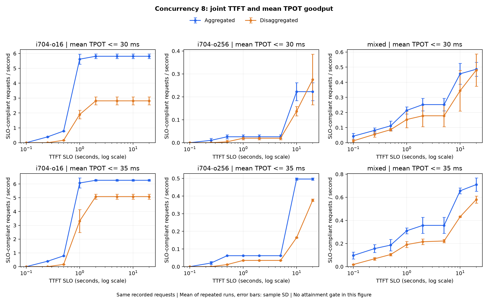

> Korean version: [한국어](summary-KR.md)

# MPS 4-Way Split Goodput Comparison

Aggregation with 4 workers (A) showed higher goodput under most SLOs. Disaggregation with 1 Prefill and 3 Decode workers (D) reverses average goodput only for long outputs with a greatly relaxed TTFT limit and a 30 ms average TPOT limit. Attainment in that condition is still below 95%, however. Comparing only configurations that attain at least 95% in every repetition keeps A's advantage, and D's only advantage is 0.2%.

Recalculated per-request raw data from the [4-way benchmark](../summary.md) completed on 2026-10-01. No new GPU measurements were run. Model is SmolLM2-135M-Instruct FP16, using 4 MPS shares of a single RTX 2060 SUPER.

For results applying each metric separately, see [TTFT and ITL (TPOT) independent goodput comparison](separate.md).

## Calculation Criteria

Goodput is completed requests satisfying both TTFT and TPOT criteria divided by measurement time. Follows the [NVIDIA AIPerf goodput definition](https://docs.nvidia.com/aiperf/tutorials/metrics-analysis/benchmark-goodput-with-ai-perf), using request-count goodput as the primary metric with attainment shown separately.

```text
Passing requests = TTFT <= TTFT SLO AND per-request average TPOT <= TPOT SLO
Average TPOT = (request latency - TTFT) / (output tokens - 1)
Request goodput = passing requests / measurement time of that run       [req/s]
Token goodput = sum of output tokens of passing requests / measurement time    [tok/s]
Attainment = passing requests / total measured requests
```

- TTFT SLO: 100, 250, 500, 1,000, 2,000, 5,000, 10,000, 20,000 ms.
- TPOT SLO: 25, 30, 35, 50 ms. 32 combinations total, a sensitivity-analysis range. Not finalized product SLOs.
- Uses 240 runs across 10 input/output combinations, concurrency 1, 2, 4, 8, and 3 repetitions per mode. 96 requests per condition per mode, 7,680 measured requests total, excluding warmup.
- Goodput averages per-repetition values arithmetically; attainment combines the 96 requests of the same condition. Table SD is run-to-run sample SD, not a confidence interval.
- AIPerf 0.12.0 throughput and goodput use the observation time window. Restored that time as `request count / stored request_throughput` and verified consistency with output-token throughput. Maximum difference from the separate `benchmark_duration` field is 0.1273%.

Table input lengths 64, 256, 704 are synthetic input settings. Actual input lengths are 94, 286, 734 tokens respectively. Mixed load is 18 requests of 94/256 tokens and 14 of 734/16 tokens per repetition.

## Same-Concurrency Comparison

Representative conditions at concurrency 8. Results are not filtered by 95% attainment here. D change is `(D / A - 1) × 100`.

| TTFT / TPOT SLO | Input/Output | A req/s | D req/s | A Attainment | D Attainment | D Change |
| --- | --- | ---: | ---: | ---: | ---: | ---: |
| 1s / 35ms | 64/16 | 7.745 | 4.237 | 100.0% | 70.8% | -45.3% |
| 1s / 35ms | 704/16 | 6.074 | 3.312 | 96.9% | 63.5% | -45.5% |
| 1s / 35ms | mixed | 0.311 | 0.191 | 43.8% | 32.3% | -38.5% |
| 20s / 30ms | 64/256 | 0.216 | 0.334 | 42.7% | 86.5% | +54.2% |
| 20s / 30ms | 256/256 | 0.199 | 0.322 | 39.6% | 84.4% | +61.6% |
| 20s / 30ms | 704/256 | 0.223 | 0.276 | 44.8% | 72.9% | +23.8% |
| 20s / 35ms | 704/256 | 0.496 | 0.376 | 100.0% | 100.0% | -24.2% |
| 20s / 35ms | mixed | 0.710 | 0.580 | 100.0% | 97.9% | -18.2% |

With a 1-second TTFT limit, D's long first-response wait makes the gap larger than a plain throughput comparison. For 704/16, D throughput was 17.1% below A, but goodput under this SLO is 45.5% lower. Mixed load attainment is 43.8% even for A, so this concurrency cannot be interpreted as satisfying the SLO.



Across 320 comparisons from 32 SLOs × 10 loads at concurrency 8, A is higher in 238, D higher in 13, and both zero in 69. Because thresholds re-evaluate the same requests, these are not 320 independent experiments. D is higher in no condition at TPOT 35 ms or 50 ms. Full-concurrency numbers are in [comparison CSV](comparison.csv).

## Why Rankings Flip on Long Outputs

At TTFT 20 s, TPOT 30 ms, and concurrency 8, all 256-token-output requests pass the TTFT criterion. Differences come from requests passing the TPOT criterion.

| Input/Output | A Pass/Total | D Pass/Total | A Goodput Mean ± SD | D Goodput Mean ± SD |
| --- | ---: | ---: | ---: | ---: |
| 64/256 | 41/96 | 83/96 | 0.216 ± 0.067 | 0.334 ± 0.097 |
| 256/256 | 38/96 | 81/96 | 0.199 ± 0.010 | 0.322 ± 0.087 |
| 704/256 | 43/96 | 70/96 | 0.223 ± 0.039 | 0.276 ± 0.111 |

Units are req/s. Even with lower overall completion throughput, D goodput is higher because a larger share is under 30 ms TPOT. Relaxing TPOT to 35 ms passes all requests in these three loads, restoring A's overall throughput advantage. Conversely, reducing TTFT to 10 s makes A goodput higher on all three loads even at TPOT 30 ms.

This reversal is sensitive to thresholds and repetition variation. For 704/256, run 1 gives A 0.200 and D 0.150 req/s with A higher, while D is higher in the other two runs. Do not interpret D's average goodput advantage as stable SLO satisfaction or a general performance advantage.

## Configurations Attaining 95%+ in Every Repetition

For each mode, kept only candidates with at least 95% attainment in all three repetitions across concurrency 1, 2, 4, and 8, then selected the configuration with the highest average request goodput. With 32 requests per repetition, at least 31 must pass in each repetition. Shows `none` where no candidate exists.

| TTFT / TPOT SLO | Input/Output | A Concurrency | A req/s | D Concurrency | D req/s |
| --- | --- | ---: | ---: | ---: | ---: |
| 1s / 35ms | 64/16 | 4 | 7.804 | 2 | 3.965 |
| 1s / 35ms | 704/16 | 4 | 6.137 | 4 | 4.808 |
| 1s / 35ms | 704/256 | 4 | 0.495 | 2 | 0.261 |
| 1s / 35ms | mixed | 2 | 0.447 | 1 | 0.224 |
| 20s / 30ms | 64/256 | 2 | 0.269 | none | none |
| 20s / 30ms | 704/256 | 2 | 0.264 | 1 | 0.131 |
| 20s / 30ms | mixed | 2 | 0.447 | 2 | 0.383 |

Of 320 combinations from 32 SLOs × 10 loads, 180 have candidates on both sides. Among them, A is higher in 176 and D higher in 4. All four D cases are 64/256 at concurrency 2 with TTFT 250/500 ms and TPOT 35/50 ms combinations. The gap is A 0.26918 ± 0.00064 vs D 0.26972 ± 0.00383 req/s, about 0.2% and smaller than repetition variation. A-only candidates occur in 18, D-only in 0, and neither in 122 cases.

This is the maximum among sample-attainment-passing candidates across the four measured concurrencies. It is not maximum sustainable QPS from an experiment varying request arrival rate, nor a value statistically guaranteeing a long-term SLA. Full results are in [best concurrency under attainment CSV](best-feasible.csv).

## Mixed-Load Token Goodput

Mixed loads have different output lengths among passing requests, so token goodput was not computed as `total tok/s × request attainment`. Summed actual output tokens of passing requests. Results at concurrency 8.

| TTFT / TPOT SLO | A req/s | D req/s | A Token Goodput | D Token Goodput |
| --- | ---: | ---: | ---: | ---: |
| 1s / 35ms | 0.311 | 0.191 | 52.884 tok/s | 35.624 tok/s |
| 20s / 30ms | 0.486 | 0.480 | 60.544 tok/s | 71.135 tok/s |
| 20s / 35ms | 0.710 | 0.580 | 107.187 tok/s | 87.830 tok/s |

At 20s/30ms, request goodput is similar but token goodput is higher for D. Rankings of the two metrics can differ depending on which requests pass. Attainment in that condition is A 68.8% and D 81.3%, both below 95%.

## Measurement Interpretation and Reproduction

TTFT is time until the first text chunk reaches the client. Includes TextStreamer word buffering and queueing. TPOT is the per-request average; it does not verify an SLO limiting maximum delay between individual tokens. This is a post-hoc calculation over 7,680 existing error-free requests, with the original finite-request-count and fixed-concurrency constraints intact. For cause analysis of the current HTTP KV transfer and batch-1 implementation, see [performance analysis](../analysis.md).

Recalculated TPOT for every raw request and verified agreement with stored AIPerf `inter_token_latency`. Maximum difference is under 2.28e-13 ms. Verified request counts, actual token lengths, and A/D payload hashes; with unlimited SLOs, existing request/output-token throughput is reproduced. Also stored SHA-256 of 722 original files.

| File | Content |
| --- | --- |
| [run-results.csv](run-results.csv) | Per-repetition goodput, pass counts, and times for 240 runs × 32 SLOs |
| [summary.csv](summary.csv) | Per-mode means, SDs, and attainment for 2,560 conditions |
| [comparison.csv](comparison.csv) | 1,280 same-concurrency A/D comparisons |
| [best-feasible.csv](best-feasible.csv) | Per-mode best goodput among candidates passing 95%+ in every repetition |
| [metadata.json](metadata.json) | Definitions, thresholds, and verification results |
| [source-sha256.json](source-sha256.json) | Source file paths and hashes used |

Requires Python and matplotlib plus original `reports/pd/benchmark-four-20261001` from the repository root. The following command regenerates CSVs, JSON, and plots. This interpretation document explains default-threshold results.

```sh
python3 scripts/report-pd-goodput.py docs/reports/gpu/pd/benchmark-four-20261001
```

Other SLOs can be stored in a separate output path.

```sh
python3 scripts/report-pd-goodput.py docs/reports/gpu/pd/benchmark-four-20261001 \
  --ttft-ms 250,500,1000,2000 \
  --tpot-ms 25,30,35,50 \
  --min-attainment 0.95 \
  --output-dir reports/pd/goodput-custom
```
