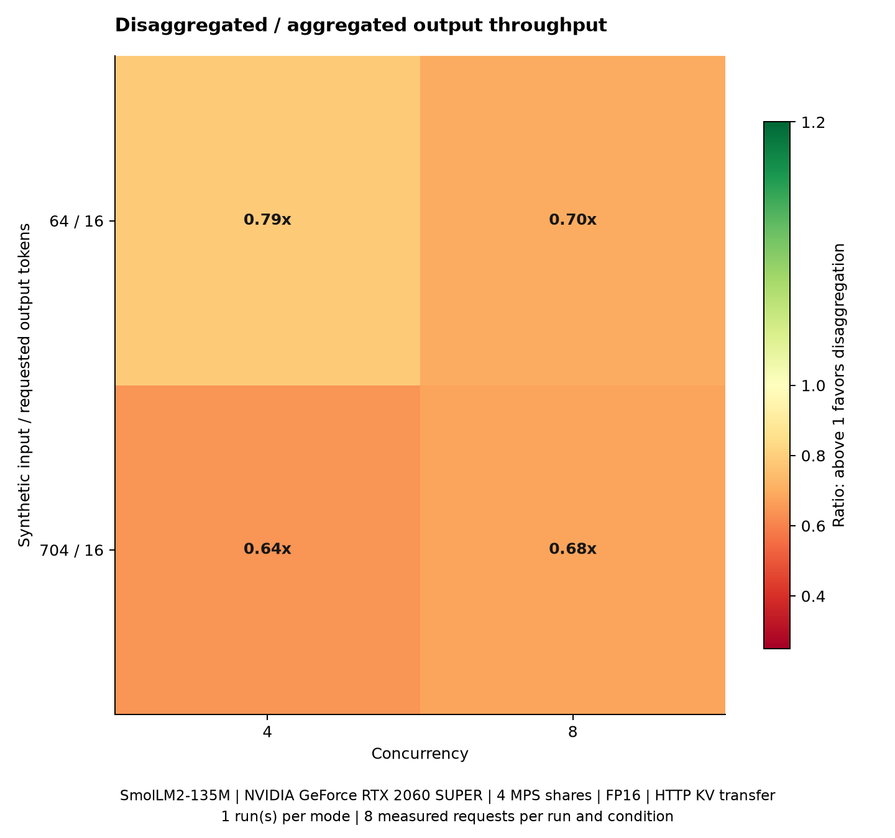
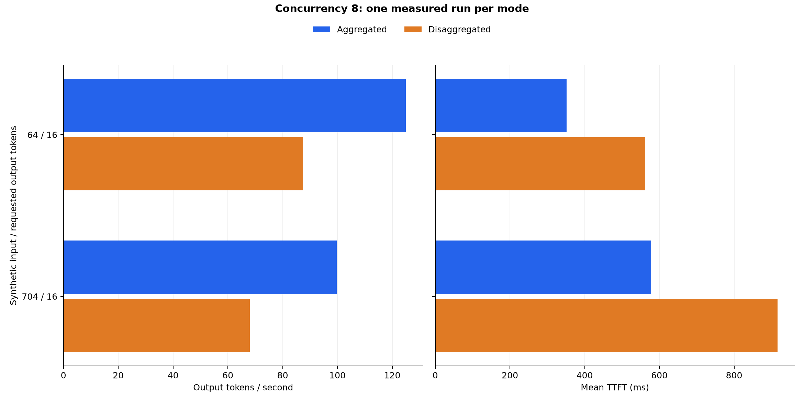

# Aggregation과 Prefill/Decode disaggregation 성능 비교

SmolLM2-135M-Instruct, FP16, GPU: `NVIDIA GeForce RTX 2060 SUPER, GPU-7b77b97b-2222-89f1-2d5e-5c488faedd7b, 580.126.09, 8192 MiB`.

집계에 포함한 측정 요청은 64개이며, 이 요청들의 오류는 0개입니다. 입력과 출력 조합 2개, 동시성 [4, 8], 1회 반복이며 조건과 반복별 8개 요청을 측정했습니다.

Disaggregation의 평균 처리량이 aggregation보다 높은 조건은 4개 중 0개입니다. 이는 단일 GPU의 MPS share 4개와 CPU 메모리를 경유하는 HTTP 상태 전달 구현에 대한 결과입니다.

동시성 8에서 disaggregation / aggregation 처리량 비율은 0.68x부터 0.70x입니다.



## 동시성 8 비교

A는 aggregation, D는 disaggregation입니다. 입력 길이는 합성 텍스트 기준이며 실제 사용량은 표에 별도로 표시합니다.

| 입력/출력 | 실제 입력 평균 | A tok/s | D tok/s | D 변화 | A TTFT ms | D TTFT ms | A p95 지연 ms | D p95 지연 ms |
| --- | ---: | ---: | ---: | ---: | ---: | ---: | ---: | ---: |
| 64/16 | 94.0 | 124.96 | 87.48 | -30.0% | 351.8 | 562.1 | 1019.5 | 1456.4 |
| 704/16 | 734.0 | 99.70 | 68.03 | -31.8% | 578.0 | 916.4 | 1277.0 | 1877.2 |



## 측정 조건

- Aggregation: 전체 추론 worker 4개. Disaggregation: Prefill worker 1개와 Decode worker 3개.
- 각 worker는 MPS share 1개, CPU 요청 1과 상한 2, 메모리 2 GiB를 사용합니다. 두 mode 모두 같은 CPU router를 사용합니다.
- 물리 GPU 하나를 MPS share 4개로 나누며 client별 active thread 한도는 25%입니다.
- Greedy decoding, EOS 억제, 요청별 batch 1, prefix cache와 continuous batching 비활성화입니다.
- 합성 입력 [64, 704], 출력 [16]의 모든 조합을 측정했습니다. 혼합 분포는 `없음`입니다.
- AIPerf 0.12.0, seed 42, 데이터셋 8개, sequential sampling을 사용했습니다.
- 혼합 부하에서 실제 측정된 입력/출력별 반복당 요청 수는 없음입니다. 설정의 확률과 유한 데이터셋의 실제 비중은 다를 수 있습니다.
- 각 조건의 워밍업 2개는 통계에서 제외했습니다. 배포, 모델 로딩과 AIPerf 시작 시간도 처리량에서 제외합니다.
- 반복별 mode 순서는 A→D입니다. 두 mode의 요청 payload 해시와 실제 입력, 출력 길이별 요청 수가 동일한지 검사했습니다.
- 출력 길이가 요청값과 다르거나 요청 오류가 있으면 해당 실행을 성공 결과로 저장하지 않습니다.

## 지표와 해석 범위

처리량, 평균 지연, 평균 TTFT와 ITL은 반복별 AIPerf 지표를 산술 평균했습니다. 1회 측정이므로 반복 간 변동성은 추정하지 않습니다. p95 지연과 p95 TTFT는 같은 조건의 모든 반복 요청을 합쳐 nearest-rank로 계산했습니다. 조건별 mode당 표본은 8개이며 긴 꼬리 지연의 정밀 추정에는 더 많은 표본이 필요합니다.

TTFT는 첫 텍스트 chunk 도착까지의 시간이며 대기열, tokenization과 HTTP 전달을 포함합니다. TextStreamer의 단어 버퍼 때문에 첫 GPU 토큰 생성 시간과 다를 수 있습니다. ITL은 AIPerf의 streaming 지표입니다.

분리 경로는 GPU KV cache를 CPU로 복사한 뒤 Prefill→Router→Decode의 HTTP 경로로 보냅니다. Decode는 프롬프트를 다시 계산하지 않습니다. 첫 토큰 선택도 Decode worker에서 수행하므로 TTFT에는 Decode 대기열이 포함됩니다. Aggregation의 4개 worker는 각각 decode를 수행하고 분리 구성에는 decode worker가 3개입니다. 긴 출력의 처리량, 전송 비용과 높은 동시성의 대기 시간을 이 조건에 맞춰 해석해야 합니다.

RDMA, NVLink 또는 CUDA IPC를 사용한 전송, continuous batching, 대형 모델과 다중 물리 GPU의 성능으로 일반화하지 않습니다.

## 원본과 재현

[집계 CSV](summary.csv), [조건별 A/D 비교](comparison.csv), [집계 설정과 검증 JSON](summary.json), [worker 단계별 진단](phase-diagnostics.json)에 수치가 있습니다. 단계별 진단은 워밍업을 포함한 worker 로그의 평균이며 AIPerf 측정 통계와 분리합니다.

요청별 AIPerf exports, payload, GPU 표본과 Pod 로그는 저장소의 `reports/pd/four-slot-check-20261001`에 보관합니다. 원본 경로는 Git에서 제외됩니다.

```sh
python3 scripts/benchmark-pd.py --mps-replicas 4 --cluster local-k8s-gpu --config docs/reports/gpu/pd/four-slot-check-20261001/workload.json
python3 scripts/report-pd.py docs/reports/gpu/pd/four-slot-check-20261001
```

준비와 설정은 [PD 비교 가이드](../../../../guides/prefill-decode-4.md)를 참고합니다.

실행 환경과 기존 환경 복구 검사는 [환경 검증 결과](environment-validation.json)에 기록합니다.

배포 검증 범위와 기존 환경 보존 확인은 [구성 검증](validation.md)을 참고합니다.
