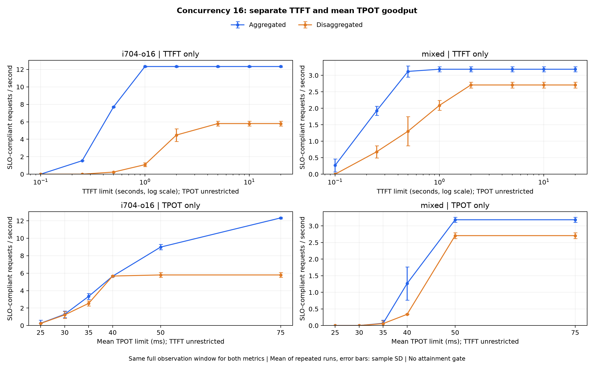

# TTFT와 TPOT를 분리한 goodput

한 지표의 임계값만 적용하며 다른 지표는 제한하지 않습니다. Goodput은 통과 요청 수를 전체 측정 관찰 시간으로 나눈 값입니다. 각 반복의 goodput을 산술 평균하며 워밍업은 제외합니다. TPOT는 요청별 평균이고 개별 토큰 ITL 상한이 아닙니다.

아래는 동시성 16의 혼합 부하입니다. 충족률은 두 반복의 48개 요청을 합산했습니다. 작은 충족률에서 goodput이 높더라도 대부분 요청이 SLO를 만족한다는 뜻은 아닙니다.

| 기준 | 상한 ms | A req/s | D req/s | A 충족률 | D 충족률 |
| --- | ---: | ---: | ---: | ---: | ---: |
| TTFT | 100 | 0.268 | 0.000 | 8.3% | 0.0% |
| TTFT | 250 | 1.925 | 0.679 | 60.4% | 25.0% |
| TTFT | 500 | 3.120 | 1.304 | 97.9% | 47.9% |
| TTFT | 1000 | 3.185 | 2.088 | 100.0% | 77.1% |
| TTFT | 2000 | 3.185 | 2.707 | 100.0% | 100.0% |
| TTFT | 5000 | 3.185 | 2.707 | 100.0% | 100.0% |
| TTFT | 10000 | 3.185 | 2.707 | 100.0% | 100.0% |
| TTFT | 20000 | 3.185 | 2.707 | 100.0% | 100.0% |
| TPOT | 25 | 0.000 | 0.000 | 0.0% | 0.0% |
| TPOT | 30 | 0.000 | 0.000 | 0.0% | 0.0% |
| TPOT | 35 | 0.067 | 0.058 | 2.1% | 2.1% |
| TPOT | 40 | 1.266 | 0.338 | 39.6% | 12.5% |
| TPOT | 50 | 3.185 | 2.707 | 100.0% | 100.0% |
| TPOT | 75 | 3.185 | 2.707 | 100.0% | 100.0% |

[전체 TTFT 비교](ttft-comparison.csv), [전체 TPOT 비교](tpot-comparison.csv), [집계 규칙과 원본 검증](metadata.json).

`best-feasible` CSV는 모든 반복에서 95% 이상 충족한 동시성 중 가장 높은 goodput을 선택합니다. 그런 조건이 없으면 빈칸입니다.

[두 SLO 동시 적용](summary.md), [성능 비교](../summary.md).
