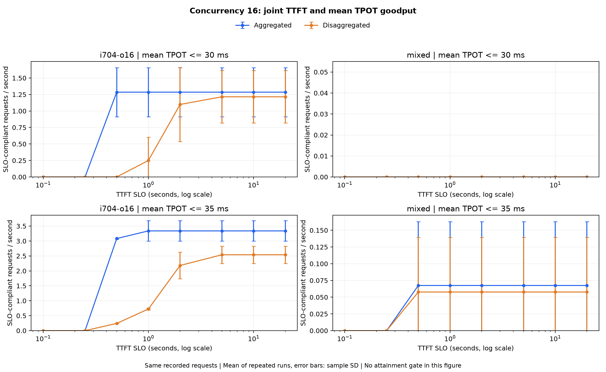

> Korean version: [한국어](summary-KR.md)

# TTFT and TPOT Joint-SLO Goodput

Counts only requests passing both TTFT and per-request average TPOT caps. Excludes warmup and averages per-repetition goodput arithmetically.

[Full comparison CSV](comparison.csv), [capacity under 95% attainment](best-feasible.csv), [raw-data verification and aggregation rules](metadata.json).

[Results constraining TTFT and TPOT separately](separate.md).
