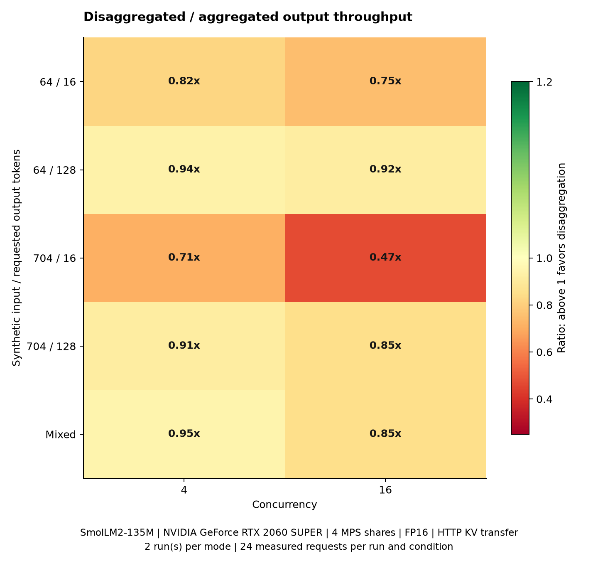
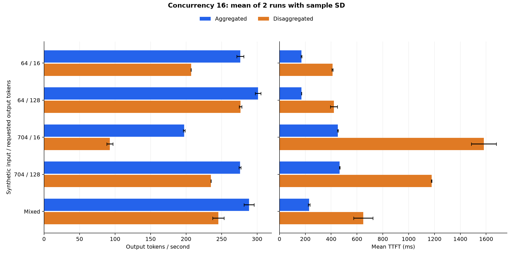

> Korean version: [한국어](summary-KR.md)

# Aggregation vs Prefill/Decode Disaggregation Performance Comparison

SmolLM2-135M-Instruct, FP16, GPU: `NVIDIA GeForce RTX 2060 SUPER, GPU-7b77b97b-2222-89f1-2d5e-5c488faedd7b, 580.126.09, 8192 MiB`.

Measured requests included in aggregation are 960, with 0 errors among them. 5 input/output combinations, concurrency [4, 16], 2 repetitions, with 24 requests measured per condition per repetition.

Disaggregation average throughput is higher than aggregation in 0 of 10 conditions. This is a result for 4 MPS shares of a single GPU and HTTP state transfer through CPU memory.

The disaggregation / aggregation throughput ratio at concurrency 16 ranges from 0.47x to 0.92x.



## Concurrency 16 Comparison

A is aggregation, D is disaggregation. Input lengths are synthetic-text settings; actual usage is shown separately in the table.

| Input/Output | Actual Avg Input | A tok/s | D tok/s | D Change | A TTFT ms | D TTFT ms | A p95 Latency ms | D p95 Latency ms |
| --- | ---: | ---: | ---: | ---: | ---: | ---: | ---: | ---: |
| 64/16 | 94.0 | 276.36 | 207.06 | -25.1% | 169.7 | 410.8 | 816.4 | 1381.8 |
| 64/128 | 94.0 | 301.37 | 276.64 | -8.2% | 170.1 | 421.3 | 5769.4 | 6847.6 |
| 704/16 | 734.0 | 197.29 | 92.74 | -53.0% | 451.9 | 1581.7 | 1470.9 | 2999.5 |
| 704/128 | 734.0 | 275.97 | 235.13 | -14.8% | 465.8 | 1177.8 | 6653.6 | 8951.8 |
| mixed | 307.3 | 288.76 | 245.46 | -15.0% | 229.6 | 648.1 | 5978.9 | 6992.1 |



## Measurement Conditions

- Aggregation: 4 full inference workers. Disaggregation: 1 Prefill worker and 3 Decode workers.
- Each worker uses 1 MPS share, CPU request 1 and limit 2, 2 GiB memory. Both modes use the same CPU router.
- Splits one physical GPU into 4 MPS shares with a 25% per-client active thread limit.
- Greedy decoding, EOS suppression, RUNNING-first continuous batching, per-step token budget 256, max_num_seqs 8, prefix cache disabled.
- Measured all combinations of synthetic inputs [64, 704] and outputs [16, 128]. Mixed distribution is `64,128:50;704,16:50`.
- Used AIPerf 0.12.0, seed 42, 24 datasets, sequential sampling.
- In mixed load, measured per-repetition request counts by actual input/output are 16 requests of 94/128 tokens and 8 of 734/16 tokens. Configured probabilities and actual shares of the finite dataset can differ.
- Excluded 4 warmup requests per condition from statistics. Deployment, model loading, and AIPerf startup time are also excluded from throughput.
- Per-repetition mode order is A→D, D→A. Verified that request payload hashes and actual input/output length request counts match between modes.
- If output length differs from the requested value or a request errors, that run is not stored as a successful result.

## Metrics and Interpretation Scope

Throughput, average latency, average TTFT, and ITL are arithmetic means of per-repetition AIPerf metrics. Standard deviation is run-to-run sample SD. p95 latency and p95 TTFT use nearest-rank over all repeated requests in the same condition. Samples are 48 per mode per condition; more samples are needed for precise estimation of long-tail latency.

TTFT is time until the first text chunk arrives and includes queueing, tokenization, and HTTP transfer. Because of the TextStreamer word buffer, it can differ from first GPU token generation time. ITL is the AIPerf streaming metric.

The disaggregated path copies GPU KV cache to CPU, then sends it over the Prefill→Router→Decode HTTP path. For first-output generation, Decode recomputes the last prompt token. First-token selection also runs on the Decode worker, so TTFT includes Decode queueing. Aggregation's 4 workers each decode, while the disaggregated setup has 3 decode workers. Interpret long-output throughput, transfer cost, and high-concurrency latency under these conditions.

Uses packed SDPA and per-request KV copies; does not implement vLLM PagedAttention, CUDA graphs, async execution, or preemption. Do not interpret these results as vLLM performance itself.

## Raw Data and Reproduction

Values are in [aggregation CSV](summary.csv), [per-condition A/D comparison](comparison.csv), [aggregation configuration and verification JSON](summary.json), and [worker phase diagnostics](phase-diagnostics.json). Phase diagnostics are worker-log averages including warmup, separate from AIPerf measurement statistics.

Per-request AIPerf exports, payloads, GPU samples, and Pod logs are kept in `reports/pd/scheduler-20261002-b256` in storage. Raw paths are excluded from Git.

```sh
python3 scripts/benchmark-pd.py --mps-replicas 4 --cluster local-k8s-gpu --scheduler token-budget --token-budget 256 --config docs/reports/gpu/pd/scheduler-20261002-b256/workload.json
python3 scripts/report-pd.py docs/reports/gpu/pd/scheduler-20261002-b256
```

For setup and configuration, see the [PD comparison guide](../../../../guides/prefill-decode-4.md).

For per-request TTFT and TPOT threshold results, see [Goodput comparison](goodput/summary.md).

Scheduling token budget, request-count caps, and per-role prefill/decode separation are recorded in [step-log verification](scheduler-diagnostics.json). Includes warmup logs.
