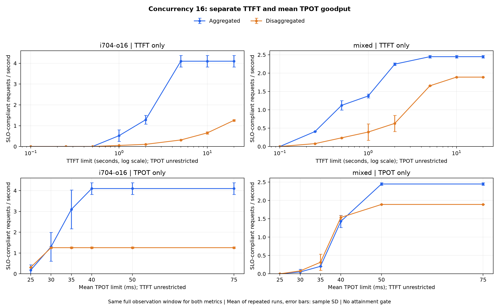

> Korean version: [한국어](separate-KR.md)

# TTFT and TPOT Goodput Separately

Applies only one metric's threshold and does not constrain the other. Goodput is passing requests divided by total measured observation time. Averages per-repetition goodput arithmetically and excludes warmup. TPOT is a per-request average, not a per-token ITL cap.

Below is concurrency-16 mixed load. Attainment sums 48 requests across two repetitions. High goodput at low attainment does not mean most requests satisfy the SLO.

| Criterion | Cap ms | A req/s | D req/s | A Attainment | D Attainment |
| --- | ---: | ---: | ---: | ---: | ---: |
| TTFT | 100 | 0.000 | 0.000 | 0.0% | 0.0% |
| TTFT | 250 | 0.408 | 0.079 | 16.7% | 4.2% |
| TTFT | 500 | 1.121 | 0.236 | 45.8% | 12.5% |
| TTFT | 1000 | 1.376 | 0.394 | 56.2% | 20.8% |
| TTFT | 2000 | 2.244 | 0.630 | 91.7% | 33.3% |
| TTFT | 5000 | 2.448 | 1.654 | 100.0% | 87.5% |
| TTFT | 10000 | 2.448 | 1.891 | 100.0% | 100.0% |
| TTFT | 20000 | 2.448 | 1.891 | 100.0% | 100.0% |
| TPOT | 25 | 0.000 | 0.000 | 0.0% | 0.0% |
| TPOT | 30 | 0.050 | 0.079 | 2.1% | 4.2% |
| TPOT | 35 | 0.204 | 0.315 | 8.3% | 16.7% |
| TPOT | 40 | 1.429 | 1.536 | 58.3% | 81.2% |
| TPOT | 50 | 2.448 | 1.891 | 100.0% | 100.0% |
| TPOT | 75 | 2.448 | 1.891 | 100.0% | 100.0% |

[Full TTFT comparison](ttft-comparison.csv), [full TPOT comparison](tpot-comparison.csv), [aggregation rules and raw-data verification](metadata.json).

`best-feasible` CSVs select the highest-goodput concurrency among those attaining 95%+ in every repetition. Blank where no such condition exists.

[Both SLOs applied together](summary.md), [performance comparison](../summary.md).
