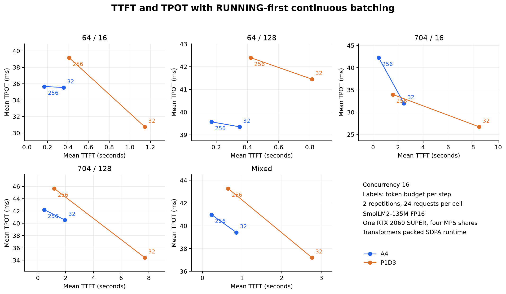

# Token budget 스케줄러 검증

RUNNING 우선 continuous batching과 chunked prefill을 추가하고 실제 GPU에서 A4와 P1D3를 비교했습니다. TPOT SLO를 유지하면서 prefill budget을 크게 설정할 수 있는 조건에서 P1D3의 TTFT 개선을 확인했습니다.

같은 token budget끼리 비교한 20개 조건에서는 P1D3의 평균 TTFT가 더 낮은 조건이 0개였습니다. 설정 선택의 기준이 중요합니다.

측정 요청 1,920개, 오류 0개, worker 재시작 0회, router OOM 0회입니다. 기존 MPS 구성과 보고서를 보존했고 원래 GPU 환경으로 복구했습니다.

## 대표 사례: TPOT 상한을 지키는 설정 비교

합성 입력 704토큰(실제 prompt 734토큰), 출력 16토큰, 동시성 16입니다. 예시 목표로 요청별 평균 TPOT 40 ms 이하를 각 반복에서 95% 이상 충족하도록 설정을 선택했습니다. 요청 표본은 각 행당 48개이며 아래 충족률은 두 반복을 합산했습니다.

| 구성 | Budget | TTFT ms | 평균 TPOT ms | TPOT 충족률 | 최소 반복 충족률 | Goodput req/s |
| --- | ---: | ---: | ---: | ---: | ---: | ---: |
| A4 | 32 | 2464.0 | 32.0 | 100.0% | 100.0% | 4.097 |
| A4 | 256 | 451.9 | 42.3 | 45.8% | 45.8% | 5.652 |
| P1D3 | 32 | 8476.5 | 26.7 | 100.0% | 100.0% | 1.256 |
| P1D3 | 256 | 1581.7 | 34.0 | 97.9% | 95.8% | 5.672 |

목표를 통과한 A4 budget 32와 P1D3 budget 256을 비교하면 평균 TTFT는 **2,464.0→1,581.7 ms로 35.8% 감소**, TPOT-only goodput은 **4.097→5.672 req/s로 38.4% 증가**했습니다. P1D3는 첫 반복 24/24, 두 번째 반복 23/24가 통과했습니다. A4 budget 256은 TTFT가 더 짧지만 TPOT 충족률이 45.8%로 설정 선택 기준을 통과하지 못했습니다.

TPOT 상한을 75 ms로 완화하면 A4 budget 256도 모든 요청이 통과하고 TTFT는 451.9 ms로 P1D3보다 낮습니다. TTFT 이점은 workload와 지연 목표에 따라 달라집니다.

## 원인 해석

A4는 큰 prefill chunk와 decode를 같은 forward에 넣습니다. 대표 사례에서 budget을 32에서 256으로 높이면 TTFT는 줄지만 평균 TPOT는 32.0→42.3 ms로 늘었습니다. P1D3에서는 P의 chunk를 키워도 D는 별도 forward로 실행하므로, 같은 변경 후 평균 TPOT 34.0 ms로 40 ms 목표를 대부분 충족했습니다. 다만 MPS이므로 물리 GPU의 실행 자원은 계속 공유합니다.

P의 step 로그에서는 같은 220,480개 prefill 토큰을 처리하는 forward 수가 6,950회에서 1,087회로 줄었습니다. 이 집계에는 전체 workload와 워밍업이 포함됩니다. 같은 budget의 TTFT 비교에서는 A4의 prefill 처리 worker 4개와 P1D3의 P worker 1개라는 차이, HTTP KV 전달과 전송 admission 대기의 부담이 나타났습니다.

A의 mixed step에서 decode가 사용한 전체 token budget의 비율은 평균 6.1%(budget 32), 0.84%(budget 256)였습니다. 이 로그와 지표를 함께 보면 이번 이점은 TPOT 목표를 지키면서 P의 chunk를 크게 설정할 수 있었던 효과로 해석하는 것이 적절합니다. 다른 workload에서도 같은 결과가 난다는 의미는 아닙니다.

Router 전송 동시성은 2로 유지했습니다. 로그에서 P의 동시 실행 요청도 최대 2개였으므로 이 실험에는 해당 backpressure의 영향이 포함됩니다. [Budget 32 단계별 지표](../scheduler-20261002-b32/phase-diagnostics.json)와 [Budget 256 단계별 지표](../scheduler-20261002-b256/phase-diagnostics.json)는 같은 입출력 길이의 여러 동시성 및 혼합 요청을 합친 진단이며, 위 대표 사례 TTFT의 직접적인 시간 분해는 아닙니다.

## 동시성 16 비교

A는 Aggregation worker 4개, D는 Prefill 1개와 Decode 3개입니다. 모든 worker에 같은 token budget을 적용했습니다. 입력 길이는 합성 입력 기준입니다.

| Budget | 입력/출력 | A TTFT ms | D TTFT ms | D TTFT 변화 | A TPOT ms | D TPOT ms | A tok/s | D tok/s |
| ---: | --- | ---: | ---: | ---: | ---: | ---: | ---: | ---: |
| 32 | i64-o16 | 356.5 | 1145.1 | +221.2% | 35.5 | 30.8 | 226.6 | 120.6 |
| 32 | i64-o128 | 350.6 | 813.6 | +132.1% | 39.3 | 41.4 | 291.5 | 267.0 |
| 32 | i704-o16 | 2464.0 | 8476.5 | +244.0% | 32.0 | 26.7 | 65.6 | 20.1 |
| 32 | i704-o128 | 1950.1 | 7701.3 | +294.9% | 40.5 | 34.4 | 233.4 | 128.4 |
| 32 | mixed | 856.4 | 2762.9 | +222.6% | 39.4 | 37.2 | 221.9 | 171.4 |
| 256 | i64-o16 | 169.7 | 410.8 | +142.0% | 35.7 | 39.2 | 276.4 | 207.1 |
| 256 | i64-o128 | 170.1 | 421.3 | +147.6% | 39.6 | 42.4 | 301.4 | 276.6 |
| 256 | i704-o16 | 451.9 | 1581.7 | +250.0% | 42.3 | 34.0 | 197.3 | 92.7 |
| 256 | i704-o128 | 465.8 | 1177.8 | +152.9% | 42.2 | 45.7 | 276.0 | 235.1 |
| 256 | mixed | 229.6 | 648.1 | +182.2% | 41.0 | 43.3 | 288.8 | 245.5 |

## 같은 TPOT SLO를 지키는 설정의 TTFT

동시성 16에서 각 mode의 두 budget 중 모든 반복의 TPOT 충족률이 95% 이상인 것만 남기고 평균 TTFT가 가장 낮은 budget을 선택했습니다. 탐색한 상한은 25, 30, 35, 40, 50과 75 ms입니다. 데이터 확인 후 수행한 제한된 설정 비교이며 보편적인 최적값 탐색은 아닙니다.

[모든 workload와 SLO의 설정 선택 결과](tpot-constrained-ttft.csv)에 TTFT, 처리량과 최소 반복 충족률을 기록했습니다. 빈칸은 충족 설정이 없다는 뜻입니다.

| 입력/출력 | TPOT 상한 ms | A budget | A TTFT ms | D budget | D TTFT ms |
| --- | ---: | ---: | ---: | ---: | ---: |
| i64-o16 | 35 | - | - | 32 | 1145.1 |
| i64-o16 | 40 | - | - | 32 | 1145.1 |
| i64-o16 | 50 | 256 | 169.7 | 256 | 410.8 |
| i64-o128 | 35 | - | - | - | - |
| i64-o128 | 40 | - | - | - | - |
| i64-o128 | 50 | 256 | 170.1 | 256 | 421.3 |
| i704-o16 | 35 | - | - | 32 | 8476.5 |
| i704-o16 | 40 | 32 | 2464.0 | 256 | 1581.7 |
| i704-o16 | 50 | 32 | 2464.0 | 256 | 1581.7 |
| i704-o128 | 35 | - | - | - | - |
| i704-o128 | 40 | - | - | 32 | 7701.3 |
| i704-o128 | 50 | 256 | 465.8 | 32 | 7701.3 |
| mixed | 35 | - | - | - | - |
| mixed | 40 | - | - | - | - |
| mixed | 50 | 256 | 229.6 | 256 | 648.1 |

## 측정 조건과 한계

- SmolLM2-135M-Instruct, FP16, RTX 2060 SUPER 8 GiB, MPS client 4개입니다. 각 client의 active thread 한도는 25%, 메모리 한도는 2 GiB입니다. 전용 SM 분할은 아닙니다.
- 입력 64와 704, 출력 16과 128의 조합 및 `64,128:50;704,16:50` 혼합 부하를 사용했습니다. 동시성은 4와 16입니다.
- 각 조건에서 워밍업 4개 뒤 24개 요청을 측정하고 두 번 반복했습니다. 반복 순서는 A→D와 D→A입니다. 총 1,920개 측정 요청과 320개 워밍업 요청입니다.
- Greedy decoding, EOS 억제, max_num_seqs 8과 KV 토큰 예약 상한 8,192를 적용했습니다. P와 D의 개별 예산 튜닝은 하지 않았습니다.
- 결과는 반복별 평균의 산술 평균입니다. p95, 반복 간 표준편차와 payload 및 토큰 길이 일치 여부는 예산별 보고서에 있습니다. 조건별 mode당 48개 표본이므로 작은 차이는 확정적인 우위로 해석하지 않습니다.
- 고정 동시성에서 유한한 요청 수를 처리하는 시험입니다. 고정 도착률을 장시간 유지한 서비스 용량 검증은 아닙니다.
- TTFT는 첫 텍스트 chunk까지이며 tokenizer, queue, KV 전송과 TextStreamer 버퍼를 포함합니다. TPOT는 요청별 `(지연 - TTFT) / (출력 토큰 수 - 1)`입니다. 토큰별 ITL tail latency를 측정한 결과는 아닙니다.
- 밀집 block mask를 쓰는 packed SDPA와 step별 KV 복사를 사용했습니다. vLLM의 PagedAttention, CUDA graph, 비동기 스케줄러와 preemption은 포함하지 않습니다. 이 결과를 실제 vLLM의 성능으로 해석하지 않습니다.

## 구현과 검증

기본 serial 모드는 유지하고 [별도 scheduler manifest](../../../../../k8s/gpu-mps-4/pd-scheduled/aggregated/kustomization.yaml)를 추가했습니다. 동작과 재현 명령은 [스케줄러 가이드](../../../../guides/prefill-decode-scheduler.md)에 있습니다.

CPU 테스트 54개와 클러스터 테스트 13개가 통과했습니다. 실제 GPU에서는 입력 64, 94, 286과 734토큰에 대해 두 budget의 16토큰 greedy 출력이 기존 serial 경로와 일치했습니다. 734토큰 KV를 전달한 decode 결과도 일치했습니다. [GPU 검증](gpu-validation.json)에 이미지 소스 해시와 CUDA 버전을 기록했습니다.

Router 메모리 최고치는 88.5 MiB였으며 상한은 1 GiB입니다. [환경 검증](validation.json), [MPS 확인](mps.json), [복구 확인](restoration.json)을 남겼습니다.

Step 로그에서 token budget, max_num_seqs, 역할별 토큰 종류를 검사했습니다. 계산된 prefill과 decode 토큰의 합계도 완료 요청의 길이와 일치합니다. [스케줄러 로그 집계](scheduler-diagnostics.json)는 워밍업을 포함합니다.

## 원본과 추가 비교

- [Budget 32 결과](../scheduler-20261002-b32/summary.md), [TTFT와 TPOT goodput](../scheduler-20261002-b32/goodput/separate.md)
- [Budget 256 결과](../scheduler-20261002-b256/summary.md), [TTFT와 TPOT goodput](../scheduler-20261002-b256/goodput/separate.md)
- [전체 조건 CSV](comparison.csv), [그림 PDF](ttft-tpot.pdf)
- Raw data: `reports/pd/scheduler-20261002-b32/`와 `reports/pd/scheduler-20261002-b256/`. 요청별 지표, payload, GPU 표본과 Pod 로그를 보관합니다.
