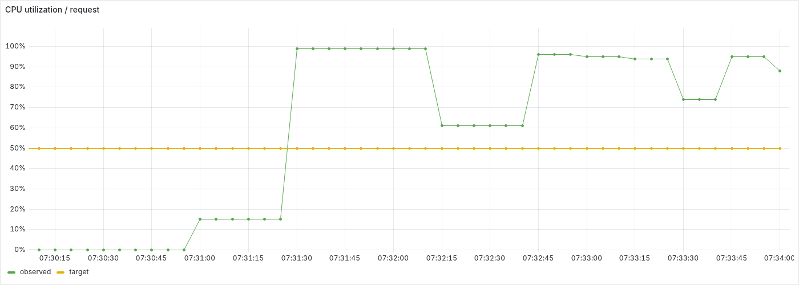
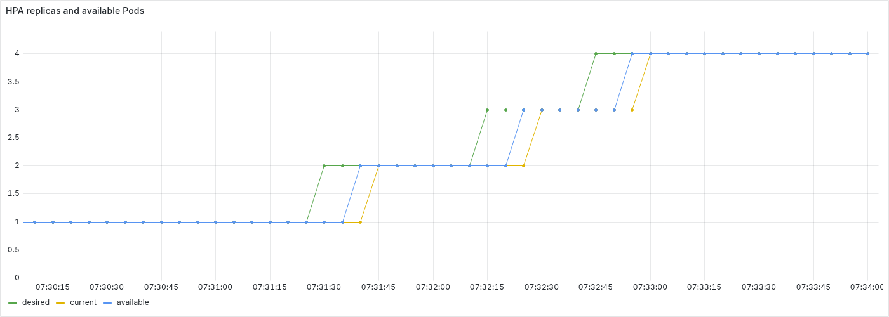
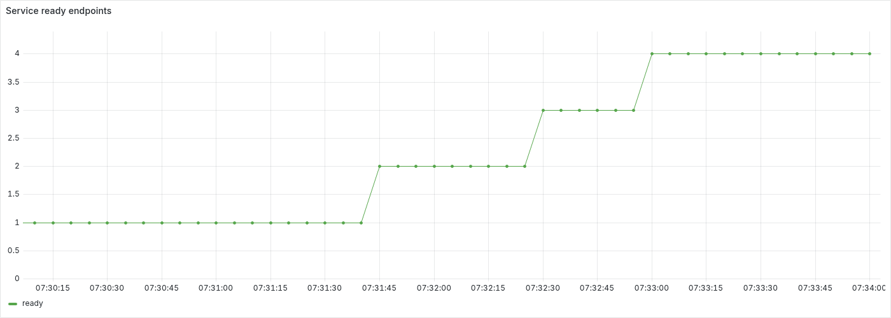
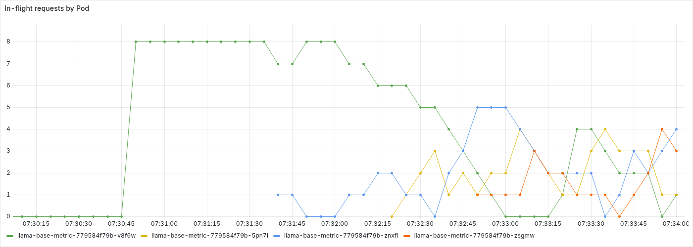
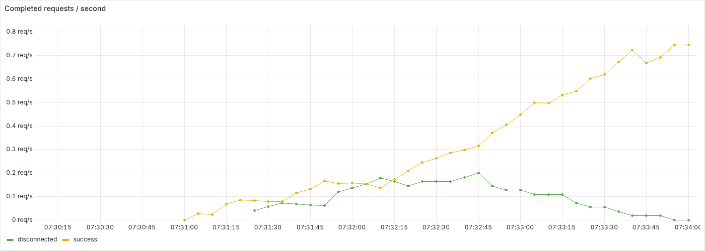
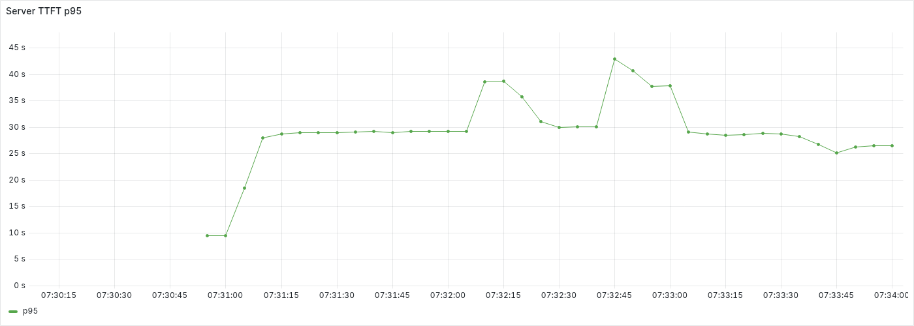

# CPU HPA 스케일 아웃 실험

CPU 목표 50%의 HPA가 AIPerf 부하에 따라 추론 replica를 **1 → 2 → 3 → 4개**로 늘렸습니다. 새 Pod의 Ready 상태와 Service endpoint 편입을 확인했고, 목표 상태를 60초 이상 유지해 자동 검증이 완료되었습니다.

## 실행 조건

- 실행: 2026-09-20 07:30:06~07:34:02 UTC, `local-k8s` 클러스터의 `hpa-test` 네임스페이스.
- 환경: Kubernetes v1.36.4, kind control-plane 1개·engine worker 2개·monitor worker 1개. Docker 호스트 CPU 15개, 메모리 약 23.9 GiB를 공유합니다.
- 추론: `local/llama-base-metric:0.1.0`, Qwen2.5-0.5B-Instruct Q4_K_M, Pod당 2 threads와 CPU 2 / 메모리 2 GiB (`requests=limits`).
- HPA: CPU request 대비 평균 사용률 50%, replica 1~4, 증가 정책 30초당 최대 1개. Metrics Server v0.8.1을 사용했습니다.
- 부하: AIPerf 0.12.0, 동시성 8, 스트리밍, 매 요청 새 연결, timeout 30초. 입력/출력 목표 토큰 `64/32`, `256/64`를 각 50%로 사용했습니다.
- 기존 availability-test의 추론 Pod 2개와 관측 구성도 같은 호스트에 존재했으며, 해당 AIPerf와 renderer는 정지 상태였습니다.

## 관찰 결과

경과 시간은 AIPerf Deployment의 scale 요청인 **07:30:38.420 UTC** 기준입니다. 5초 간격 표본에서 처음 관찰한 시각이므로 controller 이벤트 시각과 차이가 있습니다.

| 목표 replica | desired 증가 관찰 | 당시 HPA CPU | Ready endpoint 도달 |
| ---: | ---: | ---: | ---: |
| 2 | +52.2초 | 99% | +57.3초 |
| 3 | +98.3초 | 61% | +103.4초 |
| 4 | +123.9초 | 96% | +129.1초 |

HPA current까지 4개로 일치한 시점은 **+139.4초**였습니다. 이후 약 62초 동안 desired/current, Deployment replica/available, Ready Pod·endpoint 4개가 유지되었습니다. HPA 이벤트에서도 CPU 목표 초과를 이유로 replica 2·3·4로 각각 `SuccessfulRescale`이 기록되었습니다.

완료 판정 당시 Prometheus의 성공 요청 카운터는 기준 0에서 83으로 증가했습니다. 부하 중지 시 저장된 AIPerf 최종 결과는 완료 요청 101건 중 성공 84건, timeout 17건(16.83%)입니다. 성공 요청의 TTFT p95는 26.51초, 요청 지연 p95는 27.53초였습니다. 두 집계의 종료 시점이 달라 성공 요청 수가 1건 차이 납니다.

이 결과는 **CPU 기반 replica 증가와 서비스 편입**을 확인합니다. 초기 Pod 1개에 동시성 8을 가하는 과정에서 timeout이 발생했으므로 무오류 처리나 지연 목표 달성을 의미하지 않습니다. 공유 호스트에서 한 번 실행한 결과이며 스케일 아웃 소요 시간과 처리 성능은 자원 경쟁에 따라 달라질 수 있습니다.

## Grafana 패널

아래 이미지는 `hpa-test` Grafana 대시보드의 실제 패널을 PNG로 추출한 것입니다. 모든 패널의 데이터 범위는 **2026-09-20 07:30:06.837~07:34:02.952 UTC**로 고정했습니다. 부하 시작은 07:30:38.420, replica 4개 검증은 07:32:57.861, 부하 중지는 07:34:01.609 UTC입니다. 추출은 같은 날 07:48:32 UTC에 시작했으며, 렌더러는 부하 측정 종료 후에만 실행했습니다.

### CPU와 replica

CPU 패널의 `observed`는 HPA가 마지막으로 평가한 request 대비 평균 사용률이며, `target`은 설정값 50%입니다. replica 패널은 desired/current와 Deployment available의 변화를 함께 보여 줍니다.





### Service 편입과 요청 분산

ready endpoint가 1→4개로 늘어나는 흐름을 Pod별 처리 중 요청과 비교합니다. endpoint 증가 시각과 HPA current 갱신 시각에는 수집·제어 주기에 따른 차이가 있습니다.





### 서버 처리량과 TTFT

완료 요청 처리량은 서버가 기록한 outcome별 값으로, 클라이언트의 timeout 집계와 일대일로 대응하지 않습니다. TTFT는 서버 histogram의 최근 1분 p95이며, 앞서 제시한 AIPerf 성공 요청 전체 구간의 TTFT p95와 측정 위치·집계 범위가 다릅니다.





## 재현과 근거

[준비·실행 가이드](../../hpa-test.md)를 따라 배포한 뒤 저장소 루트에서 [스케일 아웃 전용 스크립트](../../../scripts/run-hpa-scale-out.py)를 실행합니다. 목표 replica 유지 확인 후 부하를 중지합니다.

```sh
CLUSTER_NAME=local-k8s python3 scripts/run-hpa-scale-out.py --target-replicas 4 --hold-seconds 60
```

원본은 저장소 루트의 `reports/hpa-20260920-073006-837104/`에 보관합니다. `run.json`의 `status=complete`, `observations.jsonl`과 `kubernetes-snapshots.jsonl.gz`의 replica·endpoint·이벤트, `aiperf/20260920T073038Z-1/`의 요청 결과, `prometheus/`의 시계열이 근거입니다. `grafana-capture.json`에는 패널 ID·시간 범위·추출 시각을 기록했습니다. 본문에 삽입한 PNG는 `figures/`에서 버전 관리하고 원본 대용량 자료는 제외합니다.
