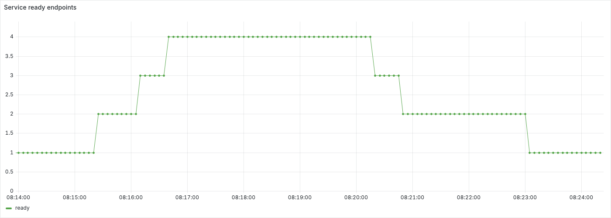
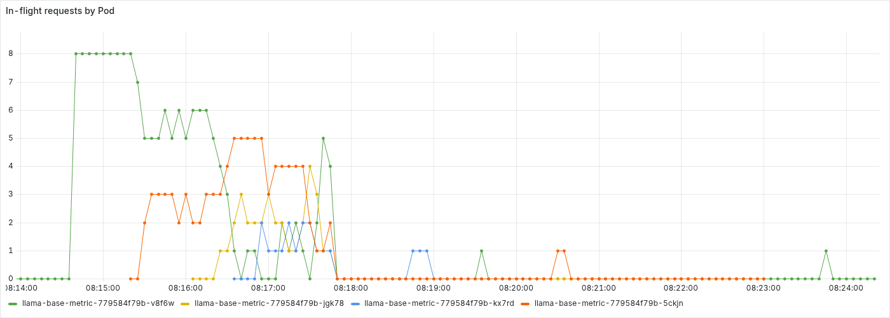
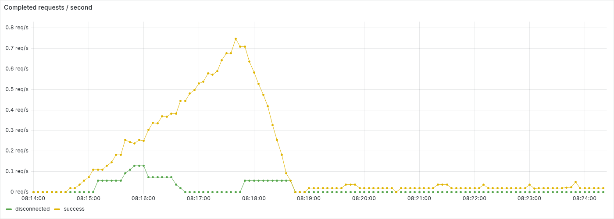
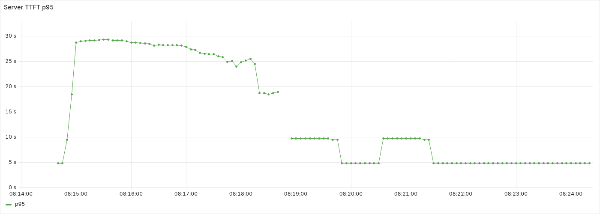

# CPU HPA 고부하→저부하 증가와 축소 실험

고부하에서 추론 replica와 Service ready endpoint가 **1→4개**로 증가했고, 요청량을 줄인 뒤 **4→1개**로 축소됐습니다. 최소 replica 상태를 65.1초 유지하는 동안 새로 시작하고 완료된 저부하 요청 1건이 성공해 자동 검증을 통과했습니다.

## 실행 조건

- 실행: 2026-09-20 08:13:57.207~08:24:23.891 UTC, kind `local-k8s`의 `hpa-test` 네임스페이스.
- 환경: Kubernetes v1.36.4, control-plane 1개, engine worker 2개, monitor worker 1개. Docker 호스트 CPU 15개와 메모리 약 23.9 GiB를 공유합니다.
- 추론: `local/llama-base-metric:0.1.0`, Qwen2.5-0.5B-Instruct Q4_K_M. Pod당 CPU 2 / 메모리 2 GiB, thread 2이며 CPU와 메모리는 `requests=limits`입니다.
- HPA: CPU request 대비 목표 50%, replica 1~4. 증가는 30초당 최대 1개, 축소는 120초 안정화 후 30초당 최대 1개입니다.
- 고부하: AIPerf 동시성 8, 요청률 제한 없이 지속 요청. replica 4개 도달 후 60초 유지했습니다.
- 저부하: AIPerf 동시성 1, 일정 간격 0.02 req/s(50초마다 1건). 최소 replica로 돌아온 뒤 60초 이상 요청을 계속 보냈습니다.
- 두 단계 모두 스트리밍, 매 요청 새 연결, timeout 30초이며 입력/출력 목표 토큰 `64/32`, `256/64`의 분포와 seed를 유지했습니다.
- 기존 availability-test의 추론 Pod 2개와 관측 구성이 같은 호스트에 있었으며 해당 AIPerf와 renderer는 정지 상태였습니다.

## 단계 전환과 관찰

| 단계 | UTC 시각 |
| --- | --- |
| 고부하 시작 요청 | 08:14:28.794 |
| HPA current, 가용 Pod, endpoint 4개 확인 | 08:16:43.281 |
| 저부하 전환 요청 | 08:17:45.645 |
| 고부하 클라이언트 종료 | 08:17:47.227 |
| 저부하 클라이언트 Pod 준비 | 08:17:47.816 |
| HPA current, Pod, endpoint 1개 및 종료 Pod 없음 확인 | 08:23:14.538 |
| 최소 replica 유지 구간 시작 | 08:23:14.619 |
| 측정 완료 | 08:24:19.705 |
| 저부하 클라이언트 종료 | 08:24:20.702 |

전환 때 AIPerf Pod를 재생성해 이전 단계 결과를 저장했습니다. 두 클라이언트 사이에는 종료, 초기화 공백이 있으며, 저부하 요청은 50초 간격으로 이어집니다. 추론 Deployment replica와 HPA 정책은 실행 중 수동 변경하지 않았습니다.

아래는 약 5초 간격 표본에서 각 ready endpoint 수를 처음 확인한 시점입니다. 증가 경과 시간은 고부하 시작 요청, 축소 경과 시간은 저부하 전환 요청 기준입니다.

| 구간 | ready endpoint | UTC 시각 | 기준 시각 후 | HPA CPU |
| --- | ---: | --- | ---: | ---: |
| 증가 | 2 | 08:15:20.799 | +52.0초 | 91% |
| 증가 | 3 | 08:16:06.947 | +98.2초 | 99% |
| 증가 | 4 | 08:16:32.852 | +124.1초 | 99% |
| 축소 | 3 | 08:20:15.236 | +149.6초 | 0% |
| 축소 | 2 | 08:20:46.876 | +181.2초 | 0% |
| 축소 | 1 | 08:22:58.714 | +313.1초 | 0% |

전체 상태가 일치한 스케일 아웃 판정은 고부하 시작 후 **134.5초**, 스케일 인 판정은 저부하 전환 요청 후 **328.9초**였습니다. CPU 하락과 replica 감소 사이에는 지표 갱신, 권고 replica의 정수 반올림, 축소 안정화, 축소 속도 제한, Pod 종료 시간이 반영됩니다.

## 요청 결과

| 구간 | 성공 / 오류 | 오류율 | 성공 요청 지연 p95 | 성공 요청 TTFT p95 |
| --- | ---: | ---: | ---: | ---: |
| 고부하 | 88 / 7 | 7.37% | 28.40초 | 27.15초 |
| 저부하 | 7 / 0 | 0.00% | 10.51초 | 8.86초 |

최종 최소 replica 유지 구간 안에서 시작하고 완료한 저부하 성공 요청은 **1건**입니다. Pod 삭제에 따라 서버 counter 합계가 줄어들 수 있어 요청 성공 여부는 단계별 AIPerf 요청 원본으로 판정했습니다. 두 단계의 요청량이 다르므로 지연 차이를 같은 부하에서의 성능 개선으로 해석하지 않습니다.

## Grafana 패널

실제 Grafana 패널의 데이터 범위를 **2026-09-20 08:13:57.207~08:24:23.891 UTC**로 고정했습니다. 저부하 전환 요청은 **08:17:45.645 UTC**입니다. 추출은 부하 종료 후 08:25:12.606 UTC에 시작했으며 렌더러는 추출 후 정지했습니다.

### CPU와 replica

CPU `observed`는 HPA가 평가한 request 대비 평균 사용률이며 `target`은 50%입니다. replica 패널은 desired/current와 Deployment available의 증가와 축소를 비교합니다.


### Service 편입과 제외와 요청 분산

ready endpoint 수의 변화와 Pod별 처리 중 요청을 같은 시간축에서 확인합니다. 축소된 Pod의 시계열은 마지막 scrape 이후 사라집니다.





### 서버 처리량과 TTFT

완료 요청 처리량은 서버 outcome별 값이며 클라이언트 timeout과 일대일 대응하지 않습니다. TTFT는 서버 histogram의 최근 1분 p95로, 위 AIPerf 구간별 성공 요청 p95와 집계 범위, 측정 위치가 다릅니다. 저부하에서는 요청이 드물어 histogram 표본이 적거나 없는 구간이 있습니다.





## 재현과 근거

[HPA 실행 가이드](../../hpa-test.md)를 따라 배포한 뒤 같은 `CLUSTER_NAME`을 유지하고 저장소 루트에서 [스케일 아웃→인 스크립트](../../../scripts/run-hpa-scale-out-in.py)를 실행합니다. 목표 replica 유지 후 요청량을 줄여 최소 replica 복귀와 응답 성공을 확인합니다.

```sh
python3 scripts/run-hpa-scale-out-in.py \
  --target-replicas 4 --hold-seconds 60 --low-request-rate 0.02
```

원본은 `reports/hpa-20260920-081357-206946/`에 보관합니다. `run.json`의 단계 시각, 요청 인자, 집계와 `status=complete`, `observations.jsonl`의 상태 표본, `kubernetes-snapshots.jsonl.gz`의 이벤트, Pod, EndpointSlice, `aiperf/high/`, `aiperf/low/`의 요청 원본이 근거입니다. `prometheus/`에는 시계열, `grafana-capture.json`에는 패널 ID, 추출 시각, 범위를 저장했습니다. 본문의 PNG는 `figures/`에서 버전 관리합니다.
