> Korean version: [한국어](README-KR.md)
# llamacpp test results

## Benchmark

llama.cpp results measured on 2026-09-20 UTC with the Qwen2.5-0.5B-Instruct Q4_K_M model.

Compares throughput and latency for baseline serial inference `base`, `enhanced-batch` with continuous batching, and `enhanced-cache` using RAM and disk prefix KV cache.

Inference Pods used 12 CPUs and 16 GiB. Four conditions were each measured 3 times at concurrency 1, 2, 4, 8, with all 4,800 measured requests and 96 warmup requests succeeding. There were no short or excess output lengths. The cache-clear condition cleared cache before each concurrency, and the cache-preserve condition cleared only before the first concurrency.

### Results

Table values are means of 3 measurements.

| Implementation | Concurrency | Output throughput (tok/s) | Mean TTFT (ms) | Mean ITL (ms) |
| --- | ---: | ---: | ---: | ---: |
| base | 1 | 43.24 | 628.68 | 8.29 |
| base | 2 | 43.83 | 1572.32 | 8.19 |
| base | 4 | 44.03 | 3442.62 | 8.18 |
| base | 8 | 44.45 | 7009.25 | 8.05 |
| enhanced-batch | 1 | 49.35 | 572.66 | 6.70 |
| enhanced-batch | 2 | 50.15 | 854.30 | 19.28 |
| enhanced-batch | 4 | 50.57 | 1334.28 | 48.07 |
| enhanced-batch | 8 | 51.69 | 2525.54 | 94.60 |
| enhanced-cache, clear | 1 | 98.93 | 106.16 | 7.71 |
| enhanced-cache, clear | 2 | 98.53 | 531.55 | 7.70 |
| enhanced-cache, clear | 4 | 97.20 | 1388.29 | 7.83 |
| enhanced-cache, clear | 8 | 97.64 | 3032.04 | 7.73 |
| enhanced-cache, preserve | 1 | 97.48 | 107.07 | 7.83 |
| enhanced-cache, preserve | 2 | 128.15 | 336.58 | 7.68 |
| enhanced-cache, preserve | 4 | 129.34 | 969.95 | 7.57 |
| enhanced-cache, preserve | 8 | 130.01 | 2190.50 | 7.58 |

At concurrency 8, enhanced-batch had 16.3% higher throughput and shorter TTFT than base, but ITL grew from 8.05 ms to 94.60 ms. Cache preserve had 30.1-33.2% higher throughput than cache clear at concurrency 2, 4, 8. Cache results were obtained under load repeating 16 inputs, and the clear condition still reused cache within warmup and measured requests.

### Throughput and TTFT comparison

[Detailed results](benchmark-suite-20260920-091620-649645/summary.md)

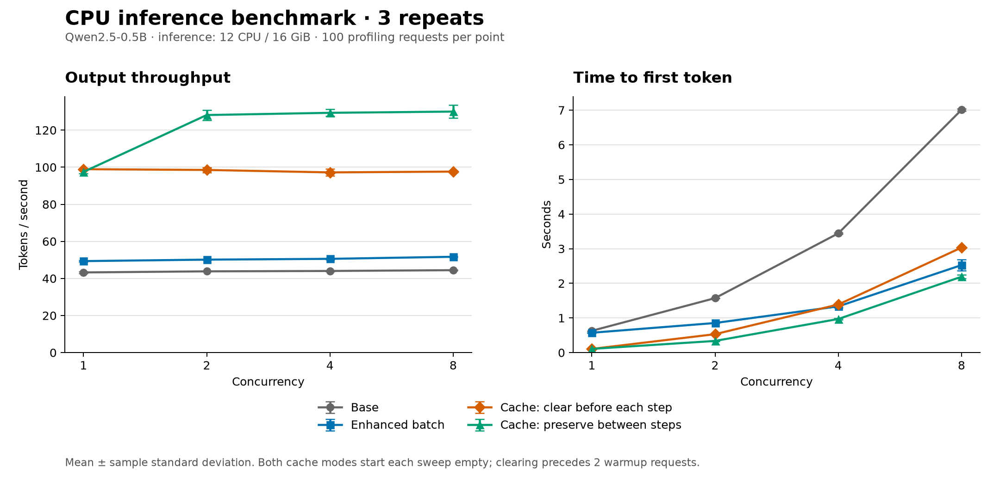

### 32 and 128 unique inputs: cache implementation

To check cache performance with more unique inputs, ran two Jobs once each. Each Job started with an empty cache and new inference Pods, and kept cache and Pods across concurrency 1, 2, 4, 8 inside the Job.

| Unique input setting | Concurrency | Output throughput (tok/s) | Mean TTFT (ms) | Mean ITL (ms) |
| ---: | ---: | ---: | ---: | ---: |
| 32 | 1 | 77.47 | 235.62 | 7.93 |
| 32 | 8 | 129.69 | 2404.92 | 7.52 |
| 128 | 1 | 43.29 | 721.20 | 7.73 |
| 128 | 8 | 127.22 | 2499.61 | 7.64 |

All 800 measured requests and 16 warmup requests succeeded. The 32-input setting matched output lengths for all requests, while the 128-input setting reported 1-2 tokens more than the 64-token target in 24 requests. Measured requests per concurrency are 100 in the 128-input setting, so actual unique inputs used per stage are also 100. Pod restart behavior and input length mix differ from the earlier 16-input experiment.

[Full concurrency results and output length verification](benchmark-cache-datasets-20260920-145858/summary.md)

### 32 and 128 unique inputs: per-concurrency cache clear

Measured one sweep per input count where each concurrency starts with an empty PVC and new inference Pods. RAM cache was also cleared, and the input set matches the cache-preserve experiment above.

| Unique input setting | Concurrency | Preserve output tok/s | Clear output tok/s | Preserve mean TTFT (ms) | Clear mean TTFT (ms) |
| ---: | ---: | ---: | ---: | ---: | ---: |
| 32 | 8 | 129.69 | 78.90 | 2404.92 | 4215.94 |
| 128 | 8 | 127.22 | 43.18 | 2499.61 | 8088.31 |

All 800 measured requests and 16 warmup requests in the clear condition succeeded. The 32-input setting matched output lengths for all requests, while the 128-input setting reported 1 token more usage than the 64-token target in 6 requests per concurrency, 24 total. Besides cache preservation between stages, RAM retention and Pod lifetime also differ, so this is not isolated as a PVC-only effect.

[Full concurrency comparison and clear verification](benchmark-cache-datasets-clear-20260920-151923/summary.md)

## Availability

Pauses or SIGKILLs one engine node to check request errors, Service endpoint removal, and replacement Pod recovery time. Two inference Pods were placed on different engine nodes, using 2 CPUs and 2 GiB per Pod. Client concurrency is 4, with NoExecute toleration split into 300 seconds and 60 seconds, measured once per condition.

### Results

Times are elapsed from fault injection. Request counts and error rates use each experiment fixed observation interval.

| Failure | Toleration | Ready endpoint decrease | Replacement Pod Ready | Successful requests | Error requests | Error rate |
| --- | ---: | ---: | ---: | ---: | ---: | ---: |
| pause | 300s | 45.1s | 349.8s | 196 | 7 | 3.45% |
| SIGKILL | 300s | 50.2s | 354.5s | 206 | 11 | 5.07% |
| pause | 60s | 54.0s | 118.8s | 155 | 7 | 4.32% |
| SIGKILL | 60s | 43.9s | 108.9s | 140 | 16 | 10.26% |

With 60-second toleration, replacement Pod readiness took about 109-119 seconds, and with the 300-second condition about 350-355 seconds. All four experiments secured 2 replicas on surviving nodes before failed node recovery, with no request errors after replacement Pod readiness until observation end. No automatic Pod redistribution appeared during the post-return observation period. Observation interval length differs per experiment, so do not compare recovery performance by total error rate alone.

### pause, toleration 300s

[Detailed results](availability-20260920-045929/summary.md)

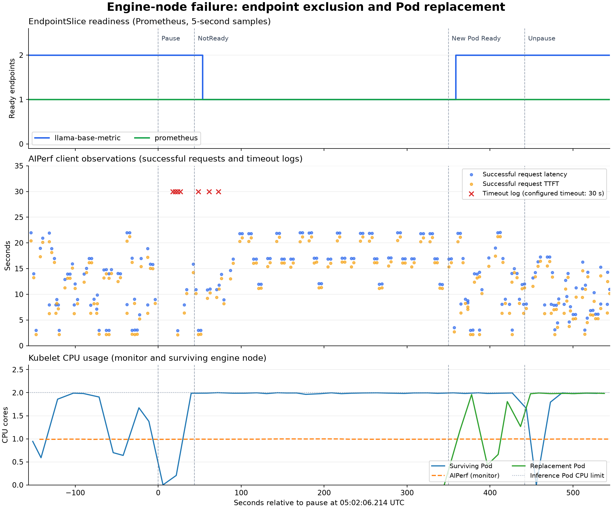

### SIGKILL, toleration 300s

[Detailed results](availability-sigkill-20260920-053546/summary.md)

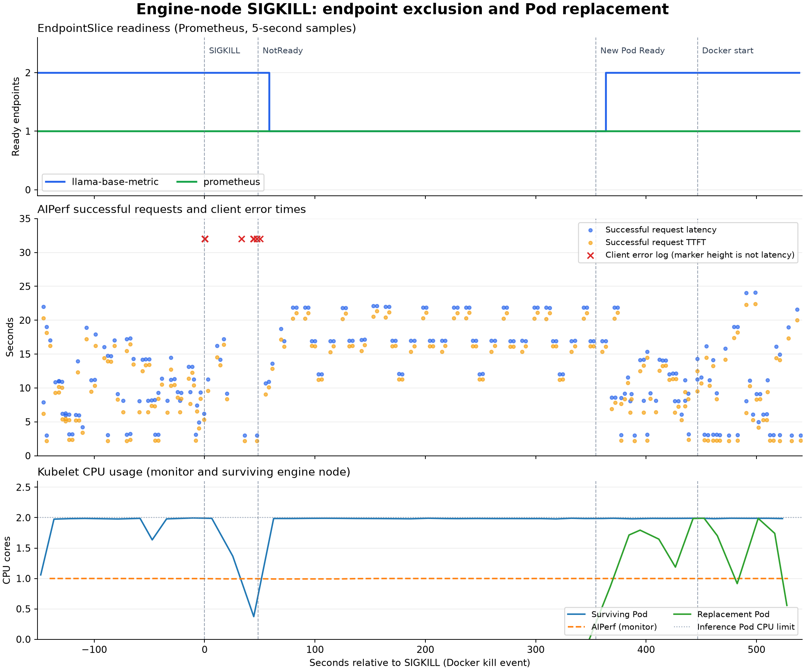

### pause, toleration 60s

[Detailed results](availability-pause-60s-20260920-061021/summary.md)

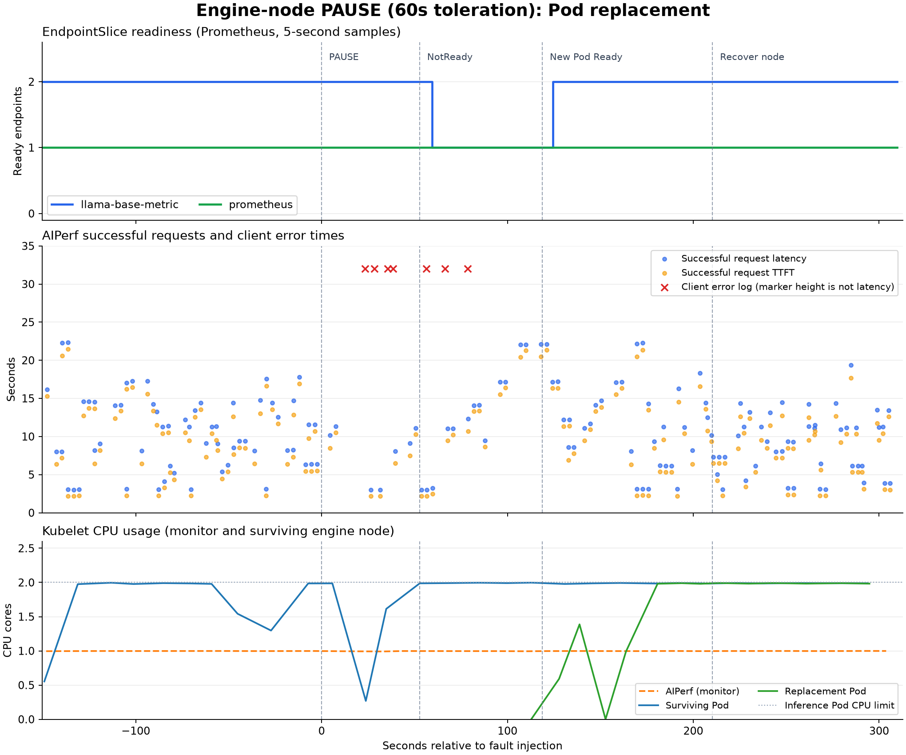

### SIGKILL, toleration 60s

[Detailed results](availability-sigkill-60s-20260920-061946/summary.md)

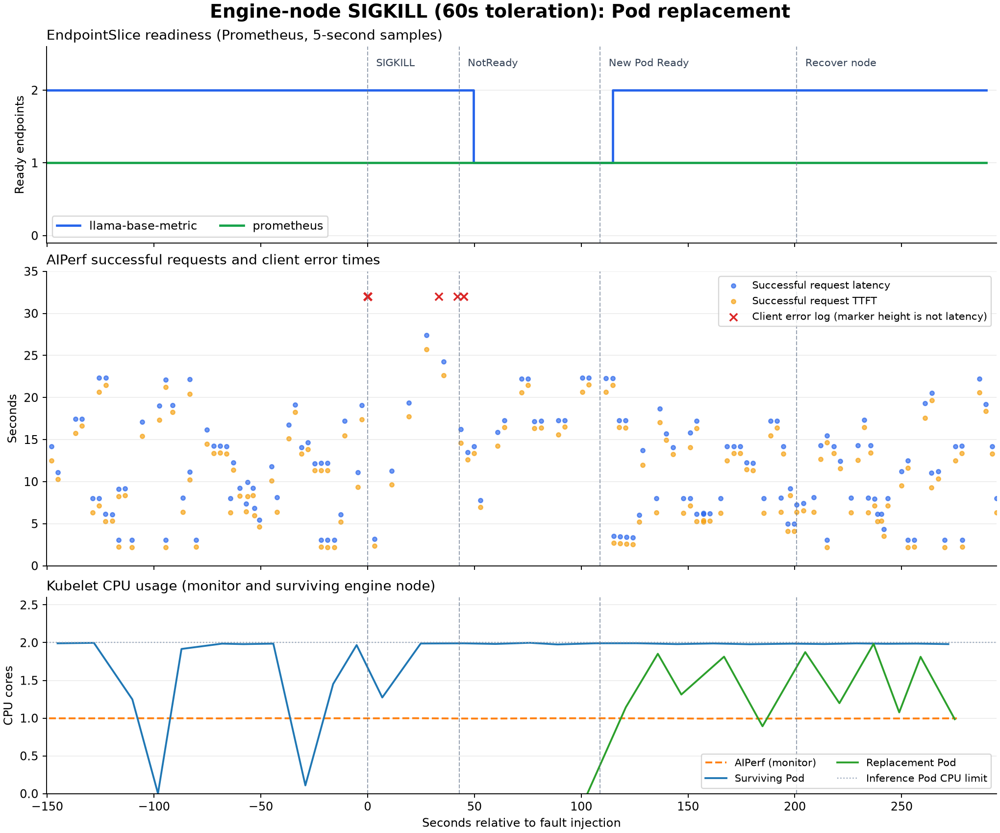

## HPA

Verifies that replicas scale up and down with load toward 50% mean utilization relative to CPU request. Inference Pods used 2 CPUs and 2 GiB each, with replica range 1-4. High load was measured at concurrency 8, low load at concurrency 1 and 0.02 req/s.

### Results

Each scenario ran once. Scale-up time runs from the high-load start request, scale-down time from the low-load switch request, until HPA, Deployment, Pod, and endpoint state match the target count.

| Scenario | Replica change | Scale-up confirmed | Scale-down confirmed | Sustain confirmed |
| --- | --- | ---: | ---: | --- |
| Scale out | 1→4 | 139.4s | Not measured | About 62s at 4 |
| Scale out to in | 1→4→1 | 134.5s | 328.9s | 60s or more at 4, 65.1s at 1 |

| Scenario and load | Successful requests | Error requests | Error rate | Successful request TTFT p95 | Successful request latency p95 |
| --- | ---: | ---: | ---: | ---: | ---: |
| Scale out, high load | 84 | 17 | 16.83% | 26.51s | 27.53s |
| Scale out to in, high load | 88 | 7 | 7.37% | 27.15s | 28.40s |
| Scale out to in, low load | 7 | 0 | 0.00% | 8.86s | 10.51s |

Both scenarios confirmed replica growth and new Pod admission to the Service. In scale out to in, after scaling down to 1 replica, one request started and completed inside the sustain interval also succeeded. Errors occurred under high load, and latency differences between high and low load reflect different request volumes.

### Scale out (1→4)

[Detailed results](hpa-20260920-073006-837104/summary.md)

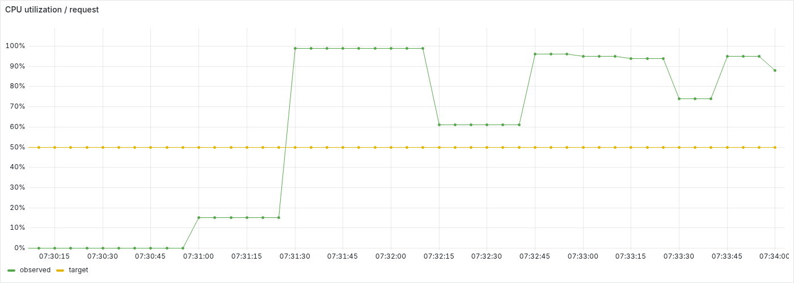

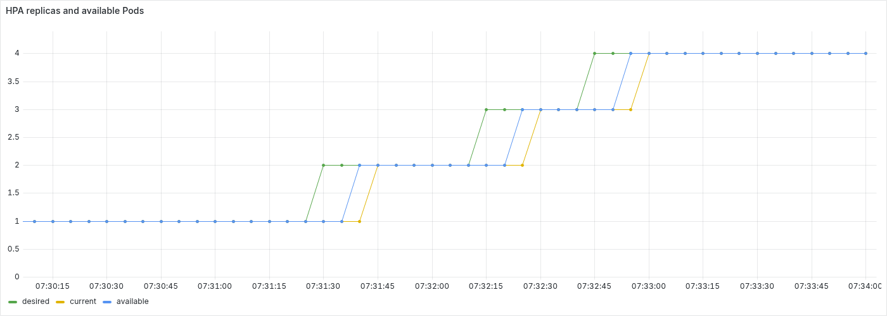

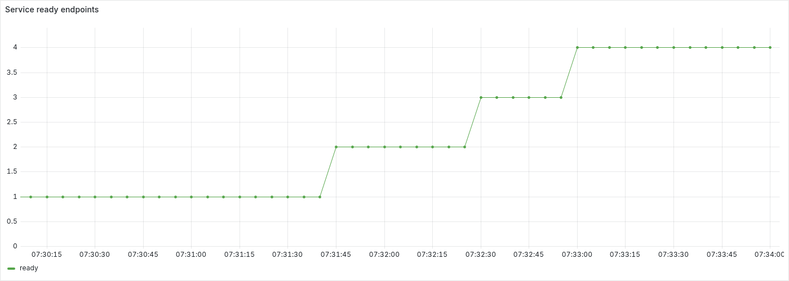

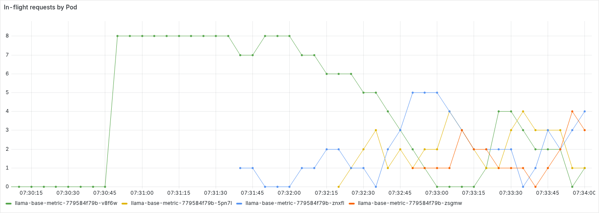

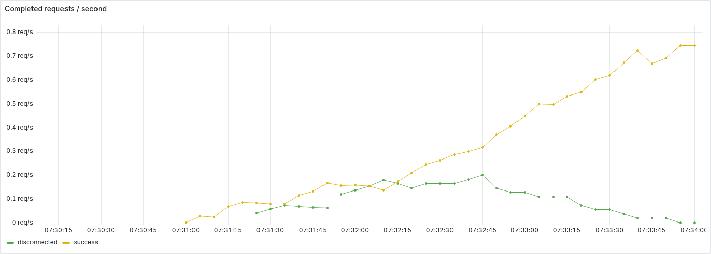

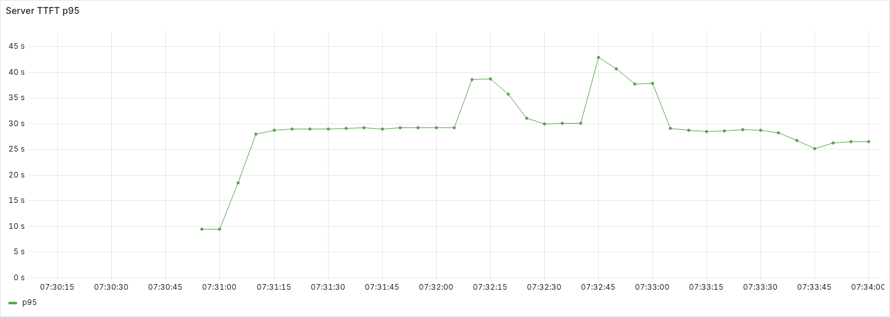

### Scale out to in (1→4→1)

[Detailed results](hpa-20260920-081357-206946/summary.md)

