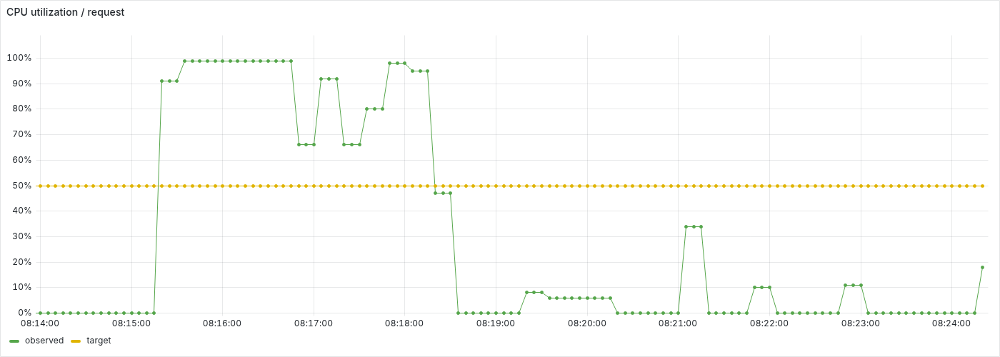
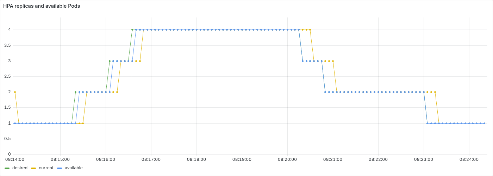
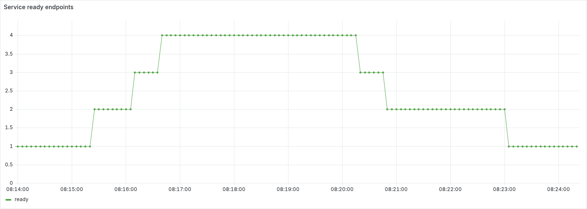
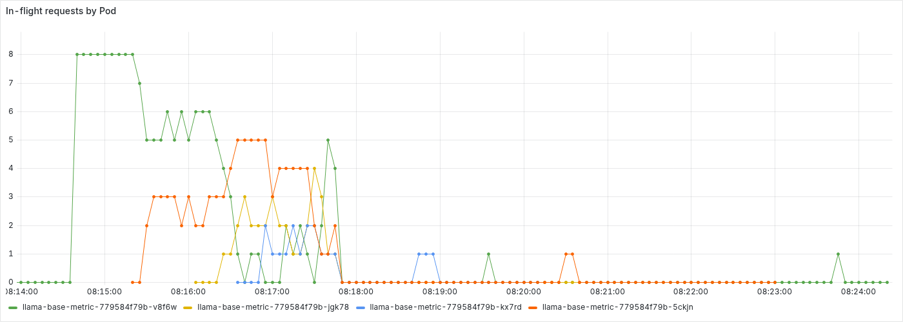
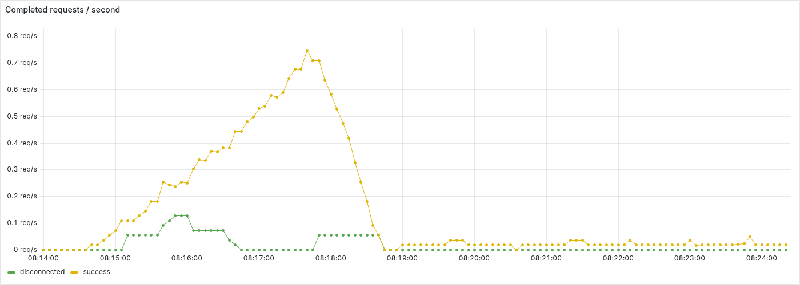
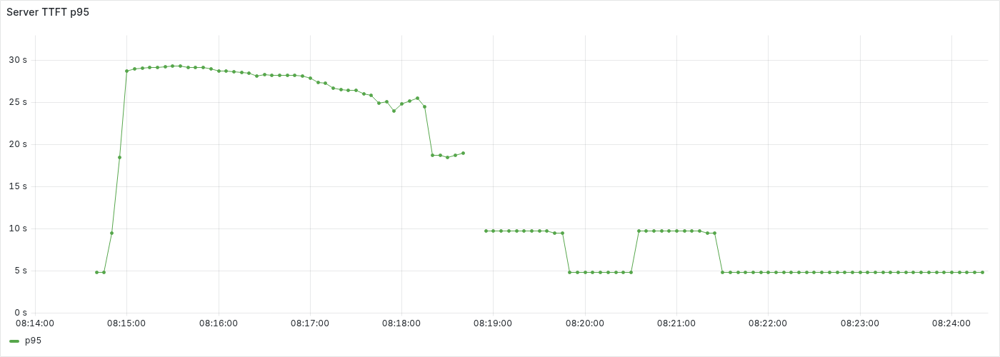

> Korean version: [한국어](summary-KR.md)

# CPU HPA high-to-low scale-up and scale-down experiment

Under high load, inference replicas and Service ready endpoints grew from **1→4**, then shrank from **4→1** after the request rate was lowered. While holding the minimum-replica state for 65.1s, 1 newly started and completed low-load request succeeded, passing automatic validation.

## Run conditions

- Run: 2026-09-20 08:13:57.207–08:24:23.891 UTC, `hpa-test` namespace on kind `local-k8s`.
- Environment: Kubernetes v1.36.4, 1 control-plane, 2 engine workers, 1 monitor worker. Shares 15 Docker host CPUs and about 23.9 GiB memory.
- Inference: `local/llama-base-metric:0.1.0`, Qwen2.5-0.5B-Instruct Q4_K_M. 2 CPU / 2 GiB memory and 2 threads per Pod, with CPU and memory `requests=limits`.
- HPA: 50% of CPU request, 1–4 replicas. At most 1 Pod per 30s for scale-up; after 120s stabilization, at most 1 Pod per 30s for scale-down.
- High load: AIPerf concurrency 8, sustained requests with no rate limit. Held 4 replicas for 60s after reaching them.
- Low load: AIPerf concurrency 1, fixed interval 0.02 req/s (1 request every 50s). Kept sending requests for 60s or more after returning to minimum replicas.
- Both phases use streaming, a new connection per request, and a 30s timeout, keeping the target input/output token `64/32` and `256/64` distribution and seed.
- The existing availability-test inference Pods (2) and observation setup were on the same host; their AIPerf and renderer were stopped.

## Phase transitions and observations

| Phase | UTC time |
| --- | --- |
| High-load start requested | 08:14:28.794 |
| HPA current, available Pods, 4 endpoints confirmed | 08:16:43.281 |
| Low-load transition requested | 08:17:45.645 |
| High-load client terminated | 08:17:47.227 |
| Low-load client Pod ready | 08:17:47.816 |
| HPA current, Pods, 1 endpoint and no terminating Pods confirmed | 08:23:14.538 |
| Minimum-replica hold window start | 08:23:14.619 |
| Measurement complete | 08:24:19.705 |
| Low-load client terminated | 08:24:20.702 |

The AIPerf Pod was recreated at the transition to save the previous phase's results. There is a termination/setup gap between the two clients, and low-load requests continue every 50s. The inference Deployment replicas and HPA policy were not manually changed during the run.

Below are the first-observed times for each ready-endpoint count in ~5s samples. Growth elapsed times use the high-load start request; shrink elapsed times use the low-load transition request.

| Phase | Ready endpoints | UTC time | After reference | HPA CPU |
| --- | ---: | --- | ---: | ---: |
| Grow | 2 | 08:15:20.799 | +52.0s | 91% |
| Grow | 3 | 08:16:06.947 | +98.2s | 99% |
| Grow | 4 | 08:16:32.852 | +124.1s | 99% |
| Shrink | 3 | 08:20:15.236 | +149.6s | 0% |
| Shrink | 2 | 08:20:46.876 | +181.2s | 0% |
| Shrink | 1 | 08:22:58.714 | +313.1s | 0% |

The scale-out decision with all states matching came **134.5s** after high-load start; the scale-in decision came **328.9s** after the low-load transition request. The gap between CPU drop and replica decrease reflects metric refresh, integer rounding of recommended replicas, scale-down stabilization, scale-down rate limits, and Pod termination time.

## Request results

| Window | Success / Error | Error rate | Successful request latency p95 | Successful request TTFT p95 |
| --- | ---: | ---: | ---: | ---: |
| High load | 88 / 7 | 7.37% | 28.40s | 27.15s |
| Low load | 7 / 0 | 0.00% | 10.51s | 8.86s |

**1** low-load successful request started and completed inside the final minimum-replica hold window. Server counter totals can fall as Pods are deleted, so request success was judged from each phase's original AIPerf request records. The two phases use different request volumes, so the latency difference should not be read as a same-load performance improvement.

## Grafana panels

Fixed the actual Grafana panel data range to **2026-09-20 08:13:57.207–08:24:23.891 UTC**. The low-load transition request was at **08:17:45.645 UTC**. Export started at 08:25:12.606 UTC after load ended, and the renderer was stopped after export.

### CPU and replicas

CPU `observed` is the request-relative mean utilization evaluated by the HPA, and `target` is 50%. The replica panel compares desired/current with Deployment available during growth and shrinkage.





### Service inclusion/removal and request distribution

Checks ready-endpoint changes and per-Pod in-flight requests on the same time axis. Time series for scaled-down Pods disappear after their last scrape.





### Server throughput and TTFT

Completed-request throughput is the per-outcome server value and does not map one-to-one to client timeouts. TTFT is the server histogram's trailing-1-minute p95, which differs from the AIPerf per-window successful-request p95 above in aggregation range and measurement location. Under low load, requests are sparse, so some histogram windows have few or no samples.





## Reproduction and evidence

Follow the [HPA run guide](../../../guides/hpa-test.md#llamacpp), deploy, keep the same `CLUSTER_NAME`, and run the [scale-out→in script](../../../../scripts/run-hpa-test-llamacpp.py) from the repository root. After holding the target replicas, lower the request rate and verify return to minimum replicas and a successful response.

```sh
python3 scripts/run-hpa-test-llamacpp.py --scenario scale-out-in \
  --target-replicas 4 --hold-seconds 60 --low-request-rate 0.02
```

Observations are summarized in the tables above and the Grafana PNGs under `figures/`.
