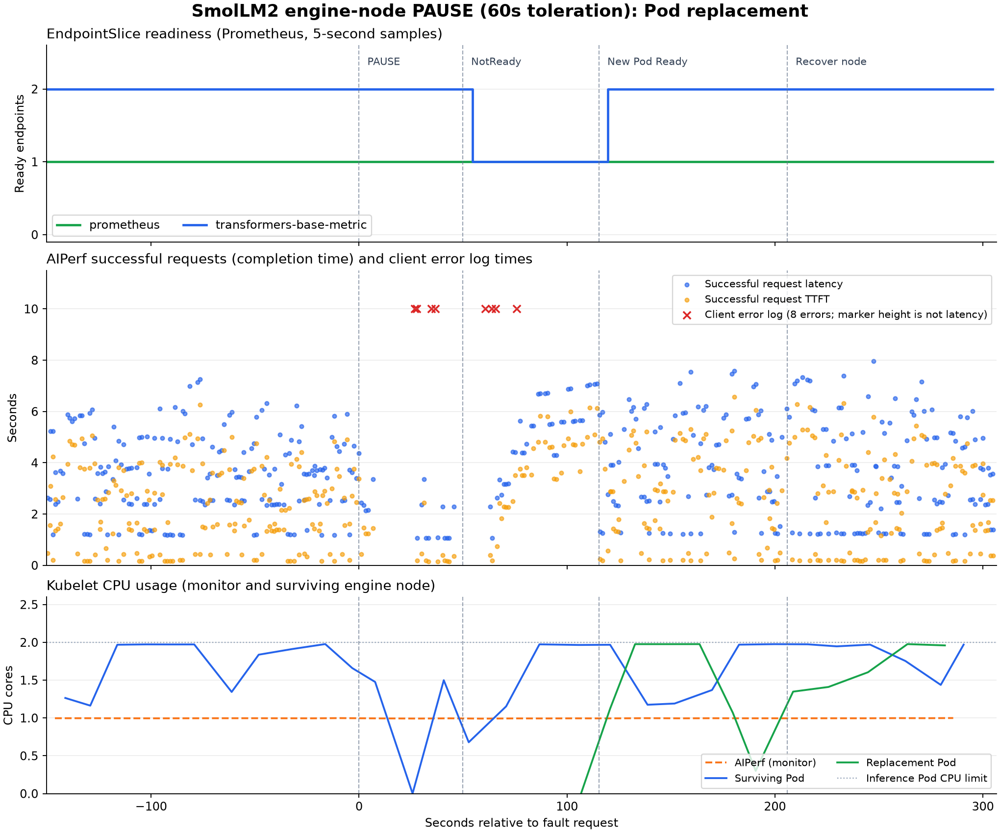
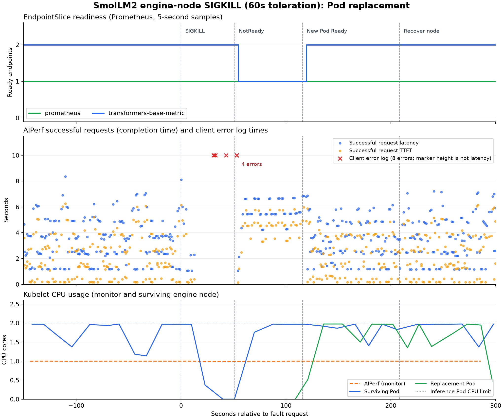
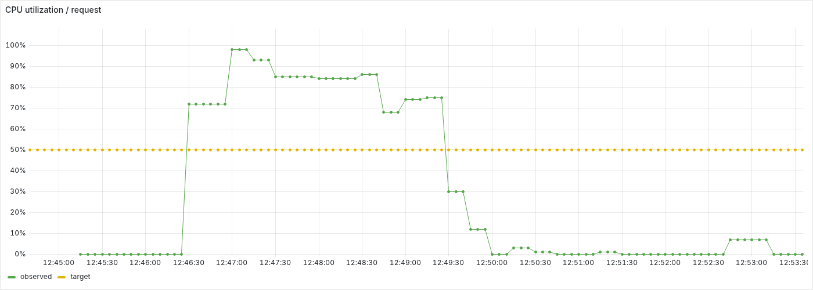
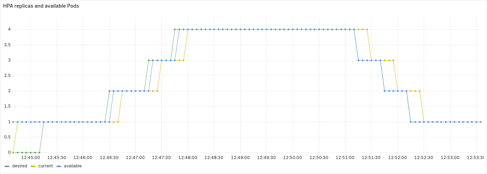
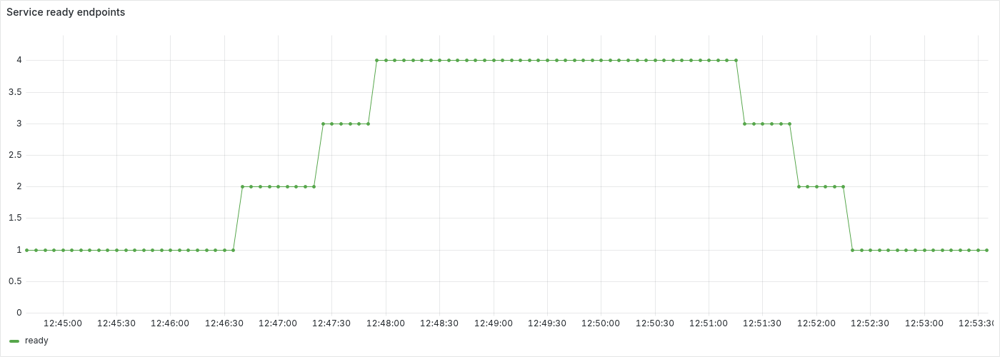
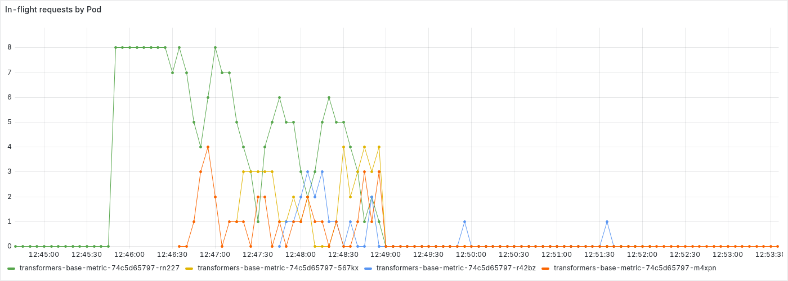
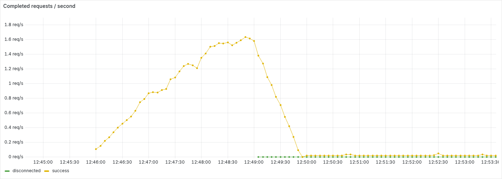
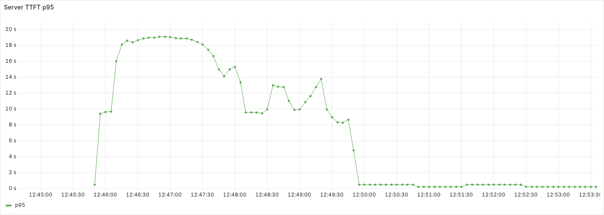

# Transformers 테스트 결과

2026-09-21 SmolLM2-135M-Instruct FP32로 측정한 성능, 장애 복구와 CPU HPA 결과입니다.

## 단일 노드 성능

kind control-plane 1개에서 base, enhanced-batch, enhanced-cache를 동시성 1, 2, 4, 8로 각각 3회 측정했습니다. 추론 Pod는 CPU 8개, PyTorch 4스레드를 사용했습니다.

| 구현 | c1 출력 tok/s | c2 출력 tok/s | c4 출력 tok/s | c8 출력 tok/s |
| --- | ---: | ---: | ---: | ---: |
| base | 44.79 | 44.96 | 45.27 | 45.09 |
| enhanced-batch | 45.39 | 62.21 | 78.53 | 79.32 |
| enhanced-cache | 48.08 | 48.90 | 49.06 | 48.97 |

출력 처리량은 3회 평균입니다. 각 동시성 측정은 새 추론 Pod에서 워밍업 2건과 본 요청 100건을 실행합니다. cache는 sweep 시작 전에 비우고 동시성 사이에는 보존합니다.

[성능 보고서](benchmark-suite-20260921-101648-638635/summary.md)에서 지연, 표준편차와 회차별 결과를 확인할 수 있습니다. 재실행 방법은 [AIPerf 가이드](../../guides/aiperf.md)를 참고하세요.

## 멀티 노드 장애 복구

전용 kind 클러스터의 control-plane 1개, monitor worker 1개, engine worker 2개에서 측정했습니다. 추론 Pod는 각각 CPU 2개, 메모리 2Gi, PyTorch 2스레드를 사용하며 requests와 limits가 같습니다.

| 시나리오 | 장애 요청 → 대체 Pod Ready | 관측 구간 성공 / 오류 |
| --- | ---: | ---: |
| [pause, toleration 60초](availability-pause-60s-20260921-122415-594492/summary.md) | 115.4초 | 414 / 8 |
| [SIGKILL, toleration 60초](availability-sigkill-60s-20260921-123349-464541/summary.md) | 115.9초 | 428 / 8 |

두 실험 모두 대체 Pod 준비와 원래 노드 복구를 확인했습니다. 요청 수는 워밍업을 제외한 관측 구간에 시작된 요청 기준이며, 구간 이후 완료된 요청도 포함합니다. pause 오류는 timeout 8건, SIGKILL 오류는 timeout 2건과 연결 오류 6건입니다. 60초 toleration에 노드 장애 감지 시간은 포함되지 않습니다.

재실행 방법은 [장애 복구 가이드](../../guides/availability-test.md)를 참고하세요.

### pause, toleration 60초

### SIGKILL, toleration 60초

## CPU HPA

장애 복구 실험과 같은 노드 구성 및 Pod 자원 조건에서 replica 1→4→1을 검증했습니다.

| 항목 | 결과 |
| --- | ---: |
| 고부하 시작 요청 → 4 replicas Ready | 129.6초 |
| 부하 감소 요청 → 1 replica Ready, 종료 중 Pod 없음 | 212.1초 |
| 고부하 성공 / 오류 | 233 / 0 |
| 저부하 성공 / 오류 | 5 / 0 |

확장과 축소 시간에는 클라이언트 초기화 및 부하 전환 시간이 포함됩니다. 축소 후 60초 유지 구간 안에서 시작하고 완료된 성공 요청 1건을 확인했습니다. kind 노드는 같은 Docker 호스트 자원을 공유합니다.

[HPA 보고서](hpa-20260921-124439-448222/summary.md)에서 판정 조건과 Grafana 그래프를 확인할 수 있습니다. 재실행 방법은 [HPA 가이드](../../guides/hpa-test.md)를 참고하세요.

### 스케일 아웃→인 (1→4→1)

