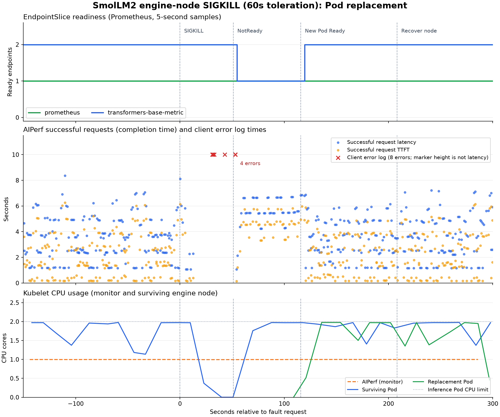
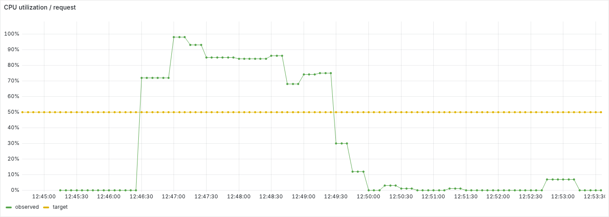
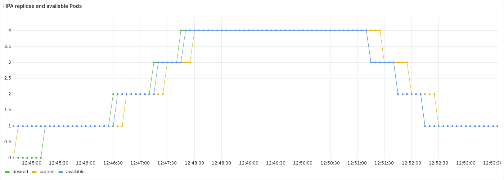
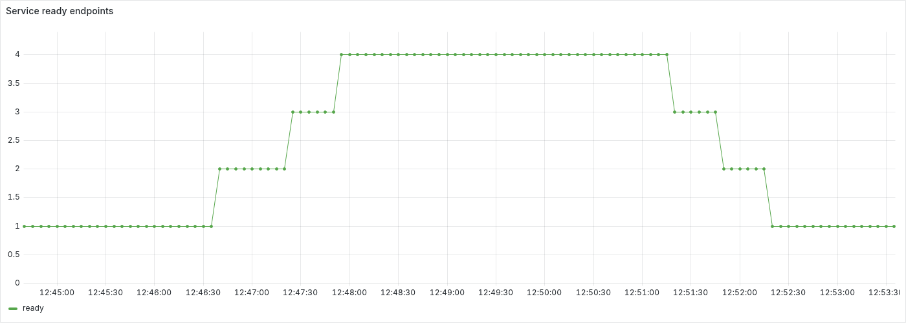
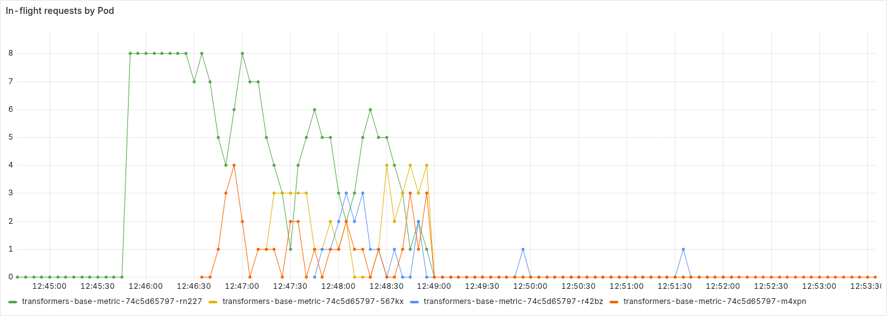
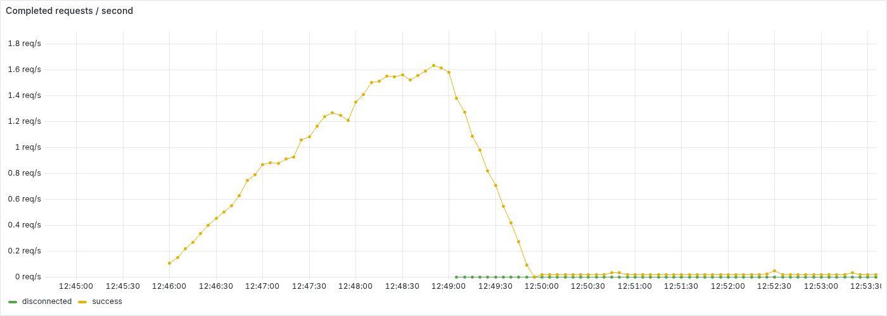
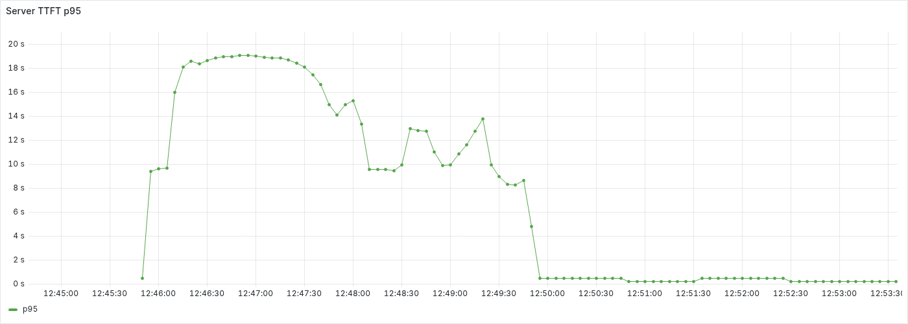

> Korean version: [한국어](README-KR.md)
# Transformers test results

Performance measurements for 2026-09-22 SmolLM2-135M-Instruct FP32 plus 2026-09-21 failure recovery and CPU HPA results.

## Single-node performance

Measured base, enhanced-batch, and enhanced-cache 3 times each at concurrency 1, 2, 4, 8 on 1 kind control-plane. Inference Pods used 8 CPUs and 4 PyTorch threads.

| Implementation | c1 output tok/s | c2 output tok/s | c4 output tok/s | c8 output tok/s |
| --- | ---: | ---: | ---: | ---: |
| base | 43.44 | 43.99 | 44.33 | 44.29 |
| enhanced-batch | 44.41 | 61.28 | 77.06 | 77.56 |
| enhanced-cache | 47.13 | 48.05 | 47.96 | 47.73 |

Output throughput is the 3-run mean. Each concurrency measurement runs 2 warmup requests and 100 measured requests on a new inference Pod. Cache is cleared before a sweep starts and preserved between concurrency levels.

For latency, standard deviation, and per-round results see the [performance report](benchmark-suite-20260922-061851-685273/summary.md). For rerun instructions see the [AIPerf guide](../../guides/aiperf.md).

## Multi-node failure recovery

Measured on a dedicated kind cluster with 1 control-plane, 1 monitor worker, and 2 engine workers. Inference Pods each use 2 CPUs, 2Gi memory, and 2 PyTorch threads with equal requests and limits.

| Scenario | Failure request to replacement Pod Ready | Success / error in observation interval |
| --- | ---: | ---: |
| [pause, toleration 60s](availability-pause-60s-20260921-122415-594492/summary.md) | 115.4s | 414 / 8 |
| [SIGKILL, toleration 60s](availability-sigkill-60s-20260921-123349-464541/summary.md) | 115.9s | 428 / 8 |

Both experiments confirmed replacement Pod readiness and original node recovery. Request counts cover requests started in the observation interval excluding warmup, including requests completed after the interval. Pause errors are 8 timeouts, SIGKILL errors are 2 timeouts and 6 connection errors. The 60-second toleration does not include node failure detection time.

For rerun instructions see the [failure recovery guide](../../guides/availability-test.md).

### pause, toleration 60s

### SIGKILL, toleration 60s

## CPU HPA

Verified replica 1→4→1 under the same node setup and Pod resource conditions as the failure recovery experiment.

| Item | Result |
| --- | ---: |
| High-load start request to 4 replicas Ready | 129.6s |
| Load decrease request to 1 replica Ready, no terminating Pods | 212.1s |
| High-load success / error | 233 / 0 |
| Low-load success / error | 5 / 0 |

Scale-up and scale-down times include client initialization and load switch time. One successful request started and completed inside the 60-second sustain interval after scale-down was confirmed. kind nodes share the same Docker host resources.

For decision conditions and Grafana graphs see the [HPA report](hpa-20260921-124439-448222/summary.md). For rerun instructions see the [HPA guide](../../guides/hpa-test.md).

### Scale out to in (1→4→1)

