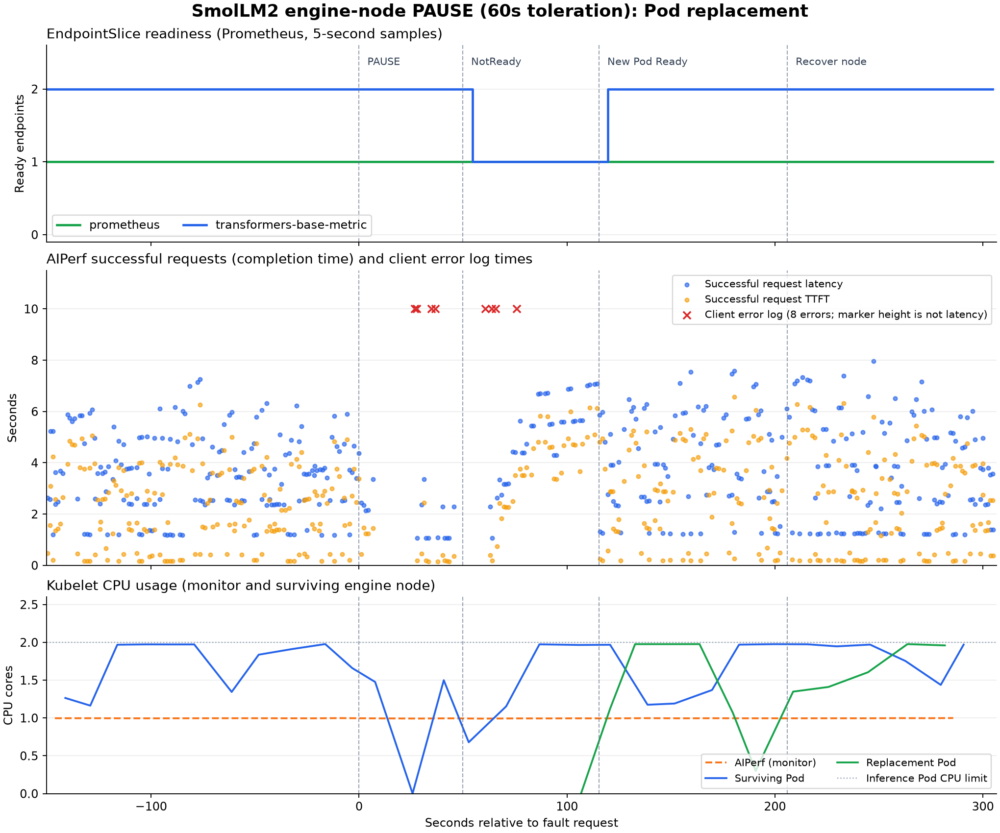

> Korean version: [한국어](summary-KR.md)

# SmolLM2 multi-node availability, pause, toleration 60s

On 2026-09-21, paused one worker in the `transformers-tests` kind cluster and verified the replacement Pod and node recovery. The procedure completed, with 8 timeouts during the observation window.

## Measurement conditions

- 1 control-plane, 1 monitor worker, 2 engine workers, Kubernetes v1.36.4.
- SmolLM2-135M-Instruct, revision `12fd25f77366fa6b3b4b768ec3050bf629380bac`, Transformers 4.57.6, torch 2.10.0, FP32.
- `transformers-base-metric` 2 replicas, 2 CPUs and 2Gi memory per Pod, 2 PyTorch threads. All measured containers use requests=limits.
- AIPerf 0.12.0, concurrency 4, 1 worker, 30s timeout, streaming, new connection per request.
- Input/output distribution `64,32:50;256,64:50`, 16 inputs, seed 42, sequential, `ignore_eos:true`.
- 90s warmup, 150s normal window, fault and replacement Pod, 90s post-replacement, 90s post-node-recovery.

## Recovery results

| Item | Time |
| --- | ---: |
| Fault request → Node NotReady observed | 49.9s |
| Fault request → replacement Pod Ready observed | 115.4s |
| Node recovery request → Node Ready observed | 10.4s |
| Pod initialization through collection and redistribution complete | 563.5s |

Paused `transformers-tests-worker2`, and a replacement Pod became ready on `worker3`. After termination, unpaused worker2 and redistributed the inference Pods across both workers. The 60s value is the Pod NoExecute toleration; node-failure detection time is separate.

## Request results

| Aggregation scope | Success | Error | Success rate | Mean successful-request latency |
| --- | ---: | ---: | ---: | ---: |
| Requests started in the observation window | 414 | 8 | 98.10% | 3.794s |
| Full AIPerf, including warmup and shutdown wait | 514 | 8 | 98.47% | 3.738s |

The observation window covers requests started in `run.json`'s `[collection_start, experiment_complete)`, including completions after the window. All 8 errors are TimeoutError. They are requests started from 3.4s before the fault to 45.6s after it, including in-flight requests at the fault moment and requests before endpoint removal. Procedure completion does not mean error-free service. The kind workers share one Docker host's resources.

## Observed time series

Endpoints, request latency/TTFT, and CPU over the observation window are plotted on the same time axis. x-axis 0 is the fault request time; successes plot at completion time and errors at AIPerf error-log time. The red × height of 10 is not a latency value. CPU deduplicates kubelet sample times.

[Re-run guide](../../../guides/availability-test.md), [run timestamps](run.json).
